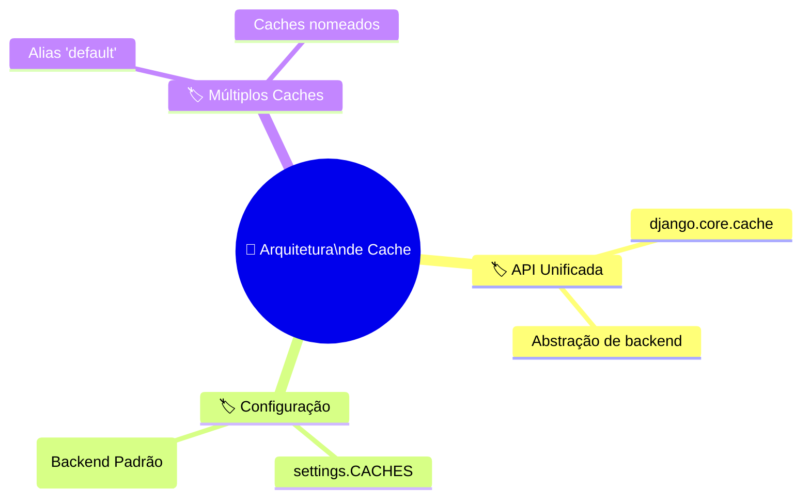
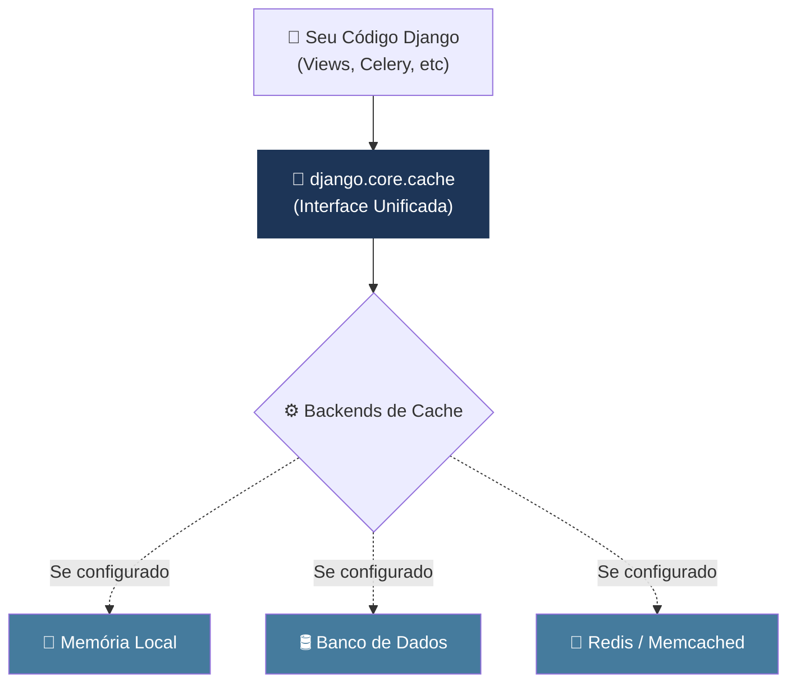
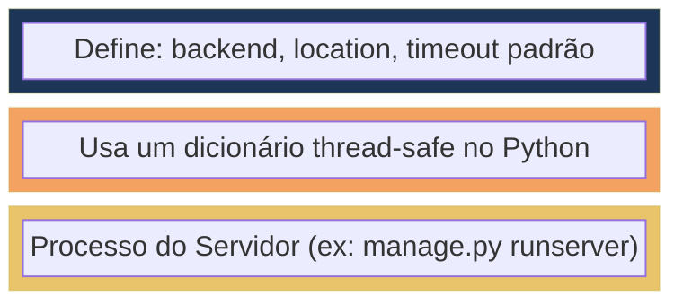
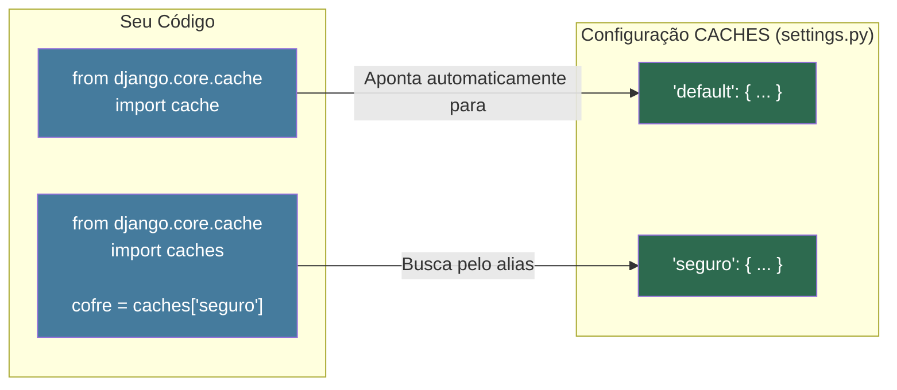
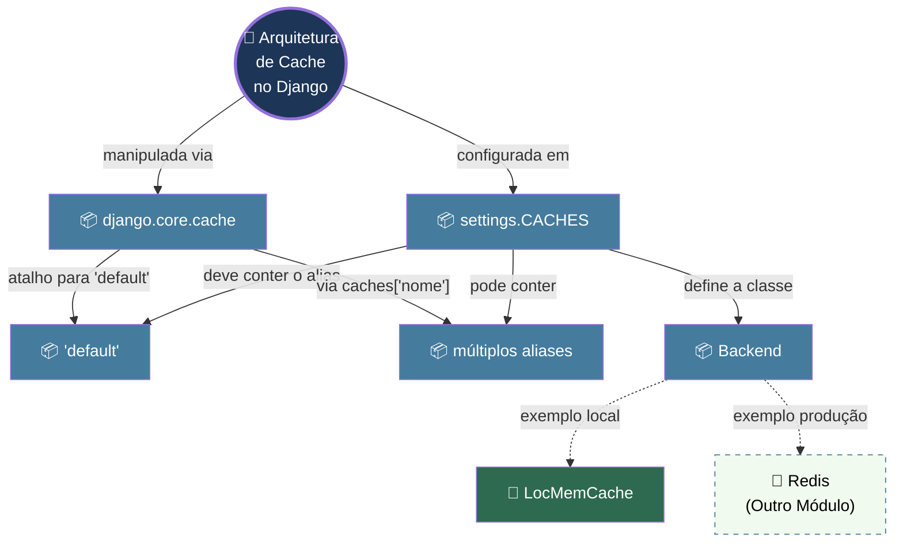
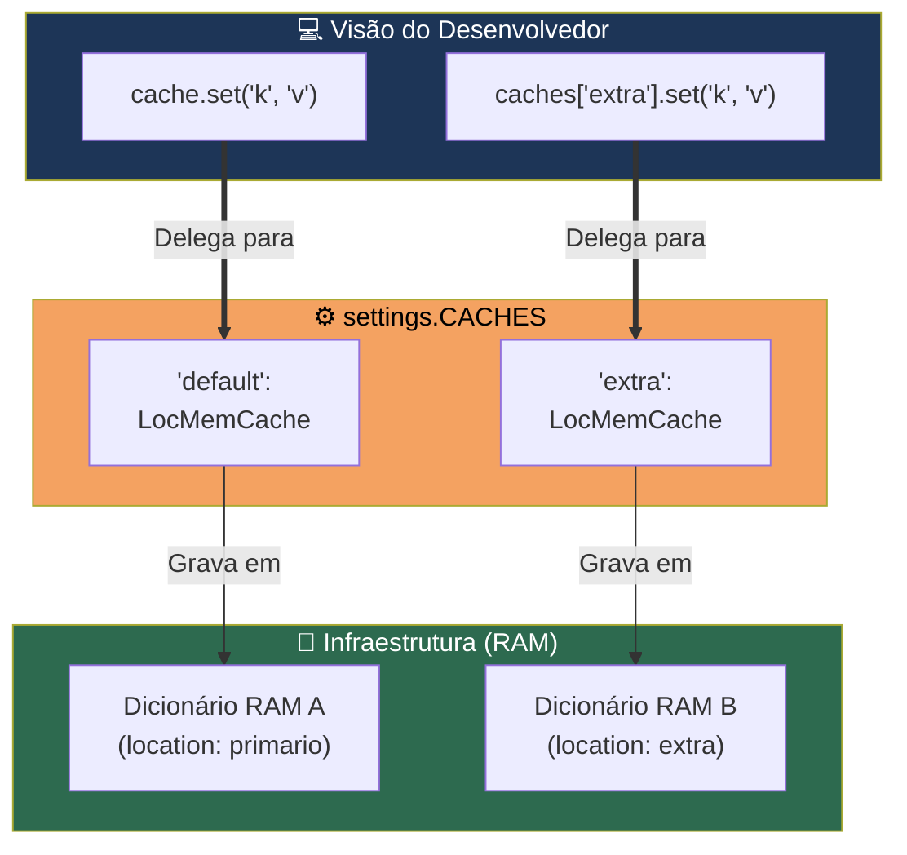

# 📘 Aula 2.1: Arquitetura do cache no Django

> **Módulo:** Módulo 2: O Framework de Cache do Django | **Nível:** 🟡 Intermediário
> **Tempo estimado:** ~25min de estudo focado | **Pré-requisitos:** Django básico (settings, views), familiaridade com o Django Shell

---

## 📑 Índice

1. [🎯 Objetivo de Aprendizado](#-objetivo-de-aprendizado)
2. [🗺️ Mapa da Aula](#️-mapa-da-aula)
3. [📖 Conceito: O Framework de Cache e `django.core.cache`](#-conceito-o-framework-de-cache-e-djangocorecache)
4. [📖 Conceito: A configuração `CACHES` e o backend `LocMemCache`](#-conceito-a-configuração-caches-e-o-backend-locmemcache)
5. [📖 Conceito: Default alias e múltiplos aliases de cache](#-conceito-default-alias-e-múltiplos-aliases-de-cache)
6. [🔗 Mapa de Conexões](#-mapa-de-conexões)
7. [📊 Resumo Visual](#-resumo-visual)
8. [🧪 Teste seu Conhecimento](#-teste-seu-conhecimento)

---

## 🎯 Objetivo de Aprendizado

Ao concluir esta aula, você será capaz de:

- **Identificar** os componentes da arquitetura de cache do Django e como eles se comunicam através de uma API unificada.
- **Configurar** a variável `CACHES` no `settings.py` utilizando o backend `LocMemCache`.
- **Implementar** o uso de múltiplos aliases de cache para diferentes propósitos dentro de um mesmo projeto.
- **Manipular** dados em cache utilizando os métodos básicos (`set`, `get`) através do Django shell.

---

## 🗺️ Mapa da Aula



---

## 📖 Conceito: O Framework de Cache e `django.core.cache`

### 💡 O que é

> 💬 **Analogia:** Pense no framework de cache como um **controle remoto universal**. Você não precisa saber se a TV é LG, Samsung ou Sony; os botões de volume e canal funcionam da mesma forma para todas.

O Django possui um framework de cache robusto que fornece uma **interface unificada (API)** para interagir com diferentes tipos de armazenamento. Independentemente de você guardar seus dados na memória RAM, no banco de dados, em arquivos ou no Redis, seu código Python que interage com o cache continua **exatamente o mesmo**, tudo graças ao módulo `django.core.cache`.

### ⚙️ Como funciona

O Django abstrai a complexidade do armazenamento real. Você importa o objeto `cache` e utiliza seus métodos. O Django lê suas configurações e delega a operação de salvar/buscar para a classe responsável (o backend) correspondente.

| Propriedade | Detalhe |
|:---|:---|
| **Abstração** | Permite trocar a tecnologia de cache sem alterar a lógica da aplicação. |
| **Objeto principal** | `django.core.cache.cache` representa a conexão com o cache padrão. |
| **Operações comuns** | `.set(key, value, timeout)`, `.get(key, default)`. |

### 📊 Diagrama



### 💻 Na Prática

A interação mais básica com o cache é importá-lo e testar as funções de gravação e leitura.

```python
# No Django Shell (python manage.py shell)
from django.core.cache import cache

# Salvando um valor na chave 'minha_chave' por 60 segundos
cache.set('minha_chave', 'Olá, Cache!', timeout=60)

# Recuperando o valor
valor = cache.get('minha_chave')
print(valor) # Saída: Olá, Cache!

# Tentando buscar uma chave inexistente
vazio = cache.get('chave_fantasma')
print(vazio) # Saída: None
```

### ⚠️ Armadilhas Comuns

- ❌ **Não tratar retornos nulos (`None`)**: Assumir que `cache.get()` sempre retornará o dado desejado. O dado pode ter expirado ou ter sido removido (eviction). Sempre preveja um fallback para quando houver um *cache miss* (falha de cache).

---

> [!TIP]
> 🧠 **Pare e Pense:** Se o objeto `cache` mascara onde os dados estão fisicamente guardados, como o Django sabe para onde enviar o dado quando você chama `cache.set()`? Onde ele busca essa instrução?

---

## 📖 Conceito: A configuração `CACHES` e o backend `LocMemCache`

### 💡 O que é

> 💬 **Analogia:** É como o **contrato de aluguel** de um armazém. O contrato diz exatamente *qual* depósito usar (o Backend) e *onde* ele fica (a Location). E, por padrão, o Django aluga um quartinho na sua própria casa (a Memória Local).

No arquivo `settings.py`, a variável `CACHES` é um dicionário que diz ao Django exatamente quais tecnologias de cache ele deve utilizar. O **LocMemCache** (Local Memory Cache) é o backend embutido do Django que armazena os dados na memória RAM do próprio processo Python que está rodando.

### ⚙️ Como funciona

Se você não configurar a variável `CACHES` explicitamente no seu `settings.py`, o Django usará secretamente o `LocMemCache` como padrão, para que comandos básicos de cache não quebrem. No entanto, em um projeto real, você sempre deve explicitá-la.

| Propriedade | Detalhe |
|:---|:---|
| **BACKEND** | A classe Python que implementa a lógica do cache (ex: `django.core.cache.backends.locmem.LocMemCache`). |
| **LOCATION** | Um identificador único para o cache. Para memória local, é apenas um nome para garantir que caches não se misturem (ex: `unico-floco-de-neve`). |
| **Isolamento** | O `LocMemCache` é isolado *por processo*. Ele não compartilha dados com outras instâncias do Django. |

### 📊 Diagrama



### 💻 Na Prática

Abra o seu `settings.py` e adicione a configuração explícita:

```python
# settings.py

CACHES = {
    'default': {
        'BACKEND': 'django.core.cache.backends.locmem.LocMemCache',
        'LOCATION': 'meu_cache_local',
        # Configurações opcionais:
        # 'TIMEOUT': 300, # Tempo padrão de expiração em segundos (5 minutos)
    }
}
```

### ⚠️ Armadilhas Comuns

- ❌ **Usar LocMemCache em Produção Multi-processo**: Em produção, você geralmente usa servidores como o Gunicorn ou uWSGI que iniciam *múltiplos workers* (vários processos do Django). Se usar `LocMemCache`, cada worker terá seu **próprio cache vazio isolado**. O Worker A salva um dado, o Worker B tenta ler o mesmo dado e não encontra. Em produção, use um cache centralizado como Redis.

---

> [!TIP]
> 🧠 **Pare e Pense:** Se você executar `python manage.py shell` em um terminal, salvar um dado no `LocMemCache`, abrir *outro* terminal e rodar outro `shell`, você conseguirá ler o dado salvo no primeiro terminal? Por quê?

---

## 📖 Conceito: Default alias e múltiplos aliases de cache

### 💡 O que é

> 💬 **Analogia:** Na sua casa, você tem uma **caixa de entrada genérica** na porta ("default") onde chegam cartas, mas também tem um **cofre** ("seguro") e uma **estante na garagem** ("ferramentas"). Cada um tem um propósito específico.

O dicionário `CACHES` aceita múltiplas chaves. Essas chaves são chamadas de **aliases**. A chave obrigatória `default` é a que o Django usa quando você chama o `django.core.cache.cache` diretamente. Porém, você pode criar quantos aliases quiser para separar informações em sistemas de cache diferentes.

### ⚙️ Como funciona

Você pode querer salvar sessões de usuários em um banco Redis muito rápido, mas usar um cache em arquivo mais lento (e maior) para gerar relatórios diários. O Django permite que você controle qual cache usar invocando o módulo genérico `caches` passando o nome (alias) desejado.

| Propriedade | Detalhe |
|:---|:---|
| `default` | O alias principal e obrigatório. |
| `caches` | Um objeto de dicionário do módulo `django.core.cache` usado para acessar aliases específicos. |
| `cache` (singleton) | Um atalho direto para `caches['default']`. |

### 📊 Diagrama



### 💻 Na Prática

Configurando múltiplos aliases no `settings.py` e usando no shell:

```python
# settings.py
CACHES = {
    'default': {
        'BACKEND': 'django.core.cache.backends.locmem.LocMemCache',
        'LOCATION': 'cache_principal',
    },
    'relatorios': {
        'BACKEND': 'django.core.cache.backends.dummy.DummyCache', # Um cache falso que não guarda nada!
        'LOCATION': 'falso_cache',
    }
}
```

```python
# No Django Shell
from django.core.cache import cache, caches

# Salvando no alias 'default'
cache.set('usuario_1', 'Leonardo')

# Acessando um alias específico ('relatorios')
cache_rel = caches['relatorios']
cache_rel.set('relatorio_vendas', 'dados enormes...')

# Tentando ler do DummyCache (ele sempre finge que falhou em achar)
print(cache_rel.get('relatorio_vendas')) # Saída: None
```

---

## 🔗 Mapa de Conexões

Veja como os conceitos desta aula se conectam entre si — e como se integram ao contexto maior:



A configuração fundamental mora no `settings.CACHES`, que mapeia *aliases* para implementações concretas (*Backends*, como o `LocMemCache`). O desenvolvedor não toca diretamente nesses backends; ele utiliza a API fornecida pelo `django.core.cache` (seja pelo atalho `cache` para o alias padrão, ou pelo seletor `caches[]` para múltiplos aliases).

---

## 📊 Resumo Visual

### Síntese em Um Olhar



### ✅ Checklist: O que devo saber

Antes de avançar, verifique se você consegue:

- [ ] Identificar a finalidade do módulo `django.core.cache`.
- [ ] Explicar por que a abstração de backend é útil no código do projeto.
- [ ] Configurar o dicionário `CACHES` no `settings.py` utilizando o backend embutido na memória.
- [ ] Listar a diferença prática entre acessar o objeto `cache` e acessar a coleção `caches`.
- [ ] Justificar o perigo de usar o `LocMemCache` em servidores de produção com múltiplos processos/workers.

---

## 🧪 Teste seu Conhecimento

Tente responder antes de ver a resposta. Resista à tentação de espiar! 🙈

---

### Questões Conceituais

**Questão 1:** Por que o Django foi arquitetado para que os desenvolvedores interajam com o `django.core.cache` e não diretamente com a biblioteca de uma tecnologia específica, como uma biblioteca cliente do Redis (ex: `redis-py`)?

<details>
<summary>🔍 Ver resposta</summary>

**Resposta:** Essa arquitetura (API unificada abstrata) garante que o código da sua aplicação não fique amarrado (acoplado) à tecnologia de armazenamento em cache. Se amanhã você precisar trocar de Memória Local para Redis ou Memcached, você altera apenas o `settings.py`; toda a lógica de `cache.set()` e `cache.get()` no seu código permanece intocada.

</details>

---

**Questão 2:** Qual é a diferença fundamental entre importar `cache` e importar `caches` do módulo `django.core.cache`?

<details>
<summary>🔍 Ver resposta</summary>

**Resposta:** O objeto `cache` é um *atalho de conveniência* (singleton) que aponta automaticamente para a configuração que tem o alias `'default'` no `settings.CACHES`. O objeto `caches` é um dicionário inteligente que permite acessar qualquer outro cache nomeado (alias), como por exemplo `caches['relatorios']`.

</details>

---

### Questões Práticas / Cenários

**Questão 3:** Você está desenvolvendo um e-commerce localmente no seu computador e configurou o `LocMemCache` para guardar os totais de carrinho dos usuários por 30 minutos. Tudo funciona bem. Quando você faz o deploy na AWS, configurou 4 instâncias Gunicorn para atender o alto tráfego. Subitamente, os clientes reclamam que adicionam itens no carrinho, mas ao ir para o checkout o carrinho aparece vazio. O que aconteceu?

<details>
<summary>🔍 Ver resposta</summary>

**Resposta:** O problema é o uso do `LocMemCache` em um ambiente multi-processo. O `LocMemCache` usa a memória RAM do processo individual do Python. Um cliente fez a requisição que caiu no processo A e o item foi salvo no cache do processo A. Quando ele foi para o checkout, a requisição caiu no processo C, que possui sua própria memória separada (e vazia) e não achou o carrinho no cache (um cache miss), retornando carrinho vazio. Em produção distribuída, é necessário usar um cache centralizado como Redis.

</details>

---

**Questão 4 (A Pegadinha):** Analise o seguinte código rodando num ambiente onde `LocMemCache` foi configurado sem definir a chave `TIMEOUT` explicitamente no `settings.py`:
```python
from django.core.cache import cache
cache.set('nome', 'Leonardo')
```
Você decide buscar esse valor 6 minutos depois. Qual será o resultado e por quê?

<details>
<summary>🔍 Ver resposta</summary>

**Resposta:** O resultado será `None` (falha de cache). A intuição ingênua pode levar a achar que se você não passar o `timeout`, o cache vive para sempre. Mas o comportamento padrão do Django é que, se omitido, o `TIMEOUT` implícito na configuração (ou o parâmetro opcional na chamada do `set()`) assume o valor padrão de **300 segundos (5 minutos)**. Logo, aos 6 minutos o dado já expirou e foi removido.

</details>

---

**Questão 5:** Dado o seguinte bloco do `settings.py`:
```python
CACHES = {
    'default': {
        'BACKEND': 'django.core.cache.backends.locmem.LocMemCache',
        'LOCATION': 'principal',
    },
    'default': {
        'BACKEND': 'django.core.cache.backends.dummy.DummyCache',
    }
}
```
O que acontece se você rodar `cache.set('chave', 'valor')` e logo depois `cache.get('chave')`?

<details>
<summary>🔍 Ver resposta</summary>

**Resposta:** Retornará `None`. Este é um erro clássico de sintaxe em dicionários Python: você declarou a chave `'default'` duas vezes. A segunda declaração sobrescreve a primeira, então o Django vai registrar a configuração como sendo apenas o `DummyCache`. O `DummyCache` (cache falso) simplesmente ignora qualquer chamada de gravação e sempre retorna `None` em chamadas de leitura (muito útil em ambientes de teste de unidade ou quando você quer desligar o cache na sua máquina sem mexer no código das views).

</details>

---

### 🏋️ Desafio de Aplicação

> **Cenário:** Você recebeu um projeto sem qualquer configuração explícita de cache e precisa prepará-lo para diferentes casos de uso na sua máquina.
>
> **Tarefa:**
> 1. Vá até o `settings.py` de um projeto Django local e crie a variável `CACHES` do zero.
> 2. Configure dois aliases: `'default'` usando o `LocMemCache` (timeout de 1 hora) e um alias chamado `'testes_leves'` usando o `DummyCache` (que não salva nada).
> 3. Abra o Django Shell (`python manage.py shell`).
> 4. Guarde um dado no alias `'default'` e comprove que ele foi salvo.
> 5. Guarde um dado no alias `'testes_leves'` e comprove que ele **não** foi guardado.
