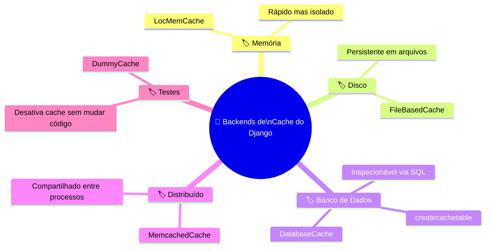
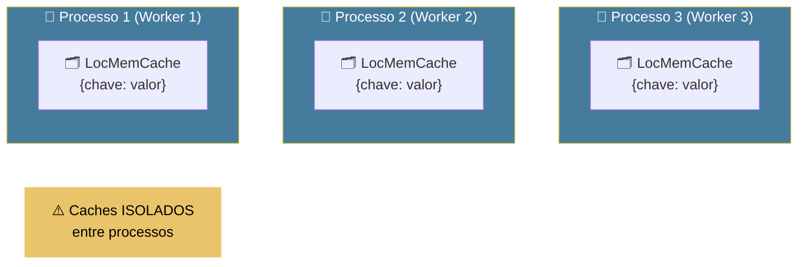
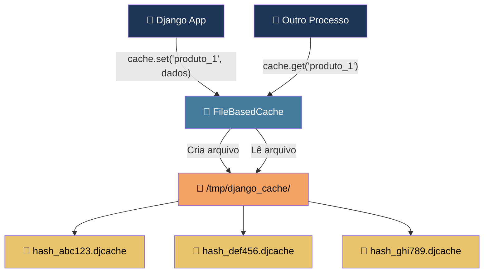
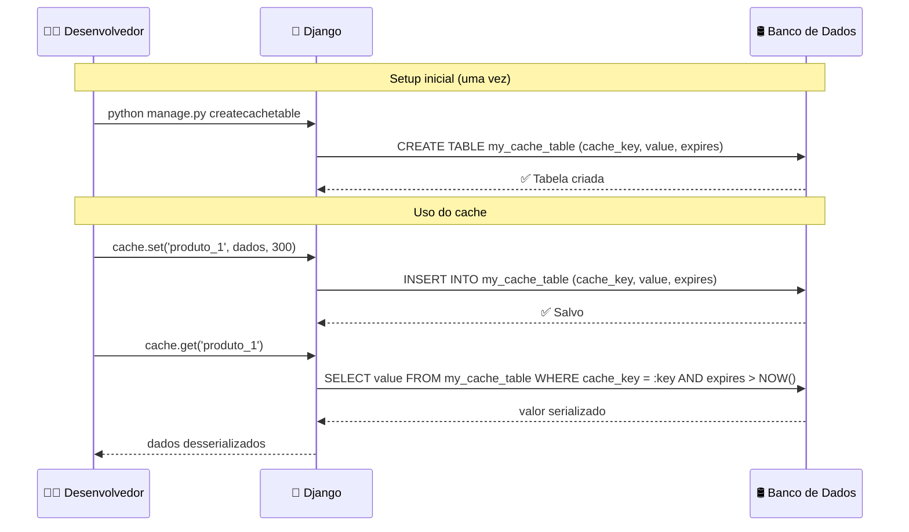
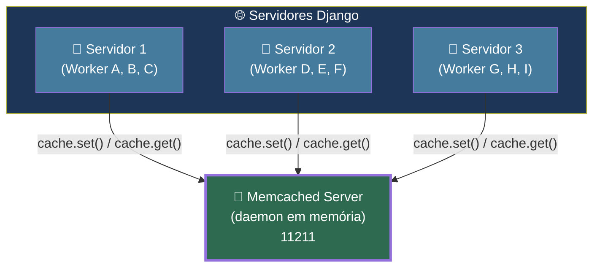
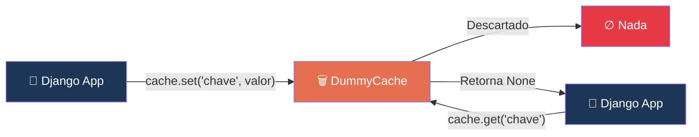
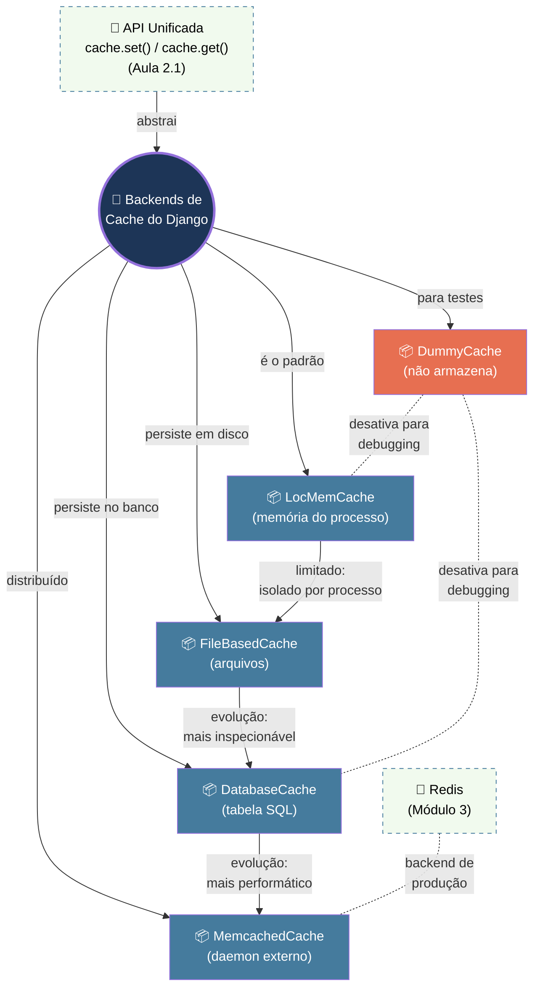
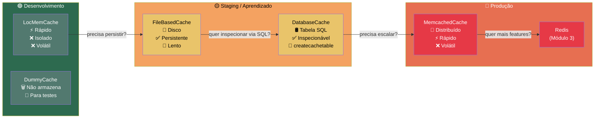

# 📘 Aula 2.2: Backends Disponíveis no Django

> **Módulo:** Módulo 2: O Framework de Cache do Django | **Nível:** 🟢 Fundamento
> **Tempo estimado:** ~30min de estudo focado | **Pré-requisitos:** Aula 2.1 (Arquitetura do cache, `CACHES`, `LocMemCache`, aliases), Django shell, `cache.set()`/`cache.get()` básico

---

## 📑 Índice

1. [🎯 Objetivo de Aprendizado](#-objetivo-de-aprendizado)
2. [🗺️ Mapa da Aula](#️-mapa-da-aula)
3. [📖 Conceito: LocMemCache — O Cache de Memória Local](#-conceito-locmemcache--o-cache-de-memória-local)
4. [📖 Conceito: FileBasedCache — Cache em Arquivos](#-conceito-filebasedcache--cache-em-arquivos)
5. [📖 Conceito: DatabaseCache — Cache em Tabela do Banco](#-conceito-databasecache--cache-em-tabela-do-banco)
6. [📖 Conceito: MemcachedCache — Cache Distribuído em Memória](#-conceito-memcachedcache--cache-distribuído-em-memória)
7. [📖 Conceito: DummyCache — O Cache "Faz de Conta"](#-conceito-dummycache--o-cache-faz-de-conta)
8. [🔗 Mapa de Conexões](#-mapa-de-conexões)
9. [📊 Resumo Visual](#-resumo-visual)
10. [🧪 Teste seu Conhecimento](#-teste-seu-conhecimento)

---

## 🎯 Objetivo de Aprendizado

Ao concluir esta aula, você será capaz de:

- **Comparar** os cinco backends de cache nativos do Django em termos de armazenamento, performance, persistência e cenários de uso.
- **Configurar** o `DatabaseCache` no `settings.py` e criar a tabela de cache com `python manage.py createcachetable`.
- **Avaliar** qual backend é adequado para cada cenário — desenvolvimento, testes, staging e produção.
- **Implementar** operações de `cache.set()` e `cache.get()` com o `DatabaseCache` e verificar os dados diretamente na tabela do banco.

---

## 🗺️ Mapa da Aula



---

## 📖 Conceito: LocMemCache — O Cache de Memória Local

### 💡 O que é

> 💬 **Analogia:** Imagine um bloco de notas adesivas colado na **sua** mesa de trabalho. Você escreve lembretes e consulta rapidamente — mas se o seu colega do lado precisar da mesma informação, ele não consegue ler suas anotações. E quando você vai embora no fim do dia (o processo encerra), todas as notas vão para o lixo.

O `LocMemCache` é o backend **padrão** do Django. Ele armazena dados na **memória RAM do processo Python** que está rodando. É extremamente rápido porque não faz nenhuma operação de I/O (sem disco, sem rede), mas os dados ficam **confinados ao processo** — cada worker do seu servidor tem seu próprio cache isolado — e são **perdidos ao reiniciar**.

### ⚙️ Como funciona

| Propriedade | Detalhe |
|:---|:---|
| **Armazenamento** | Dicionário Python na memória RAM do processo |
| **Persistência** | ❌ Nenhuma — dados perdidos ao reiniciar o processo |
| **Compartilhamento** | ❌ Cada processo/worker tem cache isolado |
| **Performance** | ⚡ Extremamente rápido (acesso direto à memória) |
| **Configuração extra** | Nenhuma — funciona out-of-the-box |
| **Limite de tamanho** | Padrão: 300 entradas (configurável via `MAX_ENTRIES`) |

O Django usa internamente um `OrderedDict` com política de evicção **LRU** (Least Recently Used). Quando o cache atinge `MAX_ENTRIES`, os itens menos usados recentemente são descartados para abrir espaço.

### 📊 Diagrama



### 💻 Na Prática

```python
# settings.py — Configuração explícita do LocMemCache
# (mesmo que seja o padrão, é boa prática declarar)

CACHES = {
    'default': {
        'BACKEND': 'django.core.cache.backends.locmem.LocMemCache',
        'LOCATION': 'meu-cache-unico',   # Identifica esta instância de cache
        'OPTIONS': {
            'MAX_ENTRIES': 500,            # Limite de entradas (padrão: 300)
        }
    }
}
```

### ⚠️ Armadilhas Comuns

- ❌ **Usar `LocMemCache` em produção com múltiplos workers**: Como cada worker do Gunicorn/uWSGI tem seu próprio cache isolado, o usuário A pode ter dados cacheados no worker 1 e, na próxima requisição, cair no worker 2 onde o cache está vazio. Resultado: **cache miss imprevisível** e inconsistência.
- ❌ **Esquecer o `LOCATION` quando há múltiplos `LocMemCache`**: Se você configura dois aliases de cache ambos com `LocMemCache` e não define `LOCATION` diferente para cada um, eles **compartilham o mesmo espaço de memória** e podem sobrescrever dados um do outro.

---

Agora que entendemos o cache mais simples — aquele que vive e morre com o processo — vamos para o próximo nível: **e se quisermos que o cache sobreviva a um restart?** É aí que entra o `FileBasedCache`.

---

## 📖 Conceito: FileBasedCache — Cache em Arquivos

### 💡 O que é

> 💬 **Analogia:** Pense em uma **gaveta de arquivo** no escritório. Em vez de anotar coisas em post-its na sua mesa (memória), você escreve em fichas e guarda na gaveta. É mais lento do que olhar para um post-it, mas quando você volta no dia seguinte, a ficha ainda está lá. Qualquer colega com acesso ao escritório pode abrir a gaveta e ler as fichas.

O `FileBasedCache` armazena cada entrada de cache como um **arquivo individual** em um diretório do sistema de arquivos. Cada chave vira um arquivo serializado no disco, o que garante **persistência entre restarts** — mas com o custo de operações de I/O em disco.

### ⚙️ Como funciona

| Propriedade | Detalhe |
|:---|:---|
| **Armazenamento** | Arquivos individuais em um diretório do filesystem |
| **Persistência** | ✅ Sobrevive a restarts do processo |
| **Compartilhamento** | ✅ Processos no mesmo servidor podem compartilhar (mesmo diretório) |
| **Performance** | 🐢 Lento — I/O de disco a cada operação |
| **Configuração extra** | Apenas definir `LOCATION` com o caminho do diretório |
| **Limpeza** | O Django faz limpeza de entradas expiradas automaticamente (cull) |

Internamente, o Django converte a chave de cache em um hash que se torna o nome do arquivo. O conteúdo do arquivo contém o **valor serializado** (via `pickle`) junto com o **timestamp de expiração**.

### 📊 Diagrama



### 💻 Na Prática

```python
# settings.py — Configuração do FileBasedCache

CACHES = {
    'default': {
        'BACKEND': 'django.core.cache.backends.filebased.FileBasedCache',
        'LOCATION': '/tmp/django_cache',   # Diretório onde os arquivos serão salvos
        # No Windows: 'LOCATION': 'C:/django_cache'
        'OPTIONS': {
            'MAX_ENTRIES': 1000,            # Máximo de arquivos no diretório
        }
    }
}
```

```bash
# Verificando os arquivos criados no diretório de cache
$ ls /tmp/django_cache/
# Você verá arquivos como:
# 3a5f1b2c8d.djcache
# 7e4d9f0a1b.djcache
```

### ⚠️ Armadilhas Comuns

- ❌ **Usar um diretório sem permissão de escrita**: O processo Django precisa ter permissão de leitura E escrita no diretório configurado em `LOCATION`. Se o diretório não existir, o Django tenta criá-lo — mas se o diretório pai não tiver permissão, você recebe um erro silencioso.
- ❌ **Apontar para `/tmp` em produção**: Muitos sistemas limpam `/tmp` automaticamente em reinicializações ou via cronjobs, eliminando seu cache sem aviso.

---

> [!TIP]
> 🧠 **Pare e Pense:** Imagine que você tem uma aplicação Django rodando com 4 workers Gunicorn. Você precisa de um cache que seja compartilhado entre todos os workers, mas sem depender de serviços externos (como Redis). Dos dois backends que vimos até agora (`LocMemCache` e `FileBasedCache`), qual resolveria esse problema? E qual seria a desvantagem dessa escolha?

---

Com o `FileBasedCache`, ganhamos persistência e compartilhamento — mas ao custo de performance. E se pudéssemos usar algo que **já existe na sua infraestrutura** e que oferece persistência sem precisar de um serviço extra? Aqui entra o `DatabaseCache`.

---

## 📖 Conceito: DatabaseCache — Cache em Tabela do Banco

### 💡 O que é

> 💬 **Analogia:** É como ter um **armário de arquivo dentro do banco** — o mesmo banco onde você já guarda seu dinheiro (seus dados). Você não precisa alugar um cofre separado: pede ao gerente (Django) para criar uma gaveta extra (tabela) no seu cofre existente. O acesso é mais lento que pegar um post-it da mesa, mas tudo fica organizado, seguro e acessível por qualquer caixa (worker) do banco.

O `DatabaseCache` armazena os dados de cache em uma **tabela dedicada no seu banco de dados**. É o único backend nativo que requer um **passo extra de setup**: rodar `python manage.py createcachetable` para criar a tabela. A grande vantagem é que você pode **inspecionar o cache diretamente via SQL** e ele se integra naturalmente à sua infraestrutura existente.

### ⚙️ Como funciona

| Propriedade | Detalhe |
|:---|:---|
| **Armazenamento** | Tabela no banco de dados (PostgreSQL, MySQL, SQLite, etc.) |
| **Persistência** | ✅ Sobrevive a restarts — dados no banco |
| **Compartilhamento** | ✅ Todos os processos acessam a mesma tabela |
| **Performance** | 🔄 Moderado — usa queries SQL (mais lento que memória, mais rápido que disco para leituras aleatórias) |
| **Setup extra** | `python manage.py createcachetable` |
| **Inspecionável** | ✅ Você pode fazer `SELECT * FROM cache_table` para ver os dados |

A tabela criada tem três colunas principais:
- **`cache_key`** — a chave do cache (string)
- **`value`** — o valor serializado (texto codificado em base64)
- **`expires`** — o timestamp de expiração

### 📊 Diagrama



### 💻 Na Prática

```python
# settings.py — Configuração do DatabaseCache

CACHES = {
    'default': {
        'BACKEND': 'django.core.cache.backends.db.DatabaseCache',
        'LOCATION': 'my_cache_table',    # Nome da tabela que será criada
        'OPTIONS': {
            'MAX_ENTRIES': 1000,          # Máximo de registros na tabela
            'CULL_FREQUENCY': 3,          # Quando estourar, remove 1/3 das entradas
        }
    }
}
```

```bash
# PASSO OBRIGATÓRIO: Criar a tabela no banco de dados
$ python manage.py createcachetable

# Se quiser ver a tabela criada (PostgreSQL):
$ python manage.py dbshell
=> \d my_cache_table
# Ou via SQL:
=> SELECT * FROM my_cache_table;
```

```python
# No Django shell — testando o DatabaseCache
$ python manage.py shell

>>> from django.core.cache import cache

>>> # Armazena um valor com timeout de 5 minutos (300 segundos)
>>> cache.set('usuario_42', {'nome': 'Leonardo', 'role': 'dev'}, 300)

>>> # Recupera o valor
>>> cache.get('usuario_42')
{'nome': 'Leonardo', 'role': 'dev'}

>>> # Agora, verificando diretamente no banco de dados:
>>> # Abra outro terminal e rode:
>>> # python manage.py dbshell
>>> # SELECT cache_key, expires FROM my_cache_table;
>>> # Você verá algo como:
>>> # :1:usuario_42 | 2026-07-07 15:00:00
```

### ⚠️ Armadilhas Comuns

- ❌ **Esquecer de rodar `createcachetable`**: Diferente dos outros backends, o `DatabaseCache` **não funciona sem a tabela**. Se você configurar o `settings.py` mas não rodar o comando, receberá um erro `ProgrammingError: relation "my_cache_table" does not exist` na primeira tentativa de uso.
- ❌ **Usar `DatabaseCache` como cache de alta performance**: Cada `cache.set()` e `cache.get()` executa uma **query SQL real** no seu banco. Em cenários de alto tráfego, o cache pode **sobrecarregar o banco** — exatamente o oposto do que cache deveria fazer. Use-o para desenvolvimento, staging ou cenários de baixo/médio tráfego.
- ❌ **Não incluir `createcachetable` nas migrações/CI**: Em pipelines de deploy, a tabela de cache precisa existir. Esquecê-la no CI/CD resulta em erros em staging/produção.

---

> [!TIP]
> 🧠 **Pare e Pense:** O `DatabaseCache` armazena dados no mesmo banco que seus modelos Django. Se o objetivo do cache é **evitar consultas ao banco**, usar o próprio banco como backend não é contraditório? Em que situação faria sentido mesmo assim? (Dica: pense em computações caras vs. queries simples.)

---

Até aqui, todos os backends que vimos são **locais** ao servidor — seja na memória, no disco, ou no banco. Mas e se sua aplicação roda em **múltiplos servidores**? É aí que entra o cache distribuído.

---

## 📖 Conceito: MemcachedCache — Cache Distribuído em Memória

### 💡 O que é

> 💬 **Analogia:** Imagine que em vez de cada funcionário ter seu próprio bloco de notas (LocMemCache), a empresa instala um **quadro de avisos eletrônico centralizado** na recepção. Qualquer funcionário, de qualquer andar (servidor), pode ler e atualizar o quadro. É rápido (não precisa subir escadas até o arquivo), acessível por todos, e o quadro é grande o suficiente para o escritório inteiro.

O `MemcachedCache` conecta o Django ao **Memcached**, um sistema de cache distribuído em memória projetado para alta performance. Ao contrário do `LocMemCache`, o Memcached roda como um **serviço separado** (daemon) que pode ser acessado por múltiplos servidores Django simultaneamente, resolvendo o problema de isolamento entre workers/processos.

### ⚙️ Como funciona

| Propriedade | Detalhe |
|:---|:---|
| **Armazenamento** | Memória RAM de um servidor Memcached dedicado |
| **Persistência** | ❌ Nenhuma — dados perdidos ao reiniciar o Memcached |
| **Compartilhamento** | ✅ Total — todos os processos/servidores acessam o mesmo cache |
| **Performance** | ⚡ Muito rápido — comunicação via rede, dados em memória |
| **Dependência externa** | Servidor Memcached instalado e rodando |
| **Limite de valor** | 1 MB por entrada (padrão do Memcached) |
| **Bibliotecas Python** | `pymemcache` (recomendada) ou `pylibmc` |

O Django oferece dois backends para Memcached:
- **`django.core.cache.backends.memcached.PyMemcacheCache`** — usa a biblioteca `pymemcache` (recomendada a partir do Django 4.0+)
- **`django.core.cache.backends.memcached.PyLibMCCache`** — usa a biblioteca `pylibmc` (bindings C, mais rápido mas mais difícil de instalar)

> [!NOTE]
> O antigo `MemcachedCache` (que usava `python-memcached`) foi **depreciado no Django 3.2** e **removido no Django 5.0**. Use sempre `PyMemcacheCache`.

### 📊 Diagrama



### 💻 Na Prática

```python
# settings.py — Configuração com PyMemcacheCache (Django 4.0+)

CACHES = {
    'default': {
        'BACKEND': 'django.core.cache.backends.memcached.PyMemcacheCache',
        'LOCATION': '127.0.0.1:11211',    # Endereço do servidor Memcached
    }
}

# Para múltiplos servidores Memcached (cluster):
CACHES = {
    'default': {
        'BACKEND': 'django.core.cache.backends.memcached.PyMemcacheCache',
        'LOCATION': [
            '172.19.26.240:11211',
            '172.19.26.242:11211',
        ]
    }
}

# Usando socket Unix (mesmo servidor):
CACHES = {
    'default': {
        'BACKEND': 'django.core.cache.backends.memcached.PyMemcacheCache',
        'LOCATION': 'unix:/tmp/memcached.sock',
    }
}
```

### ⚠️ Armadilhas Comuns

- ❌ **Assumir persistência**: O Memcached é um cache **puro** — reiniciou, perdeu tudo. Nunca armazene dados nele que você não possa recriar a partir da fonte original.
- ❌ **Esquecer de instalar a biblioteca Python**: O Django não inclui `pymemcache` por padrão. Sem rodar `pip install pymemcache`, você recebe `ModuleNotFoundError` ao tentar usar o backend.

---

Agora que conhecemos os backends "de verdade" — que armazenam dados para uso real — falta um último backend, que existe justamente para **não cachear nada**. Parece inútil? É mais útil do que você imagina.

---

## 📖 Conceito: DummyCache — O Cache "Faz de Conta"

### 💡 O que é

> 💬 **Analogia:** Imagine que você está ensaiando uma peça de teatro. No ensaio, quando o roteiro diz "ator abre a mala e pega o dinheiro", o ator faz o gesto mas **a mala está vazia** — é um ensaio, não precisa de dinheiro real. O `DummyCache` é essa mala vazia: seu código chama `cache.set()` e `cache.get()` normalmente, mas **nada é armazenado**. O `get()` sempre retorna `None` (ou o `default`).

O `DummyCache` é um backend que **implementa toda a interface de cache mas não armazena nada**. Ele existe para cenários de **testes e debugging**, onde você quer garantir que seu código funciona **sem cache** — sem precisar remover ou comentar chamadas de cache espalhadas pelo projeto.

### ⚙️ Como funciona

| Propriedade | Detalhe |
|:---|:---|
| **Armazenamento** | ❌ Nenhum — descarta tudo que recebe |
| **`cache.set()`** | Aceita a chamada mas não salva nada |
| **`cache.get()`** | Sempre retorna `None` (ou o valor `default` passado) |
| **`cache.has_key()`** | Sempre retorna `False` |
| **Performance** | ⚡ Instantâneo (literalmente não faz nada) |
| **Uso principal** | Testes, debugging, garantir que a app funciona sem cache |

### 📊 Diagrama



### 💻 Na Prática

```python
# settings.py (ou settings_test.py) — Desativando o cache para testes

CACHES = {
    'default': {
        'BACKEND': 'django.core.cache.backends.dummy.DummyCache',
    }
}
```

```python
# Um padrão comum: usar DummyCache apenas no ambiente de teste
# settings.py

import os

if os.environ.get('DJANGO_ENV') == 'test':
    CACHES = {
        'default': {
            'BACKEND': 'django.core.cache.backends.dummy.DummyCache',
        }
    }
else:
    CACHES = {
        'default': {
            'BACKEND': 'django.core.cache.backends.db.DatabaseCache',
            'LOCATION': 'my_cache_table',
        }
    }
```

```python
# No Django shell — comportamento do DummyCache
>>> from django.core.cache import cache
>>> cache.set('teste', 'valor_importante', 300)
>>> cache.get('teste')
# None  <-- não armazenou nada!
>>> cache.has_key('teste')
# False
```

### ⚠️ Armadilhas Comuns

- ❌ **Usar `DummyCache` em produção por acidente**: Se o seu `settings.py` de produção apontar para `DummyCache` por um merge mal feito, **todo o seu cache será silenciosamente ignorado**. Sua aplicação vai funcionar, mas **sem nenhum benefício de performance** — e você pode demorar dias para perceber.

---

> [!TIP]
> 🧠 **Pare e Pense:** Você está debugando um bug onde uma view retorna dados desatualizados e você suspeita que o cache está servindo dados obsoletos. Como o `DummyCache` pode te ajudar a confirmar ou descartar essa hipótese rapidamente — sem precisar alterar nenhuma linha da sua view?

---

## 🔗 Mapa de Conexões

Veja como os conceitos desta aula se conectam entre si — e como se integram ao contexto maior:



**Conexões-chave:**
- Todos os cinco backends são **intercambiáveis** graças à **API unificada** que você aprendeu na Aula 2.1 — trocar de `LocMemCache` para `DatabaseCache` é apenas mudar uma linha no `settings.py`.
- A progressão natural de complexidade é: `LocMemCache` → `FileBasedCache` → `DatabaseCache` → `Memcached` → **Redis** (que veremos no Módulo 3).
- O `DummyCache` é o "interruptor" que desliga o cache sem tocar no código — útil para confirmar se bugs estão relacionados ao cache.

---

## 📊 Resumo Visual

### Comparação Direta

| Aspecto | LocMemCache | FileBasedCache | DatabaseCache | MemcachedCache | DummyCache |
|:---|:---:|:---:|:---:|:---:|:---:|
| **Armazenamento** | RAM do processo | Arquivos em disco | Tabela SQL | RAM de servidor externo | Nenhum |
| **Persistência** | ❌ | ✅ | ✅ | ❌ | ❌ |
| **Compartilhamento** | ❌ | ✅ (mesmo servidor) | ✅ | ✅ (multi-servidor) | — |
| **Performance** | ⚡⚡⚡ | ⚡ | ⚡⚡ | ⚡⚡⚡ | — |
| **Setup extra** | Nenhum | Diretório | `createcachetable` | Instalar Memcached | Nenhum |
| **Ideal para** | Dev rápido | Cache persistente local | Staging / dev | Produção sem Redis | Testes |
| **Palavra-chave** | *Rascunho* | *Gaveta* | *Armário* | *Quadro central* | *Ensaio* |

### Síntese em Um Olhar



### ✅ Checklist: O que devo saber

Antes de avançar, verifique se você consegue:

- [ ] Listar os 5 backends nativos de cache do Django e descrever em uma frase o que cada um faz
- [ ] Explicar por que o `LocMemCache` é inadequado para produção com múltiplos workers
- [ ] Configurar o `DatabaseCache` no `settings.py` e rodar `python manage.py createcachetable`
- [ ] Executar `cache.set()` e `cache.get()` com o `DatabaseCache` e consultar os dados diretamente na tabela do banco via SQL
- [ ] Justificar quando usar `DummyCache` em vez de simplesmente remover chamadas de cache do código
- [ ] Escolher o backend apropriado para um cenário dado (dev, teste, staging, produção)

---

## 🧪 Teste seu Conhecimento

Tente responder antes de ver a resposta. Resista à tentação de espiar! 🙈

---

### Questões Conceituais

**Questão 1:** Qual é a diferença fundamental entre `LocMemCache` e `MemcachedCache`, considerando que ambos armazenam dados na memória RAM?

<details>
<summary>🔍 Ver resposta</summary>

**Resposta:** A diferença fundamental é o **escopo do compartilhamento**. O `LocMemCache` armazena dados na memória RAM **do próprio processo Python** — cada worker tem seu cache isolado e inacessível para outros processos. O `MemcachedCache` se conecta a um **daemon externo** (servidor Memcached) que roda em processo separado, permitindo que **todos os workers e até servidores diferentes** compartilhem o mesmo cache. Ambos são rápidos e voláteis (sem persistência), mas o Memcached resolve o problema de isolamento entre processos.

</details>

---

**Questão 2:** O `FileBasedCache` e o `DatabaseCache` são os únicos backends nativos com persistência. Em que cenário você escolheria um sobre o outro?

<details>
<summary>🔍 Ver resposta</summary>

**Resposta:** O `DatabaseCache` é preferível quando você precisa **inspecionar o cache via SQL** (útil para debugging e auditoria), quando já tem uma infraestrutura de banco de dados robusta, e quando quer **incluir o cache nas migrações/backups** do banco. O `FileBasedCache` é preferível quando você quer **evitar carga extra no banco de dados** (já que cada operação de cache seria uma query SQL), quando o banco já está sob pressão, ou quando precisa de um cache persistente simples sem setup adicional (não requer `createcachetable`). Em geral, o `DatabaseCache` é mais prático para staging e desenvolvimento, enquanto o `FileBasedCache` é mais nicho.

</details>

---

### Questões Práticas / Cenários

**Questão 3:** Você configurou o `DatabaseCache` no `settings.py`, fez deploy da aplicação em produção, mas ao acessar o site recebe o erro: `django.db.utils.ProgrammingError: relation "my_cache_table" does not exist`. O que aconteceu e como resolver?

<details>
<summary>🔍 Ver resposta</summary>

**Resposta:** Você esqueceu de rodar `python manage.py createcachetable` no ambiente de produção. Diferente das migrações normais do Django, a tabela de cache **não é criada automaticamente** pelo `migrate` — ela exige um comando separado. Para resolver, execute `python manage.py createcachetable` no servidor de produção. Para evitar o problema no futuro, inclua esse comando no seu pipeline de CI/CD, após o `migrate`.

</details>

---

**Questão 4 (Pegadinha):** Sua aplicação Django roda com Gunicorn e 8 workers. Você está usando `LocMemCache` e percebe que, na maioria das requisições, o `cache.get()` retorna dados cacheados corretamente. Você conclui que o `LocMemCache` funciona bem em produção. Essa conclusão está correta?

<details>
<summary>🔍 Ver resposta</summary>

**Resposta:** **Não, a conclusão está errada.** O que está acontecendo é um efeito de coincidência estatística: com 8 workers, se o cache foi populado no worker 3 e o load balancer direciona a próxima requisição para o mesmo worker 3, o `cache.get()` funciona. Mas se a próxima requisição cai no worker 5, o cache está vazio lá — **cache miss**. Com 8 workers, você tem no melhor cenário **12,5% de chance** de acertar o worker certo em uma distribuição aleatória. O "funciona na maioria" é provavelmente porque, em ambiente de teste com pouco tráfego, o load balancer está reusando o mesmo worker. Em produção com tráfego real, o hit rate seria imprevisível e inconsistente. Use um backend compartilhado (`DatabaseCache`, `MemcachedCache` ou `Redis`) para produção com múltiplos workers.

</details>

---

**Questão 5:** Você está investigando um bug onde a API retorna o preço antigo de um produto mesmo após ele ser atualizado no banco. Você suspeita do cache. Descreva o passo a passo mais rápido para confirmar se o cache é o culpado, usando o que aprendeu nesta aula.

<details>
<summary>🔍 Ver resposta</summary>

**Resposta:** O passo mais rápido é trocar o backend para `DummyCache` temporariamente:

1. No `settings.py`, mude o `BACKEND` para `'django.core.cache.backends.dummy.DummyCache'`
2. Reinicie o servidor
3. Teste a API — se agora retorna o preço atualizado, **o cache era o culpado** (estava servindo dados obsoletos)
4. Se continua retornando o preço antigo, o bug está em outro lugar (query, serializer, etc.)
5. Restaure o backend original

Essa abordagem é melhor do que comentar chamadas de `cache.get()` no código, porque você não precisa identificar onde estão todas as chamadas — o `DummyCache` desativa **todo** o cache de uma vez.

</details>

---

### 🏋️ Desafio de Aplicação

> **Desafio: Implemente e inspecione o DatabaseCache no seu projeto Django**
>
> 1. No seu projeto Django existente, troque a configuração de `CACHES` para usar o `DatabaseCache` com uma tabela chamada `meu_cache`.
> 2. Rode o comando necessário para criar a tabela no banco.
> 3. No Django shell, armazene pelo menos 3 entradas de cache com timeouts diferentes (ex: 30s, 120s, 600s).
> 4. Usando o `dbshell` ou uma ferramenta como DBeaver/pgAdmin, consulte a tabela `meu_cache` e observe as colunas `cache_key`, `value` e `expires`.
> 5. Espere o timeout mais curto expirar e rode `cache.get()` para a chave — confirme que retorna `None`.
> 6. **Bônus**: Configure um segundo alias de cache chamado `'dummy'` usando `DummyCache` e demonstre que `caches['dummy'].set()` aceita dados mas `caches['dummy'].get()` sempre retorna `None`.
>
> Tempo estimado: 15-25 minutos.
