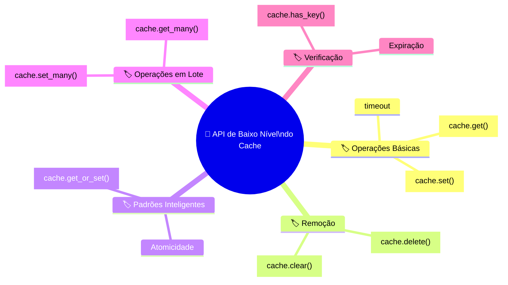
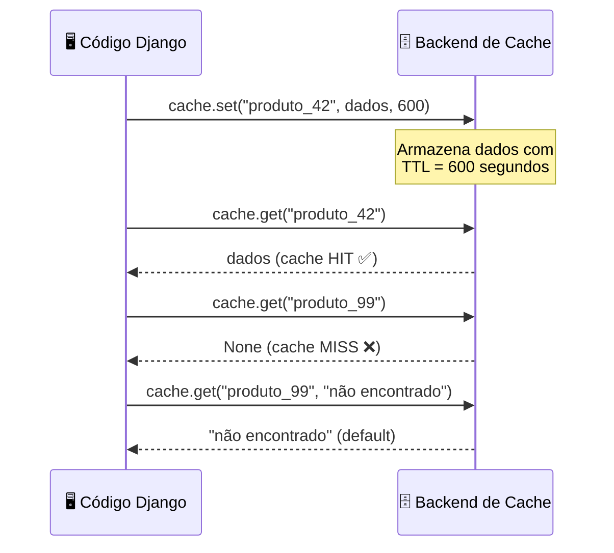
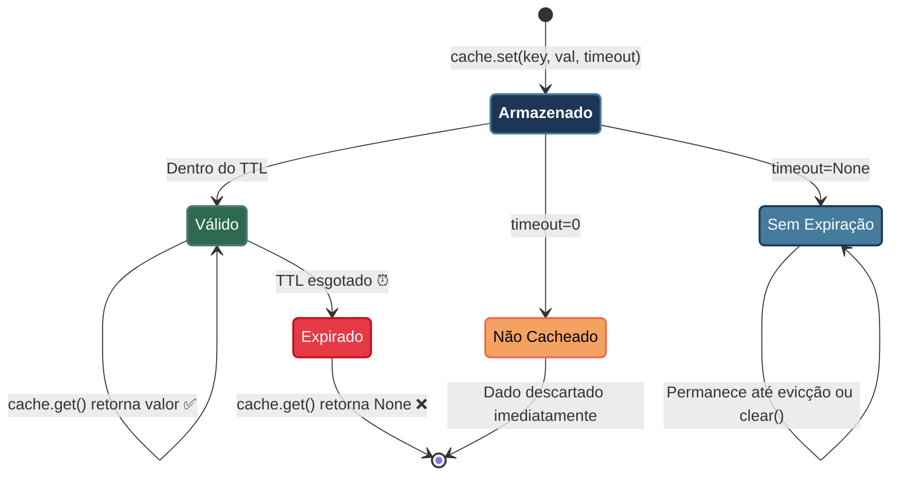
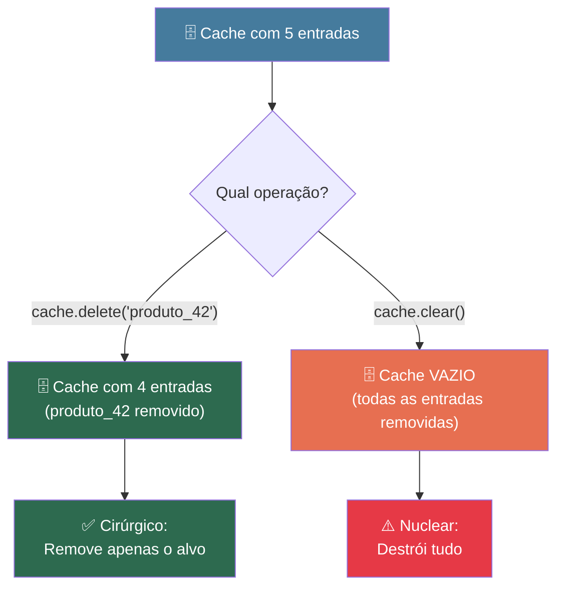
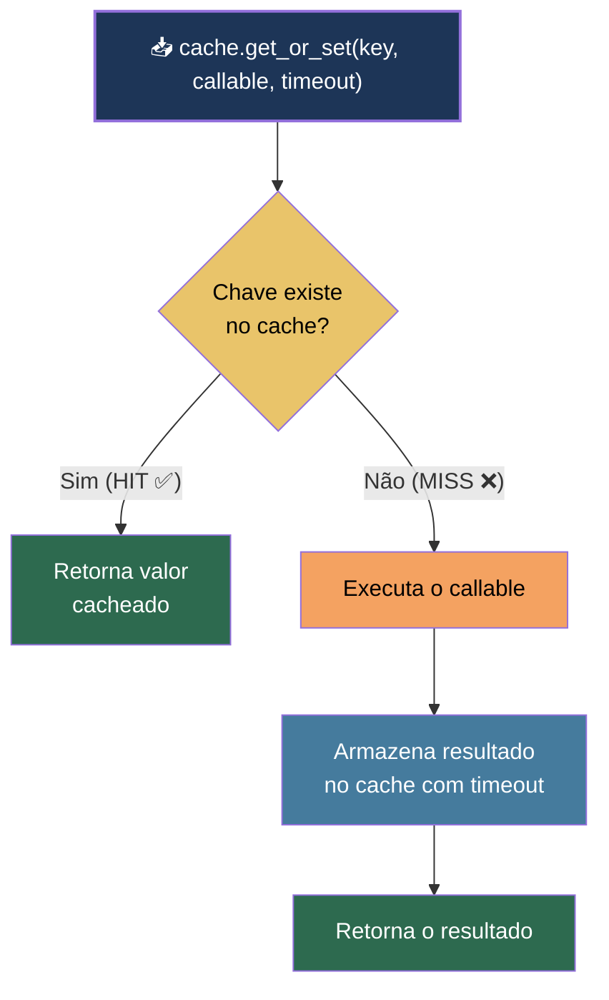
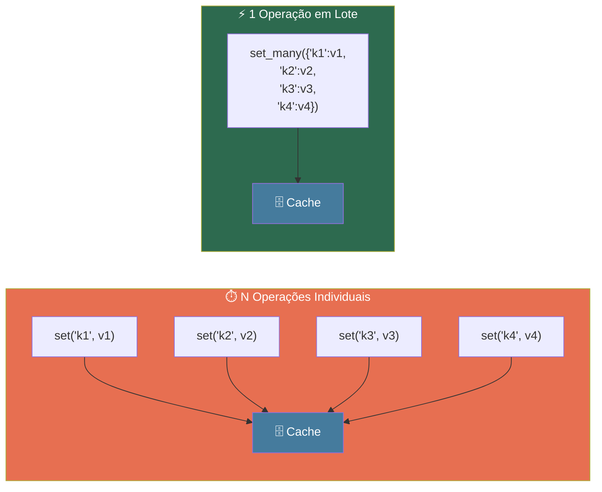
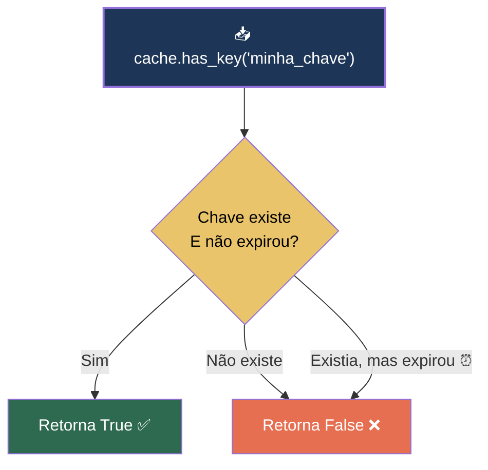
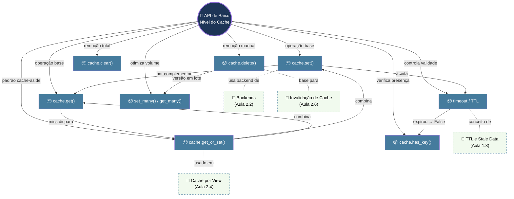
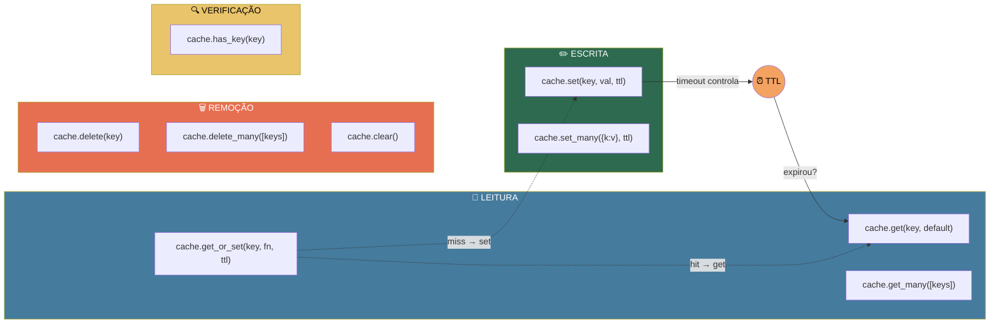

# 📘 Aula 2.3: API de Baixo Nível do Cache

> **Módulo:** Módulo 2: O Framework de Cache do Django | **Nível:** 🟢 Fundamento
> **Tempo estimado:** ~35min de estudo focado | **Pré-requisitos:** Aula 2.1 (Arquitetura do cache, `CACHES`, aliases), Aula 2.2 (backends disponíveis, `LocMemCache`, `DatabaseCache`), Django shell básico

---

## 📑 Índice

1. [🎯 Objetivo de Aprendizado](#-objetivo-de-aprendizado)
2. [🗺️ Mapa da Aula](#️-mapa-da-aula)
3. [📖 Conceito: cache.set() e cache.get() — Escrita e Leitura Básica](#-conceito-cacheset-e-cacheget--escrita-e-leitura-básica)
4. [📖 Conceito: timeout — Controlando a Expiração](#-conceito-timeout--controlando-a-expiração)
5. [📖 Conceito: cache.delete() e cache.clear() — Remoção de Dados](#-conceito-cachedelete-e-cacheclear--remoção-de-dados)
6. [📖 Conceito: cache.get_or_set() — Leitura com Fallback Inteligente](#-conceito-cacheget_or_set--leitura-com-fallback-inteligente)
7. [📖 Conceito: Operações em Lote — set_many() e get_many()](#-conceito-operações-em-lote--set_many-e-get_many)
8. [📖 Conceito: cache.has_key() — Verificação de Existência](#-conceito-cachehas_key--verificação-de-existência)
9. [🔗 Mapa de Conexões](#-mapa-de-conexões)
10. [📊 Resumo Visual](#-resumo-visual)
11. [🧪 Teste seu Conhecimento](#-teste-seu-conhecimento)

---

## 🎯 Objetivo de Aprendizado

Ao concluir esta aula, você será capaz de:

- **Armazenar** e **recuperar** dados no cache do Django usando `cache.set()` e `cache.get()` com controle de timeout e valores padrão.
- **Gerenciar** o ciclo de vida dos dados em cache, removendo entradas individuais com `cache.delete()` ou limpando todo o cache com `cache.clear()`.
- **Implementar** o padrão cache-aside de forma atômica usando `cache.get_or_set()`, evitando race conditions.
- **Otimizar** operações em lote com `cache.set_many()` e `cache.get_many()` para reduzir round-trips ao backend.
- **Verificar** a existência de chaves no cache com `cache.has_key()`, compreendendo suas limitações e quando preferir `cache.get()`.

---

## 🗺️ Mapa da Aula



---

## 📖 Conceito: cache.set() e cache.get() — Escrita e Leitura Básica

### 💡 O que é

> 💬 **Analogia:** Pense em um **guarda-volumes** de um shopping. Você entrega um objeto (`value`) ao atendente, que cola uma etiqueta com um código (`key`) e guarda o item. Quando você volta, apresenta o código e recebe o objeto de volta. Se o código não existir — talvez o item já tenha sido devolvido ou descartado — o atendente diz "não encontrado".

`cache.set()` e `cache.get()` são as duas operações mais fundamentais da API de cache do Django. Juntas, formam o par de **escrita e leitura** que você vai usar em 90% das suas interações com o cache. O `set()` armazena um valor associado a uma **chave única**, e o `get()` recupera esse valor pela mesma chave.

### ⚙️ Como funciona

| Propriedade | Detalhe |
|:---|:---|
| **`cache.set(key, value, timeout)`** | Armazena `value` sob a chave `key`. O `timeout` (em segundos) é opcional — se omitido, usa o `TIMEOUT` padrão do backend (300s por padrão). |
| **`cache.get(key, default=None)`** | Retorna o valor armazenado ou `default` se a chave não existir ou estiver expirada. |
| **Tipos suportados** | Qualquer objeto serializável via pickle: strings, números, listas, dicts, querysets avaliados, instâncias de modelos. |
| **Chaves** | Strings de até 250 caracteres (limite do Memcached, respeitado por convenção). Devem ser únicas e descritivas. |
| **Retorno de `set()`** | Não retorna valor útil — a operação é fire-and-forget. |
| **Retorno de `get()`** | O valor cacheado ou o `default`. Retornar `None` não garante que a chave não existe (o valor guardado pode ser `None`). |

### 📊 Diagrama



### 💻 Na Prática

```python
# No Django shell: python manage.py shell

from django.core.cache import cache

# 1. Armazenar um valor simples
cache.set("meu_nome", "Leonardo", 120)  # expira em 120 segundos

# 2. Recuperar o valor
nome = cache.get("meu_nome")
print(nome)  # "Leonardo"

# 3. Tentar recuperar uma chave inexistente
resultado = cache.get("chave_fantasma")
print(resultado)  # None

# 4. Usar um valor padrão (default) para chaves inexistentes
resultado = cache.get("chave_fantasma", "valor padrão")
print(resultado)  # "valor padrão"

# 5. Armazenar estruturas mais complexas
cache.set("produto_42", {
    "nome": "Camiseta Django",
    "preco": 79.90,
    "estoque": 150,
    "tags": ["python", "web", "framework"]
}, 300)

produto = cache.get("produto_42")
print(produto["nome"])   # "Camiseta Django"
print(produto["preco"])  # 79.90
```

### ⚠️ Armadilhas Comuns

- ❌ **Guardar `None` no cache e depois testar com `if cache.get(key)`**: Se o valor cacheado for `None`, o `get()` retorna `None` — o mesmo retorno de um cache miss. Você não consegue distinguir "não existe" de "existe com valor `None`". **Solução**: Use um sentinela (ex: `_MISSING = object()`) como `default`, ou use `cache.has_key()`.

- ❌ **Chaves genéricas como `"dados"` ou `"resultado"`**: Em produção, múltiplas views/funções podem colidir usando a mesma chave. **Solução**: Use chaves descritivas e com namespace, como `"produto:42:detalhes"` ou `"usuario:15:perfil"`.

---

## 📖 Conceito: timeout — Controlando a Expiração

### 💡 O que é

> 💬 **Analogia:** O `timeout` funciona como o **prazo de validade** de um alimento na geladeira. Quando você guarda uma marmita (dado), pode anotar "consumir até sexta-feira" (timeout). Depois do prazo, o alimento é descartado automaticamente — mesmo que ainda estivesse "bom". Sem prazo anotado, vale a regra geral da casa (o timeout padrão do backend).

O **timeout** é o parâmetro que controla quanto tempo (em segundos) um dado permanece válido no cache. Ele é o mecanismo fundamental que evita **stale data** — dados obsoletos que não refletem mais o estado real do seu banco de dados. Dominar o timeout é a diferença entre um cache que ajuda e um cache que causa bugs sutis.

### ⚙️ Como funciona

| Propriedade | Detalhe |
|:---|:---|
| **Valor em segundos** | `cache.set("key", "val", 60)` → expira em 60 segundos. |
| **`None` (sem expiração)** | `cache.set("key", "val", None)` → o dado **nunca expira** (a menos que o backend o remova por falta de espaço — evicção LRU). |
| **`0` (expiração imediata)** | `cache.set("key", "val", 0)` → o dado **não é cacheado** de fato. Equivale a não cachear. |
| **Omitido** | `cache.set("key", "val")` → usa o `TIMEOUT` padrão definido no `settings.py` (default: 300 segundos). |
| **Padrão global** | Configurável em `CACHES["default"]["TIMEOUT"]` no `settings.py`. |

### 📊 Diagrama



### 💻 Na Prática

```python
from django.core.cache import cache
import time

# 1. Timeout explícito de 5 segundos (para teste rápido)
cache.set("efemero", "vou sumir logo", 5)
print(cache.get("efemero"))  # "vou sumir logo"

time.sleep(6)  # Espera 6 segundos
print(cache.get("efemero"))  # None — expirou!

# 2. Timeout = None → nunca expira
cache.set("permanente", "fico aqui para sempre", None)
# Este dado só sairá do cache via cache.delete(), cache.clear(),
# ou evicção por falta de espaço (LRU no LocMemCache)

# 3. Timeout = 0 → não cacheia de fato
cache.set("fantasma", "nunca fui guardado", 0)
print(cache.get("fantasma"))  # None — não foi armazenado

# 4. Timeout omitido → usa o padrão do settings (300s por default)
cache.set("padrao", "uso o timeout do settings")
# Equivale a cache.set("padrao", "uso o timeout do settings", 300)
```

### ⚠️ Armadilhas Comuns

- ❌ **Confundir `timeout=None` com `timeout=0`**: `None` significa "para sempre" — o dado fica até ser removido manualmente ou por evicção. `0` significa "descarte imediatamente" — o dado não é sequer armazenado. Trocar um pelo outro causa comportamentos opostos e bugs difíceis de rastrear.

- ❌ **Usar timeouts muito longos sem estratégia de invalidação**: Colocar `timeout=86400` (24h) em dados que mudam com frequência significa servir dados obsoletos por horas. **Solução**: Combine TTL curto com invalidação ativa (`cache.delete()`) quando o dado original mudar.

---

> [!TIP]
> 🧠 **Pare e Pense:** Imagine que você está cacheando o resultado de uma consulta que retorna as 10 notícias mais populares do dia. O TTL é de 10 minutos. Uma notícia bomba é publicada e em 2 minutos já é a mais popular. Os usuários que acessam a API nos próximos 8 minutos vão ver a lista desatualizada. **Como você resolveria esse cenário sem eliminar o cache completamente?** Pense em pelo menos duas abordagens diferentes.

---

## 📖 Conceito: cache.delete() e cache.clear() — Remoção de Dados

### 💡 O que é

> 💬 **Analogia:** O `cache.delete()` é como ir ao guarda-volumes e pedir para retirar **um item específico** pela etiqueta — "me devolva o pacote 42". Já o `cache.clear()` é o equivalente a acionar o alarme de incêndio no prédio: **todos os itens** são esvaziados de uma vez, sem distinção.

Enquanto o `timeout` cuida da expiração **automática** dos dados, `cache.delete()` e `cache.clear()` são as ferramentas de remoção **manual**. Elas são essenciais para a **invalidação ativa** do cache — quando você sabe que um dado mudou e precisa forçar a remoção imediata, sem esperar o TTL expirar.

### ⚙️ Como funciona

| Propriedade | Detalhe |
|:---|:---|
| **`cache.delete(key)`** | Remove a entrada associada à chave. **Não levanta exceção** se a chave não existir — é uma operação segura e idempotente. |
| **`cache.clear()`** | Remove **todas** as entradas do cache. Afeta o alias de cache no qual foi chamado (ex: `caches["default"].clear()` limpa só o `default`). |
| **Retorno de `delete()`** | `True` se a chave existia e foi removida, `False` se não existia (comportamento varia por backend — em `LocMemCache` retorna `True`/`False`; em Memcached sempre retorna `None`). |
| **Retorno de `clear()`** | Não retorna valor útil. |
| **Segurança** | Ambas são operações irreversíveis — não há "desfazer". |

### 📊 Diagrama



### 💻 Na Prática

```python
from django.core.cache import cache

# Cenário: um produto teve o preço atualizado no banco de dados.
# Precisamos invalidar o cache desse produto para que a próxima
# requisição busque o dado fresco.

# 1. Setup: cachear dois produtos
cache.set("produto:42:detalhes", {"nome": "Camiseta", "preco": 79.90}, 600)
cache.set("produto:99:detalhes", {"nome": "Caneca", "preco": 39.90}, 600)

# 2. Invalidar apenas o produto que mudou
cache.delete("produto:42:detalhes")

print(cache.get("produto:42:detalhes"))  # None — foi removido
print(cache.get("produto:99:detalhes"))  # {"nome": "Caneca", ...} — intacto

# 3. Limpar TUDO (cuidado em produção!)
cache.clear()
print(cache.get("produto:99:detalhes"))  # None — tudo foi limpo

# 4. delete() em chave inexistente — não dá erro
cache.delete("chave_que_nunca_existiu")  # Operação segura, sem exceção
```

### ⚠️ Armadilhas Comuns

- ❌ **Chamar `cache.clear()` em produção para "resolver um bug de cache"**: O `clear()` remove **todas** as entradas de todos os usuários — se o seu cache tem milhares de entradas, todas as próximas requisições vão bater direto no banco, causando um **pico de carga** (efeito "thundering herd"). **Solução**: Use `cache.delete()` cirurgicamente nas chaves afetadas.

- ❌ **Esquecer de invalidar o cache quando o dado original muda**: Se você atualiza um produto no banco mas não chama `cache.delete("produto:42:detalhes")`, os usuários continuam vendo o dado antigo até o TTL expirar. **Solução**: Acople a invalidação ao local onde o dado é modificado (signals, métodos `save()`, ou no próprio endpoint de update).

---

## 📖 Conceito: cache.get_or_set() — Leitura com Fallback Inteligente

### 💡 O que é

> 💬 **Analogia:** Imagine um balcão de informações de um aeroporto. Você pergunta: "Qual o portão do voo 1234?" Se o atendente já tem essa informação anotada (cache hit), responde na hora. Se não tem (cache miss), ele liga para a torre de controle (executa a função), anota a resposta para os próximos passageiros (guarda no cache), e te responde. Tudo em uma única interação — você não precisa voltar ao balcão duas vezes.

O `cache.get_or_set()` combina **leitura + escrita condicional** em uma única operação. Ele tenta buscar o valor no cache; se não encontrar, executa um **callable** (ou usa um valor fixo), armazena o resultado, e o retorna. Isso implementa o padrão **cache-aside** de forma compacta e, em backends que suportam, de forma **atômica** — evitando race conditions onde múltiplas requisições simultâneas tentam popular o cache ao mesmo tempo.

### ⚙️ Como funciona

| Propriedade | Detalhe |
|:---|:---|
| **Assinatura** | `cache.get_or_set(key, default, timeout)` |
| **`default` como valor** | Se for um valor fixo (string, dict, etc.), é armazenado diretamente. |
| **`default` como callable** | Se for uma função (ou lambda), ela é chamada **apenas no cache miss**. O retorno é cacheado. |
| **Atomicidade** | Em backends como Redis e Memcached, a operação é atômica (usa `ADD`/`SETNX`). No `LocMemCache`, usa lock interno. |
| **Retorno** | Sempre retorna o valor — seja do cache (hit) ou do callable/default (miss). |
| **Timeout** | Funciona igual ao `cache.set()` — em segundos, com `None` para sem expiração. |

### 📊 Diagrama



### 💻 Na Prática

```python
from django.core.cache import cache

# 1. Uso básico com valor fixo
valor = cache.get_or_set("config:moeda", "BRL", 3600)
print(valor)  # "BRL"

# Na segunda chamada, retorna do cache sem "recalcular"
valor = cache.get_or_set("config:moeda", "USD", 3600)
print(valor)  # "BRL" — o valor do cache prevalece!

# 2. Uso com callable — a função só executa no cache miss
def buscar_produtos_populares():
    """Simula uma consulta pesada ao banco de dados."""
    print("🔍 Consultando banco de dados...")  # Só aparece no miss
    # Em um projeto real: return list(Produto.objects.order_by('-vendas')[:10])
    return [
        {"id": 1, "nome": "Camiseta Django", "vendas": 500},
        {"id": 2, "nome": "Caneca Python", "vendas": 420},
    ]

# Primeira chamada: executa a função, cacheia o resultado
produtos = cache.get_or_set("produtos:populares", buscar_produtos_populares, 300)
# Output: 🔍 Consultando banco de dados...
print(len(produtos))  # 2

# Segunda chamada: retorna do cache, a função NÃO é executada
produtos = cache.get_or_set("produtos:populares", buscar_produtos_populares, 300)
# Nenhum output de "Consultando banco..." — veio do cache!
print(len(produtos))  # 2

# 3. Com lambda para consultas simples
total = cache.get_or_set(
    "stats:total_usuarios",
    lambda: 42,  # Em projeto real: User.objects.count()
    600
)
```

### ⚠️ Armadilhas Comuns

- ❌ **Passar o callable com parênteses: `cache.get_or_set("key", minha_funcao(), 60)`**: Isso **executa** a função imediatamente (a cada chamada!), transformando o resultado em um valor fixo. O cache até funciona, mas você perde a otimização do lazy evaluation. **Solução**: Passe a referência sem parênteses — `cache.get_or_set("key", minha_funcao, 60)`.

---

> [!TIP]
> 🧠 **Pare e Pense:** Você tem duas abordagens para implementar cache em uma view: **(A)** usar `cache.get()` + verificar `None` + `cache.set()` em um bloco if/else, ou **(B)** usar `cache.get_or_set()` diretamente. Além da legibilidade, existe uma diferença técnica importante entre as duas abordagens quando **duas requisições chegam ao mesmo tempo e o cache está vazio**. Qual é essa diferença? Pense em termos de atomicidade.

---

## 📖 Conceito: Operações em Lote — set_many() e get_many()

### 💡 O que é

> 💬 **Analogia:** Imagine que você vai ao correio enviar 10 encomendas. Se usar `cache.set()`, é como ir ao guichê 10 vezes separadas — cada vez entrando na fila, sendo atendido, e saindo. Com `cache.set_many()`, é como entregar as 10 encomendas de uma vez no mesmo guichê — uma única viagem, uma única fila, muito mais eficiente.

`cache.set_many()` e `cache.get_many()` são versões **em lote** (batch) das operações básicas. Elas reduzem o número de **round-trips** ao backend de cache, o que é especialmente importante quando o backend é remoto (Redis, Memcached) e cada operação individual envolve latência de rede.

### ⚙️ Como funciona

| Propriedade | Detalhe |
|:---|:---|
| **`cache.set_many(mapping, timeout)`** | Recebe um dicionário `{key: value, ...}` e armazena todos os pares de uma vez. |
| **`cache.get_many(keys)`** | Recebe uma lista de chaves `[key1, key2, ...]` e retorna um dicionário **apenas com as chaves encontradas**. |
| **Retorno de `set_many()`** | Lista de chaves que **falharam** ao ser armazenadas (lista vazia = tudo OK). |
| **Retorno de `get_many()`** | Dict `{key: value}` — chaves não encontradas simplesmente **não aparecem** no dict. |
| **Performance** | Em backends de rede (Redis, Memcached), pode usar pipelines/multi-get nativos — ordens de magnitude mais rápido que N operações individuais. |
| **`cache.delete_many(keys)`** | Existe também! Remove múltiplas chaves de uma vez. Recebe uma lista de chaves. |

### 📊 Diagrama



### 💻 Na Prática

```python
from django.core.cache import cache

# 1. Armazenar múltiplos valores de uma vez
cache.set_many({
    "produto:1:nome": "Camiseta Django",
    "produto:2:nome": "Caneca Python",
    "produto:3:nome": "Adesivo Flask",
    "produto:4:nome": "Boné FastAPI",
}, 600)
# Retorna [] → nenhuma falha, todos armazenados com sucesso

# 2. Recuperar múltiplos valores de uma vez
resultados = cache.get_many(["produto:1:nome", "produto:2:nome", "produto:99:nome"])
print(resultados)
# {'produto:1:nome': 'Camiseta Django', 'produto:2:nome': 'Caneca Python'}
# Note: "produto:99:nome" não aparece — não existe no cache

# 3. Verificar quais chaves estão faltando
chaves_solicitadas = {"produto:1:nome", "produto:2:nome", "produto:99:nome"}
chaves_encontradas = set(resultados.keys())
chaves_faltando = chaves_solicitadas - chaves_encontradas
print(chaves_faltando)  # {'produto:99:nome'}

# 4. Remover múltiplas chaves de uma vez
cache.delete_many(["produto:1:nome", "produto:2:nome"])
print(cache.get("produto:1:nome"))  # None — removido
print(cache.get("produto:3:nome"))  # "Adesivo Flask" — intacto
```

### ⚠️ Armadilhas Comuns

- ❌ **Ignorar o retorno de `get_many()` e assumir que todas as chaves foram encontradas**: O dicionário retornado contém **apenas** as chaves que existem no cache. Se você fizer `resultados["chave_inexistente"]`, vai tomar um `KeyError`. **Solução**: Use `resultados.get("chave", default)` ou verifique `if "chave" in resultados`.

- ❌ **Usar `set_many()` com um dicionário enorme (milhares de chaves) sem considerar o tamanho da operação**: Mesmo sendo uma operação em lote, ela pode travar ou estourar limites de memória/pacote em backends de rede. **Solução**: Para volumes muito grandes, divida em chunks de 500-1000 itens.

---

## 📖 Conceito: cache.has_key() — Verificação de Existência

### 💡 O que é

> 💬 **Analogia:** O `cache.has_key()` é como perguntar ao atendente do guarda-volumes: "Vocês ainda têm o pacote com etiqueta 42?" — sem retirar o pacote. Você só quer saber se ele **existe**, sem precisar ver o conteúdo. É uma verificação rápida de presença.

O `cache.has_key()` verifica se uma chave **existe e ainda é válida** (não expirou) no cache. Retorna `True` ou `False`. É útil em cenários onde você precisa saber se um dado está cacheado sem necessariamente recuperá-lo — por exemplo, para decidir se uma operação de invalidação é necessária, ou para construir lógica de controle de fluxo.

### ⚙️ Como funciona

| Propriedade | Detalhe |
|:---|:---|
| **Assinatura** | `cache.has_key(key)` → `bool` |
| **Chave válida** | Retorna `True` se a chave existe **e** não expirou. |
| **Chave expirada** | Retorna `False` — a expiração é tratada como inexistência. |
| **Chave inexistente** | Retorna `False`. |
| **Não é atômica com `get()`** | Entre `has_key()` e um `get()` subsequente, a chave pode expirar ou ser removida (race condition). |
| **Performance** | Em backends como Redis, pode ser mais eficiente que `get()` quando o valor é grande e você não precisa dele. |

### 📊 Diagrama



### 💻 Na Prática

```python
from django.core.cache import cache
import time

# 1. Verificar existência de uma chave
cache.set("sessao:abc123", {"user_id": 42}, 10)  # TTL de 10 segundos

print(cache.has_key("sessao:abc123"))  # True — existe e é válida
print(cache.has_key("sessao:xyz999"))  # False — nunca existiu

# 2. Verificar após expiração
time.sleep(11)  # Espera a chave expirar

print(cache.has_key("sessao:abc123"))  # False — expirou!
print(cache.get("sessao:abc123"))      # None — confirmando

# 3. Uso prático: decidir se precisa invalidar
def atualizar_produto(produto_id, novos_dados):
    """Atualiza produto no banco e invalida cache se necessário."""
    # ... lógica de atualização no banco ...
    
    chave_cache = f"produto:{produto_id}:detalhes"
    
    # Só tenta invalidar se a chave existe no cache
    if cache.has_key(chave_cache):
        cache.delete(chave_cache)
        print(f"Cache invalidado para produto {produto_id}")
    else:
        print(f"Produto {produto_id} não estava em cache")
```

### ⚠️ Armadilhas Comuns

- ❌ **Usar `has_key()` + `get()` quando `get()` com `default` resolveria**: O padrão `if cache.has_key(k): val = cache.get(k)` faz **duas operações** no backend, com risco de race condition entre elas (a chave pode expirar entre o `has_key` e o `get`). **Solução**: Na maioria dos casos, use `cache.get(key, sentinela)` com um sentinela para distinguir miss de valor `None`.

---

> [!TIP]
> 🧠 **Pare e Pense:** Considere este código:
> ```python
> if cache.has_key("dados_relatorio"):
>     relatorio = cache.get("dados_relatorio")
>     processar(relatorio)
> ```
> Em um cenário de alta concorrência, qual bug sutil pode acontecer entre a linha 1 e a linha 2? E como você reescreveria esse código de forma segura usando **apenas** `cache.get()`?

---

## 🔗 Mapa de Conexões

Veja como os conceitos desta aula se conectam entre si — e como se integram ao contexto maior:



As conexões mais importantes desta aula são:

1. **`cache.set()` e `cache.get()` formam o par fundamental** — toda a API se constrói sobre essas duas operações. O `get_or_set()` é uma composição atômica dessas duas, e as operações em lote (`set_many`, `get_many`) são extensões de performance.

2. **O `timeout` é a ponte entre esta aula e os conceitos de TTL (Aula 1.3)** — o que você aprendeu sobre expiração e stale data se materializa aqui como um parâmetro numérico concreto.

3. **O `cache.delete()` planta a semente da invalidação (Aula 2.6)** — o que hoje é uma remoção manual simples vai se tornar, no futuro, uma estratégia sofisticada com signals, padrões de nomeação de chaves e invalidação em cascata.

---

## 📊 Resumo Visual

### Comparação Direta

| Aspecto | `set` / `get` | `get_or_set` | `set_many` / `get_many` | `delete` / `clear` | `has_key` |
|:---|:---:|:---:|:---:|:---:|:---:|
| **Tipo** | Leitura/Escrita | Leitura + Escrita | Leitura/Escrita em lote | Remoção | Verificação |
| **Operações no backend** | 1 | 1 (atômico) | 1 (batch) | 1 | 1 |
| **Quando usar** | Caso geral | Cache-aside pattern | Volume de chaves | Invalidação | Checagem sem leitura |
| **Risco principal** | Cache miss inesperado | Callable pesado | Dict grande | `clear()` em produção | Race condition |
| **Palavra-chave** | *Fundamento* | *Conveniência* | *Performance* | *Controle* | *Presença* |

### Síntese em Um Olhar



### ✅ Checklist: O que devo saber

Antes de avançar, verifique se você consegue:

- [ ] Armazenar e recuperar dados com `cache.set()` e `cache.get()`, incluindo o uso do parâmetro `default`
- [ ] Explicar a diferença entre `timeout=None`, `timeout=0` e timeout omitido
- [ ] Invalidar chaves específicas com `cache.delete()` e saber quando (não) usar `cache.clear()`
- [ ] Implementar o padrão cache-aside usando `cache.get_or_set()` com um callable
- [ ] Otimizar operações em volume com `cache.set_many()` e `cache.get_many()`
- [ ] Verificar a existência de uma chave com `cache.has_key()` e explicar por que `get()` com sentinela é geralmente preferível

---

## 🧪 Teste seu Conhecimento

Tente responder antes de ver a resposta. Resista à tentação de espiar! 🙈

---

### Questões Conceituais

**Questão 1:** Qual a diferença prática entre `cache.set("chave", "valor", None)` e `cache.set("chave", "valor", 0)`? Em que cenário você usaria cada um?

<details>
<summary>🔍 Ver resposta</summary>

**Resposta:** `timeout=None` faz o dado **nunca expirar** automaticamente — ele permanece no cache até ser removido manualmente com `cache.delete()`, `cache.clear()`, ou por evicção (LRU) quando o cache fica cheio. Use quando o dado é praticamente imutável (ex: configurações globais da aplicação). Já `timeout=0` faz o dado **não ser armazenado** de fato — é equivalente a não cachear. Pode ser útil para desabilitar cache de uma chave específica sem mudar a lógica do código. Confundir os dois é um erro clássico com efeitos opostos!

</details>

---

**Questão 2:** Por que o padrão `if cache.has_key(k): val = cache.get(k)` é considerado problemático em ambientes de alta concorrência? Qual alternativa é mais segura?

<details>
<summary>🔍 Ver resposta</summary>

**Resposta:** Esse padrão sofre de uma **race condition** chamada TOCTOU (Time Of Check To Time Of Use). Entre a execução de `has_key()` (verificação) e `get()` (uso), a chave pode ter expirado ou sido removida por outro processo — fazendo `get()` retornar `None` mesmo após `has_key()` ter retornado `True`. A alternativa segura é usar `cache.get(key, sentinela)` com um objeto sentinela único: `_MISSING = object(); val = cache.get(k, _MISSING); if val is not _MISSING: processar(val)`. Isso faz a verificação e a leitura em uma única operação atômica.

</details>

---

### Questões Práticas / Cenários

**Questão 3:** Você está desenvolvendo uma API de e-commerce que exibe os 20 produtos mais vendidos na página inicial. A consulta ao banco leva 800ms. Você decide cachear o resultado. Escreva o código usando a função mais adequada da API de cache para implementar isso, garantindo que a consulta pesada só execute quando necessário.

<details>
<summary>🔍 Ver resposta</summary>

**Resposta:** O mais adequado é `cache.get_or_set()` com um callable, que implementa o padrão cache-aside de forma atômica:

```python
from django.core.cache import cache

def buscar_mais_vendidos():
    """Consulta pesada ao banco — executa apenas no cache miss."""
    return list(
        Produto.objects.annotate(total=Sum('vendas'))
        .order_by('-total')[:20]
        .values('id', 'nome', 'preco', 'total')
    )

# A função só é chamada quando a chave não existe no cache
produtos = cache.get_or_set("home:mais_vendidos", buscar_mais_vendidos, 600)
```

Usar `get_or_set()` em vez de `get()` + `set()` separados evita que, em cenários de alta concorrência, múltiplas requisições executem a consulta pesada simultaneamente (thundering herd).

</details>

---

**Questão 4 (Pegadinha):** Analise o código abaixo. Na segunda chamada de `get_or_set()`, qual valor será retornado — `"BRL"` ou `"USD"`?

```python
cache.get_or_set("moeda_padrao", "BRL", 300)
valor = cache.get_or_set("moeda_padrao", "USD", 300)
print(valor)
```

<details>
<summary>🔍 Ver resposta</summary>

**Resposta:** O valor retornado é **`"BRL"`**, não `"USD"`. O `get_or_set()` só armazena o `default` quando a chave **não existe** no cache. Na primeira chamada, `"BRL"` é armazenado. Na segunda chamada, a chave já existe com valor `"BRL"`, então o `"USD"` é simplesmente ignorado — o método retorna o valor já cacheado. É uma armadilha intuitiva: o nome "get_or_set" sugere que sempre faz "set", mas o "set" só acontece no caso de miss. Pense nele como "get, e se não tiver, aí sim set".

</details>

---

**Questão 5:** Dado o seguinte código, o que será impresso na última linha? Justifique.

```python
from django.core.cache import cache
import time

cache.set("token", "abc123", 3)
time.sleep(4)

resultado = cache.get("token", "expirado")
print(resultado)
```

<details>
<summary>🔍 Ver resposta</summary>

**Resposta:** Será impresso **`"expirado"`**. O valor `"abc123"` foi armazenado com timeout de 3 segundos. Após `time.sleep(4)`, o TTL já foi ultrapassado, então o cache considera a chave como inexistente. O `cache.get()` não encontra a chave e retorna o `default` fornecido, que é `"expirado"`. Se o `default` não tivesse sido fornecido, retornaria `None`. Esse é exatamente o mecanismo de expiração automática que o timeout implementa.

</details>

---

### 🏋️ Desafio de Aplicação

> Abra o Django shell (`python manage.py shell`) e construa um **mini-sistema de sessão de carrinho de compras** usando apenas a API de baixo nível do cache. O carrinho deve:
>
> 1. Ter uma chave única por "usuário" (ex: `"carrinho:user_1"`, `"carrinho:user_2"`).
> 2. Armazenar uma lista de dicionários, onde cada item tem `produto_id`, `nome`, `quantidade` e `preco`.
> 3. Ter timeout de 30 minutos (1800 segundos) — simulando expiração de sessão.
> 4. Usar `cache.get_or_set()` para inicializar um carrinho vazio quando o usuário não tem um.
> 5. Usar `cache.set_many()` para popular pelo menos 3 carrinhos de uma vez.
> 6. Usar `cache.get_many()` para recuperar todos os carrinhos e identificar quais existem.
> 7. Verificar com `cache.has_key()` se um carrinho específico existe.
> 8. Remover um carrinho específico com `cache.delete()`.
> 9. **Bônus**: Testar a expiração — crie um carrinho com timeout de 5 segundos, espere 6 segundos, e confirme que `has_key()` retorna `False`.
>
> **Tempo estimado**: 15-25 minutos. Use tudo o que aprendeu nesta aula — este é o exercício de consolidação!
