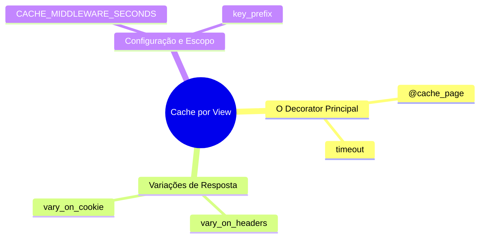
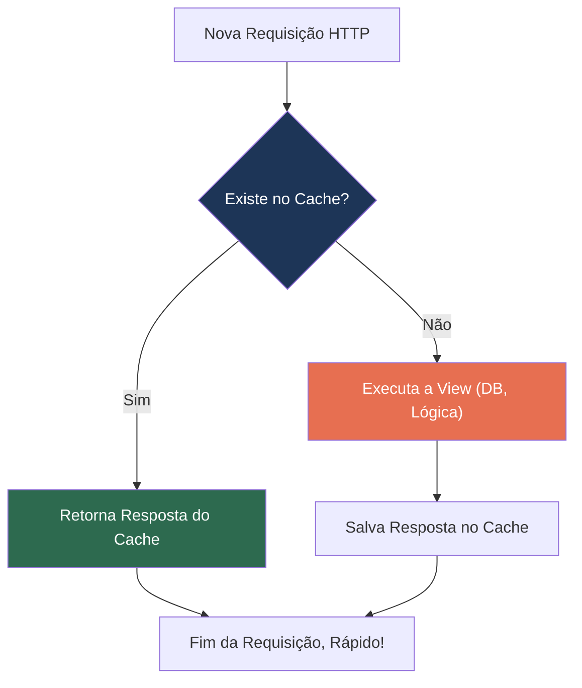
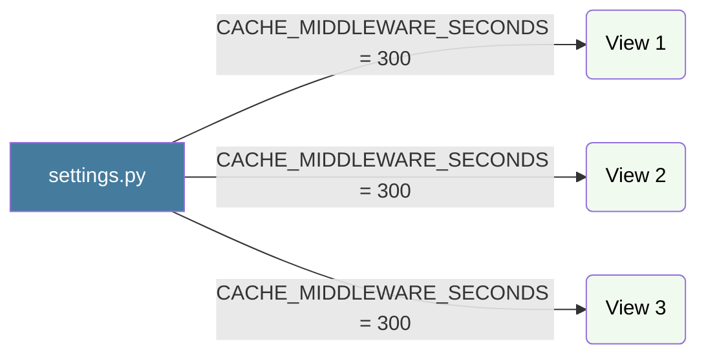
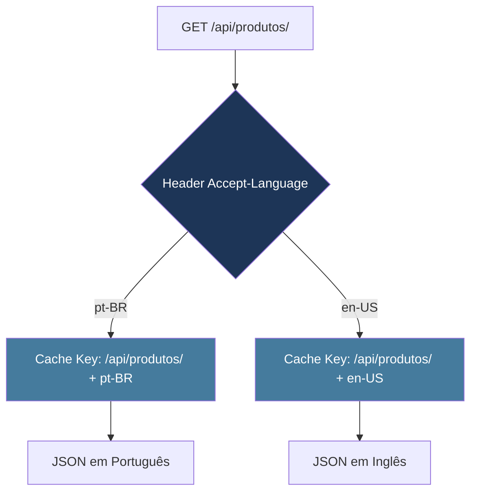
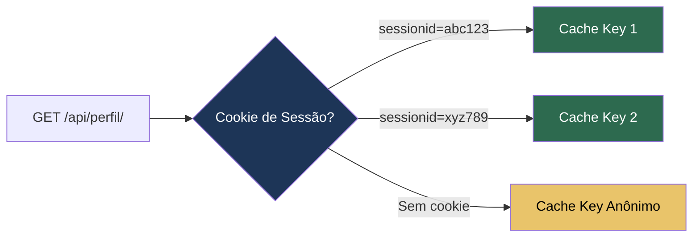
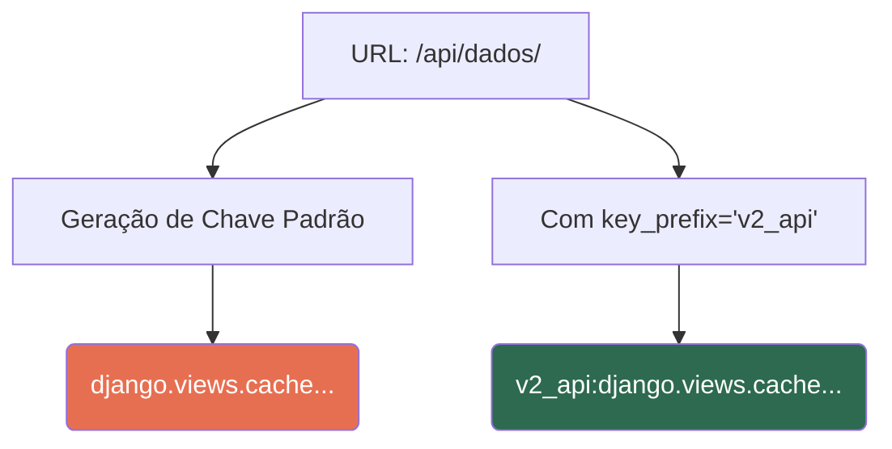
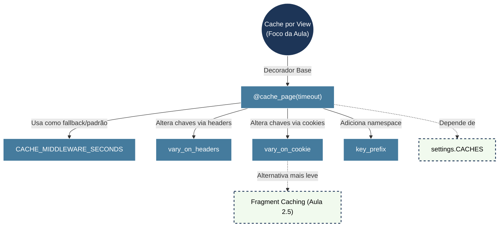
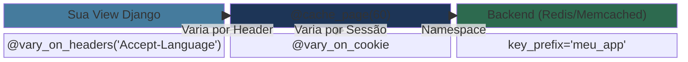

# 📘 Aula 2.4: Cache por view (per-view cache)

> **Módulo:** Módulo 2: O Framework de Cache do Django | **Nível:** 🟢 Fundamento
> **Tempo estimado:** ~45min de estudo focado | **Pré-requisitos:** API de baixo nível do cache (2.3), Configuração de Backends (2.2), Django REST Framework ou Django Ninja básicos, URLconf

---

## 📑 Índice

1. [Objetivo de Aprendizado](#-objetivo-de-aprendizado)
2. [Mapa da Aula](#-mapa-da-aula)
3. [Conceito: `@cache_page(timeout)`](#-conceito-cache_pagetimeout)
4. [Conceito: `CACHE_MIDDLEWARE_SECONDS`](#-conceito-cache_middleware_seconds)
5. [Conceito: `vary_on_headers`](#-conceito-vary_on_headers)
6. [Conceito: `vary_on_cookie`](#-conceito-vary_on_cookie)
7. [Conceito: `key_prefix`](#-conceito-key_prefix)
8. [Mapa de Conexões](#-mapa-de-conexões)
9. [Resumo Visual](#-resumo-visual)
10. [Teste seu Conhecimento](#-teste-seu-conhecimento)

---

## 🎯 Objetivo de Aprendizado

Ao concluir esta aula, você será capaz de:

- **Implementar** o cache de nível de view utilizando o decorator `@cache_page` para otimizar rotas específicas.
- **Diferenciar** respostas de cache baseadas em características do cliente (como idioma ou sessão) aplicando `vary_on_headers` e `vary_on_cookie`.
- **Organizar** chaves de cache em namespaces utilizando `key_prefix` para evitar colisões em ambientes complexos.
- **Diagnosticar** problemas de cache indevido em páginas dinâmicas e aplicar as variações corretas.

---

## 🗺️ Mapa da Aula



---

## 📖 Conceito: `@cache_page(timeout)`

### 💡 O que é

> 💬 **Analogia:** Pense no quadro de "Prato do Dia" de um restaurante. Em vez de o garçom ir à cozinha perguntar ao chef qual é o prato toda vez que um cliente chega, ele olha para o quadro que é atualizado apenas uma vez por hora. O `@cache_page` é o garçom anotando o resultado no quadro.

O decorator **`@cache_page`** é a principal ferramenta do Django para realizar cache no nível da view. Ele intercepta a **resposta HTTP** (incluindo respostas JSON de APIs) na primeira requisição e a **salva no backend de cache**. Nas requisições subsequentes para a mesma URL, o Django devolve a resposta cacheada diretamente, sem executar a lógica da view, serializers ou queries ao banco.

### ⚙️ Como funciona

Quando você decora uma view com `@cache_page(timeout)`, o Django cria uma chave de cache baseada na URL da requisição (incluindo query strings). O parâmetro obrigatório `timeout` define o tempo de vida (TTL - Time to Live) desse cache em segundos.

| Propriedade | Detalhe |
|:---|:---|
| **timeout** | Tempo em segundos que a resposta ficará em cache. |
| **cache** | Opcional. Especifica qual alias de cache usar (ex: `cache='redis'`). |
| **Gatilho** | A chave é gerada com base no caminho absoluto da URL e query params. |

### 📊 Diagrama



### 💻 Na Prática

**Com Django REST Framework (DRF):**

```python
# views.py (DRF — function-based view)
from django.views.decorators.cache import cache_page
from rest_framework.decorators import api_view
from rest_framework.response import Response
from .models import Artigo
from .serializers import ArtigoSerializer

# Cacheia a resposta JSON por 60 segundos (1 minuto)
@cache_page(60)
@api_view(['GET'])
def lista_artigos(request):
    # Esta query + serialização só será executada 1 vez por minuto
    artigos = Artigo.objects.all().order_by('-data_publicacao')
    serializer = ArtigoSerializer(artigos, many=True)
    
    # Verifique no terminal: este print só aparece 1x por minuto
    print("Executando a query no banco de dados...")
    
    return Response(serializer.data)
```

**Com Django Ninja:**

```python
# api.py (Django Ninja)
from django.views.decorators.cache import cache_page
from ninja import NinjaAPI, Router
from .models import Artigo
from .schemas import ArtigoSchema

api = NinjaAPI()
router = Router()

# ✅ Forma recomendada: passa o decorator no parâmetro decorators=[] da rota
@router.get(
    "/artigos/",
    response=list[ArtigoSchema],
    decorators=[cache_page(60)],  # Aplica o decorator de cache diretamente no endpoint
)
def lista_artigos(request):
    print("Executando a query no banco de dados...")
    return Artigo.objects.all().order_by('-data_publicacao')

api.add_router("/blog/", router)
```

```python
# urls.py (Alternativa: cachear toda a instância da NinjaAPI via URLconf)
from django.urls import path
from django.views.decorators.cache import cache_page
from .api import api

urlpatterns = [
    # Envolve toda a árvore de URLs do Ninja com cache de 60 segundos
    path("api/", cache_page(60)(api.urls)),
]
```

> [!NOTE]
> No Django Ninja, a forma mais idiomática e granular para aplicar decorators clássicos do Django (como `@cache_page` ou `@vary_on_headers`) é através do argumento `decorators=[...]` nos métodos de rota (`@router.get`, `@api.get`, etc.), passando uma lista de decorators.

### ⚠️ Armadilhas Comuns

- ❌ **Cache de endpoints autenticados sem variação**: Se sua API retorna `{"user": "João", "saldo": 1500}`, usar `@cache_page` sem `vary_on_headers('Authorization')` fará com que a Maria receba os dados do João. Em APIs com autenticação por Token/JWT, isso é um **vazamento de dados crítico**.
- ❌ **Ordem dos decorators no DRF**: No DRF com `@api_view`, o `@cache_page` deve vir **antes** (acima) do `@api_view`. Se inverter, o cache não funcionará porque o `@api_view` precisa processar a request primeiro.

---

## 📖 Conceito: `CACHE_MIDDLEWARE_SECONDS`

### 💡 O que é

> 💬 **Analogia:** É como a regra padrão de devolução de uma loja. "Se não especificado o contrário na etiqueta do produto, o prazo de devolução é de 30 dias".

**`CACHE_MIDDLEWARE_SECONDS`** é uma configuração global no `settings.py` que define o tempo de expiração padrão para o cache. Embora seja primariamente usado pelo cache de site inteiro (que veremos na próxima aula), é uma excelente prática utilizá-lo como valor padrão para as suas views em vez de espalhar números mágicos pelo código.

### ⚙️ Como funciona

Em vez de codificar "hardcoded" o valor `60` ou `3600` em múltiplos decorators `@cache_page`, você define a constante no `settings.py` e a importa nas suas views. Isso centraliza a configuração, permitindo alterar o tempo de cache do sistema inteiro alterando apenas uma linha.

| Propriedade | Detalhe |
|:---|:---|
| **Localização** | `settings.py` |
| **Tipo** | Inteiro (segundos) |

### 📊 Diagrama



### 💻 Na Prática

```python
# settings.py
CACHE_MIDDLEWARE_SECONDS = 60 * 15  # 15 minutos

# views.py (DRF)
from django.conf import settings
from django.views.decorators.cache import cache_page
from rest_framework.decorators import api_view
from rest_framework.response import Response

# Usando a configuração global para manter consistência entre endpoints
@cache_page(settings.CACHE_MIDDLEWARE_SECONDS)
@api_view(['GET'])
def dashboard_estatisticas(request):
    dados = calcular_estatisticas_pesadas()
    return Response({"metricas": dados, "periodo": "mensal"})
```

---

> [!TIP]
> 🧠 **Pare e Pense:** Na sua API, imagine que você tem endpoints com volatilidade muito diferente: `/api/cotacoes/` (muda a cada segundo), `/api/categorias/` (muda 1x por semana) e `/api/dashboard/` (atualiza a cada hora). Faz sentido usar `CACHE_MIDDLEWARE_SECONDS` para todos? Como você organizaria os TTLs — um valor global + overrides por endpoint, ou cada endpoint com seu próprio valor?

---

## 📖 Conceito: `vary_on_headers`

### 💡 O que é

> 💬 **Analogia:** Imagine uma máquina de venda de café que lembra do seu pedido anterior. Se o cache só guardasse "café", todo mundo receberia café expresso. Mas a máquina usa a sua *nacionalidade* (Header) para variar: os italianos recebem expresso, os americanos recebem café filtrado. É o mesmo URL/botão, mas a resposta varia com base em uma característica do solicitante.

O decorator **`vary_on_headers`** instrui o sistema de cache a criar **múltiplas versões** do cache para a mesma URL, baseando-se nos valores de determinados cabeçalhos HTTP (Headers).

### ⚙️ Como funciona

Sem ele, a URL `/api/produtos/` tem apenas uma chave de cache. Se o endpoint suporta content negotiation ou internacionalização baseada no header `Accept-Language`, o primeiro cliente a acessar (ex: `Accept: text/html`) criará um cache nesse formato. O próximo cliente pedindo `Accept: application/json` receberia HTML em vez de JSON!

O `vary_on_headers('Accept-Language')` diz ao Django: "Crie uma chave de cache diferente para cada valor desse header na mesma URL". Ele faz isso adicionando o cabeçalho `Vary` à resposta HTTP. Em APIs, os headers mais comuns para variar são `Accept` (content negotiation), `Accept-Language` (i18n) e `Authorization` (autenticação).

| Propriedade | Detalhe |
|:---|:---|
| **Alvo** | Cabeçalhos HTTP da requisição (ex: `Accept-Language`, `User-Agent`) |
| **Comportamento** | Modifica o header HTTP `Vary` da resposta. |

### 📊 Diagrama



### 💻 Na Prática

```python
# views.py (DRF)
from django.views.decorators.cache import cache_page
from django.views.decorators.vary import vary_on_headers
from rest_framework.decorators import api_view
from rest_framework.response import Response

# Cacheia por 1 hora, variando por idioma E por formato de resposta
@cache_page(60 * 60)
@vary_on_headers('Accept-Language', 'Accept')
@api_view(['GET'])
def listar_produtos(request):
    # O cache será armazenado separadamente para cada combinação
    # de idioma + formato (JSON, XML, etc.)
    produtos = Produto.objects.select_related('categoria').all()
    serializer = ProdutoSerializer(produtos, many=True)
    return Response(serializer.data)
```

> [!WARNING]
> Em APIs com autenticação por Token/JWT, considere usar `vary_on_headers('Authorization')` para que cada token gere sua própria entrada de cache. Sem isso, o usuário B pode receber a resposta cacheada do usuário A.

### ⚠️ Armadilhas Comuns

- ❌ **Vary no User-Agent**: Fazer `vary_on_headers('User-Agent')` pode destruir a eficácia do seu cache. Existem milhares de `User-Agents` diferentes. Isso criará milhares de chaves de cache para o mesmo endpoint, consumindo memória do Redis/Memcached (Cache Explosion).
- ❌ **Vary no Authorization com JWT**: Se seus tokens JWT mudam frequentemente (refresh a cada 5 min), o `vary_on_headers('Authorization')` criará uma nova entrada de cache a cada refresh — mesmo para o mesmo usuário. Avalie se o benefício do cache justifica o consumo de memória.

---

## 📖 Conceito: `vary_on_cookie`

### 💡 O que é

> 💬 **Analogia:** Um bar VIP onde a senha da porta não muda, mas a pulseira (cookie) que o cliente usa determina qual cardápio de bebidas ele recebe do garçom (cache).

Assim como o `vary_on_headers`, o **`vary_on_cookie`** cria versões diferentes do cache, mas usa o cabeçalho `Cookie`. É equivalente a aplicar `vary_on_headers('Cookie')`.

### ⚙️ Como funciona

Em APIs, é relevante quando o endpoint utiliza **autenticação por sessão** (cookies de `sessionid` e `csrftoken` enviados pelo navegador). O Django usará a string completa dos cookies para compor a chave de cache. Se sua API usa autenticação por **Token/JWT no header Authorization**, o `vary_on_cookie` **não é o que você precisa** — use `vary_on_headers('Authorization')` em vez disso.

| Propriedade | Detalhe |
|:---|:---|
| **Uso principal** | Variação de cache baseada em sessão/autenticação. |
| **Risco** | Alta granularidade de chaves se os cookies mudarem muito. |

### 📊 Diagrama



### 💻 Na Prática

```python
# views.py (DRF — autenticação por sessão)
from django.views.decorators.cache import cache_page
from django.views.decorators.vary import vary_on_cookie
from rest_framework.decorators import api_view, authentication_classes
from rest_framework.authentication import SessionAuthentication
from rest_framework.response import Response

# Use vary_on_cookie quando a API usa SessionAuthentication (cookies)
@cache_page(60 * 15)
@vary_on_cookie
@api_view(['GET'])
@authentication_classes([SessionAuthentication])
def feed_personalizado(request):
    # Cada sessão (cookie) terá seu próprio cache
    noticias = obter_feed_do_usuario(request.user)
    return Response({"feed": noticias})
```

> [!NOTE]
> Se sua API usa **TokenAuthentication** ou **JWT** (sem cookies), o `vary_on_cookie` não terá efeito útil. Nesse caso, use `vary_on_headers('Authorization')` para isolar o cache por token de autenticação.

---

> [!TIP]
> 🧠 **Pare e Pense:** Sua API tem 10.000 usuários ativos simultâneos. Se você usar `vary_on_cookie` (ou `vary_on_headers('Authorization')`), terá 10.000 entradas de cache por endpoint. Com 20 endpoints cacheados, são 200.000 chaves no Redis. Considerando que cada resposta JSON ocupa ~5KB, quanto de memória RAM o Redis consumirá? Faz sentido cachear endpoints cujos dados são 100% personalizados, ou seria melhor cachear apenas as queries pesadas com `cache.get_or_set()` (Aula 2.3)?

---

## 📖 Conceito: `key_prefix`

### 💡 O que é

> 💬 **Analogia:** Imagine usar um grande armazém alugado com várias empresas. Para não confundir as caixas da "Sua Empresa" com as da "Empresa do Vizinho", você cola um adesivo (prefixo) verde com o seu nome em todas as suas caixas.

O parâmetro **`key_prefix`** permite adicionar uma string personalizada ao início da chave de cache gerada pelo Django para aquela view específica.

### ⚙️ Como funciona

O Django já cria chaves complexas (ex: `views.decorators.cache.cache_header...`), mas ao usar `key_prefix`, você injeta um namespace. Isso é extremamente útil para:
1. Compartilhar o mesmo servidor Redis entre múltiplos projetos/ambientes (embora a configuração `KEY_PREFIX` no `settings.py` resolva isso globalmente).
2. **Invalidação seletiva**: Se você sabe o prefixo, é mais fácil identificar a qual view aquela chave pertence para debug ou limpeza.
3. Versionamento forçado da view (ex: `key_prefix='v2'`).

| Propriedade | Detalhe |
|:---|:---|
| **Onde usar** | Argumento do decorator `@cache_page`. |
| **Vantagem** | Previne colisões e facilita o gerenciamento de chaves. |

### 📊 Diagrama



### 💻 Na Prática

```python
# views.py (DRF)
from django.views.decorators.cache import cache_page
from rest_framework.decorators import api_view
from rest_framework.response import Response

# Prefixo 'relatorios_v2' facilita encontrar e invalidar no Redis
@cache_page(60 * 60, key_prefix="relatorios_v2")
@api_view(['GET'])
def relatorio_financeiro(request):
    dados = gerar_relatorio_pesado()
    return Response({"relatorio": dados, "gerado_em": str(timezone.now())})

# No Redis CLI, você pode inspecionar:
# redis-cli KEYS "*relatorios_v2*"
```

```python
# Também funciona no settings.py como prefixo global
# settings.py
CACHES = {
    'default': {
        'BACKEND': 'django.core.cache.backends.redis.RedisCache',
        'LOCATION': 'redis://127.0.0.1:6379/1',
        'KEY_PREFIX': 'minha_api',  # Prefixo global para TODAS as chaves
    }
}
```

---

## 🔗 Mapa de Conexões



O `@cache_page` é o coração do cache em rotas, dependendo diretamente da configuração `CACHES` definida na aula anterior. Para evitar que conteúdos errados sejam mostrados, utilizamos os moduladores `vary_on_headers` e `vary_on_cookie`, que multiplicam o comportamento da view baseada no cliente. Por fim, o `key_prefix` atua na organização estrutural de como essas chaves são salvas no banco em memória.

---

## 📊 Resumo Visual

### Síntese em Um Olhar



### ✅ Checklist: O que devo saber

- [ ] Aplicar o decorator `@cache_page(timeout)` em funções de view.
- [ ] Importar e usar `settings.CACHE_MIDDLEWARE_SECONDS` para padronizar TTLs.
- [ ] Utilizar `vary_on_headers` quando a página mudar com base no idioma (`Accept-Language`).
- [ ] Entender que `vary_on_cookie` cria uma cópia de cache para cada usuário/sessão.
- [ ] Reconhecer o perigo de "Cache Explosion" ao variar por headers muito dinâmicos como o `User-Agent`.
- [ ] Injetar namespaces customizados usando o parâmetro `key_prefix`.

---

## 🧪 Teste seu Conhecimento

### Questões Conceituais

**1. O que acontece internamente quando uma view decorada com `@cache_page(60)` recebe uma requisição na qual o cache já expirou?**
<details>
<summary>🔍 Ver resposta</summary>
O Django percebe que houve um "Cache Miss" (ou expiração). Ele encaminhará a requisição normalmente para o interior da view, executará toda a lógica (incluindo queries ao DB), capturará a resposta gerada e, antes de enviá-la ao cliente, salvará essa nova resposta no cache com um TTL de 60 segundos.
</details>

---

**2. Qual é a principal diferença prática entre usar `vary_on_cookie` e não usar nada em uma página que exibe os dados de perfil do usuário logado?**
<details>
<summary>🔍 Ver resposta</summary>
Sem `vary_on_cookie`, o primeiro usuário que acessar a página fará o cache do seu próprio perfil. Qualquer usuário que acessar nos próximos `X` segundos verá os dados do primeiro usuário (vazamento de dados). Usando `vary_on_cookie`, o Django criará um cache separado e seguro para cada usuário logado (cada cookie de sessão).
</details>

---

### Questões Práticas / Cenários

**3. Cenário:** Sua API DRF tem um endpoint `GET /api/produtos/` decorado com `@cache_page(600)`. O frontend React envia um header customizado `X-Loja-ID` para indicar de qual filial os produtos devem ser listados. Após o deploy, os clientes da filial 2 estão vendo os produtos da filial 1.
**Como corrigir isso?**
<details>
<summary>🔍 Ver resposta</summary>
Você precisa adicionar o decorator de variação para que o cache considere o header da filial:

```python
@cache_page(600)
@vary_on_headers('X-Loja-ID')
@api_view(['GET'])
def listar_produtos(request):
    loja_id = request.headers.get('X-Loja-ID', 1)
    produtos = Produto.objects.filter(loja_id=loja_id)
    ...
```

Isso fará o Django criar uma chave de cache diferente para cada valor de `X-Loja-ID`.
</details>

---

**4. 🚨 PEGADINHA:**
Você tem um endpoint DRF que processa uma query complexa. Você deseja usar a configuração global de tempo. O código abaixo funcionará perfeitamente?

```python
from django.views.decorators.cache import cache_page
from rest_framework.decorators import api_view
from rest_framework.response import Response

@cache_page(CACHE_MIDDLEWARE_SECONDS)
@api_view(['GET'])
def relatorio_diario(request):
    return Response({"dados": calcular_relatorio()})
```

<details>
<summary>🔍 Ver resposta</summary>
**Não, lançará um erro `NameError`.**
Você precisa importar as settings do Django para acessar `CACHE_MIDDLEWARE_SECONDS`. O correto é:
```python
from django.conf import settings
from django.views.decorators.cache import cache_page
from rest_framework.decorators import api_view
from rest_framework.response import Response

@cache_page(settings.CACHE_MIDDLEWARE_SECONDS)
@api_view(['GET'])
def relatorio_diario(request):
    return Response({"dados": calcular_relatorio()})
```
</details>

---

**5. Cenário:** Você administra dois sites Django (`loja.com.br` e `blog.com.br`) que compartilham o mesmo servidor Redis como backend de cache. Ambos os sites possuem uma view em `/destaque/` decorada com `@cache_page(120)`. Após o deploy, você percebe que a página de destaques do blog está exibindo os produtos da loja. O que está acontecendo e como resolver?

<details>
<summary>🔍 Ver resposta</summary>

**O problema é colisão de chaves de cache.** Como ambos os sites usam o mesmo backend Redis e a mesma URL `/destaque/`, o Django gera a mesma chave de cache para ambos. O primeiro site que acessa a view salva sua resposta no cache, e o segundo site lê essa mesma entrada cacheada.

**A solução é usar `key_prefix`** para criar namespaces distintos:

```python
# No site da loja (settings.py)
CACHES = {
    'default': {
        'BACKEND': 'django.core.cache.backends.redis.RedisCache',
        'LOCATION': 'redis://127.0.0.1:6379/1',
        'KEY_PREFIX': 'loja',
    }
}

# No site do blog (settings.py)
CACHES = {
    'default': {
        'BACKEND': 'django.core.cache.backends.redis.RedisCache',
        'LOCATION': 'redis://127.0.0.1:6379/1',
        'KEY_PREFIX': 'blog',
    }
}
```

Alternativamente, pode-se usar o parâmetro `key_prefix` diretamente no decorator: `@cache_page(120, key_prefix='loja')`.

</details>

---

### 🏋️ Desafio de Aplicação

**Objetivo:** Criar um endpoint DRF cacheado e comprovar o funcionamento com variação por header.

**O que fazer (Tempo estimado: 20 min):**
1. Crie um endpoint DRF simples com `@api_view(['GET'])` que retorne um JSON com a hora exata incluindo milissegundos (`datetime.datetime.now().isoformat()`).
2. Decore com `@cache_page(30)` e registre a URL no `urls.py`.
3. Use o **terminal** com `curl` ou o **Postman/Insomnia** para fazer várias requisições GET. Verifique que o timestamp "congela" por 30 segundos.
4. Agora adicione `@vary_on_headers('Authorization')` à view.
5. Faça duas requisições com tokens/headers diferentes:
   - `curl -H "Authorization: Token abc123" http://localhost:8000/api/hora/`
   - `curl -H "Authorization: Token xyz789" http://localhost:8000/api/hora/`
6. **Resultado esperado:** Cada token receberá um timestamp "congelado" diferente, provando que o Django criou entradas de cache isoladas por `Authorization`.
