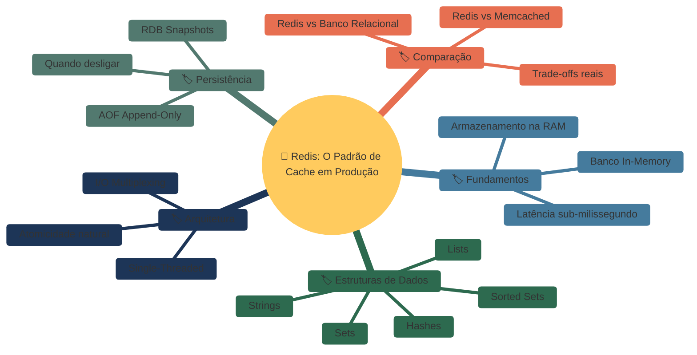
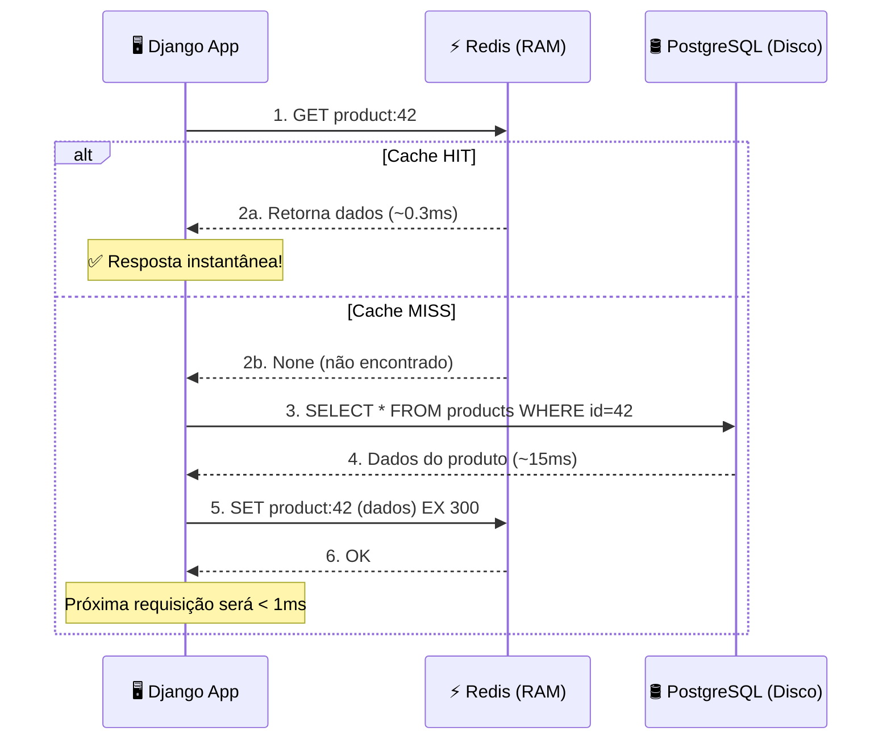
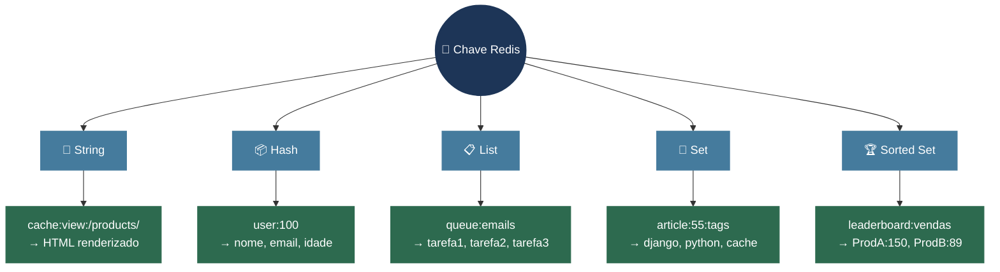
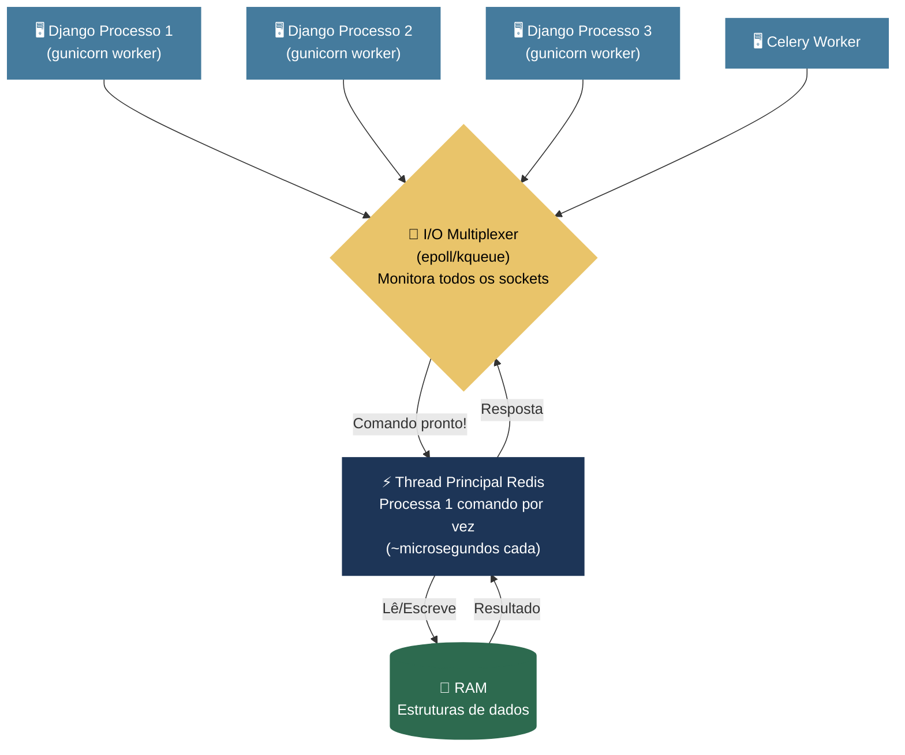
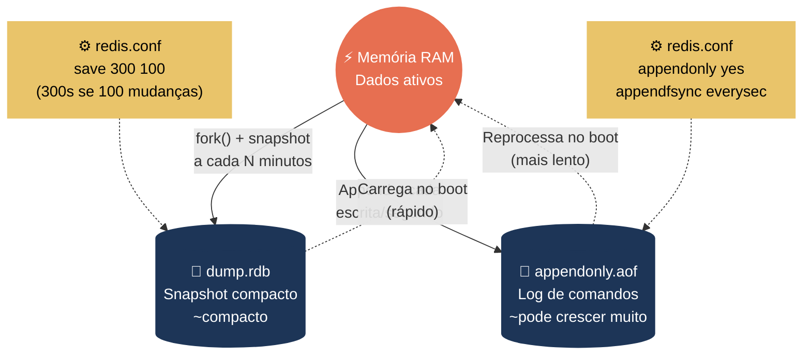
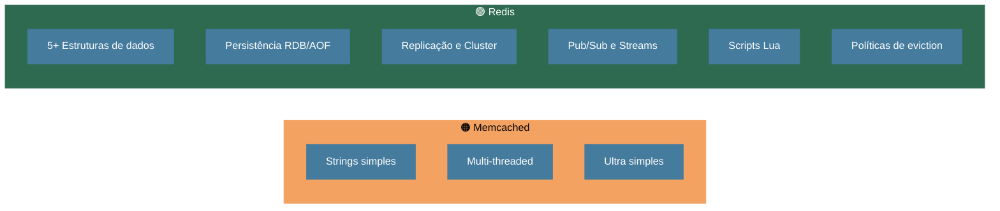
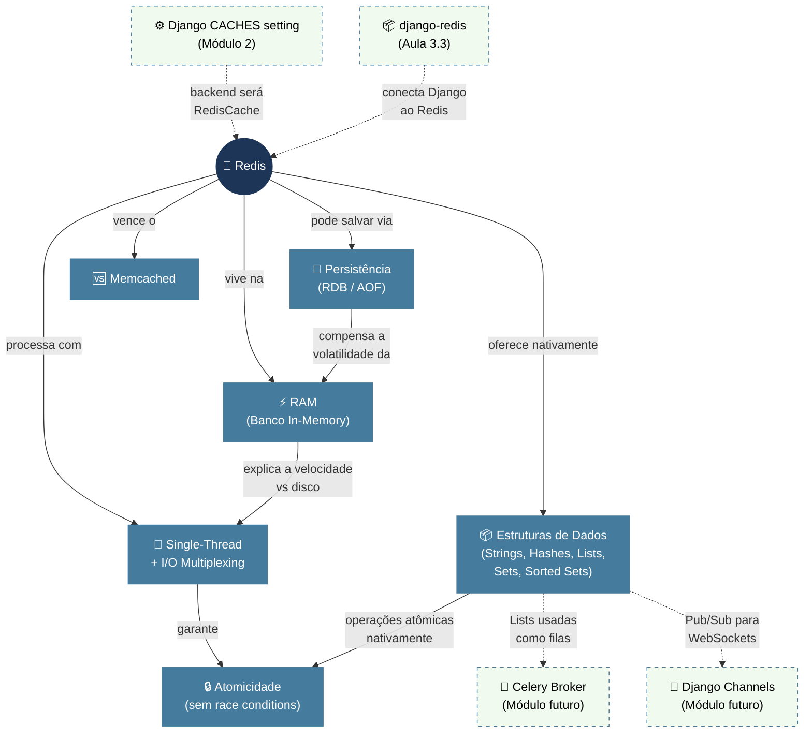
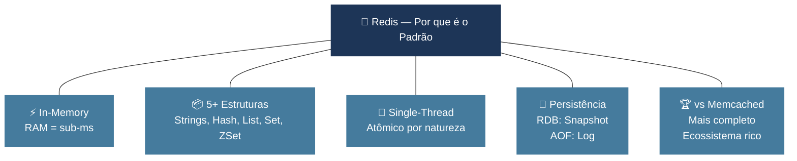

# 📘 Aula 3.1: O que é Redis e por que ele é o padrão

> **Módulo:** Módulo 3: Redis — Seu Backend de Cache em Produção | **Nível:** 🟡 Intermediário
> **Tempo estimado:** ~50min de estudo focado | **Pré-requisitos:** Cache (hit/miss, TTL, stale data), API do Django (`cache.set()`, `cache.get()`, `cache.delete()`), backends LocMemCache/DatabaseCache/FileBasedCache, `@cache_page()`

---

## 📑 Índice

1. [🎯 Objetivo de Aprendizado](#-objetivo-de-aprendizado)
2. [🗺️ Mapa da Aula](#️-mapa-da-aula)
3. [📖 Conceito: Banco In-Memory — O Segredo da Velocidade](#-conceito-banco-in-memory--o-segredo-da-velocidade)
4. [📖 Conceito: Estruturas de Dados Nativas do Redis](#-conceito-estruturas-de-dados-nativas-do-redis)
5. [📖 Conceito: Modelo Single-Threaded e I/O Multiplexing](#-conceito-modelo-single-threaded-e-io-multiplexing)
6. [📖 Conceito: Persistência Opcional — RDB e AOF](#-conceito-persistência-opcional--rdb-e-aof)
7. [📖 Conceito: Redis vs Memcached — Trade-offs](#-conceito-redis-vs-memcached--trade-offs)
8. [🔗 Mapa de Conexões](#-mapa-de-conexões)
9. [📊 Resumo Visual](#-resumo-visual)
10. [🧪 Teste seu Conhecimento](#-teste-seu-conhecimento)

---

## 🎯 Objetivo de Aprendizado

Ao concluir esta aula, você será capaz de:

- **Explicar** com precisão técnica por que o Redis é ordens de grandeza mais rápido que um banco de dados relacional para operações de cache, diferenciando acesso à RAM versus acesso a disco
- **Identificar** qual estrutura de dados nativa do Redis (String, Hash, List, Set, Sorted Set) é mais adequada para diferentes cenários reais de aplicação
- **Justificar** por que o modelo single-threaded do Redis, combinado com I/O Multiplexing, garante altíssima performance sem os gargalos de concorrência de sistemas multi-threaded
- **Comparar** os mecanismos de persistência RDB e AOF, decidindo quando habilitar ou desabilitar cada um conforme o uso (cache puro vs dados críticos)
- **Argumentar** tecnicamente por que o Redis se tornou o padrão da indústria sobre o Memcached, listando pelo menos duas vantagens concretas

---

## 🗺️ Mapa da Aula



---

## 📖 Conceito: Banco In-Memory — O Segredo da Velocidade

### 💡 O que é

> 💬 **Analogia:** Imagine que você está estudando para uma prova. Os livros da estante do outro lado do quarto são o seu **banco relacional** — para consultar qualquer informação, você precisa levantar da cadeira, caminhar até a estante, procurar o livro certo, folhear até a página, ler, e voltar. A **mesa de estudos** bem à sua frente, com fichas de resumo abertas e organizadas, é o Redis. O acesso é instantâneo: basta olhar para baixo. A diferença entre ir à estante (disco) e olhar a mesa (RAM) é exatamente a diferença de performance entre PostgreSQL e Redis para operações de leitura de cache.

Redis significa **Remote Dictionary Server** — um servidor de dicionário remoto. Na prática, é um **banco de dados in-memory**, ou seja, ele armazena todos os seus dados primariamente na **Memória RAM** do servidor. Isso é fundamentalmente diferente de bancos relacionais como PostgreSQL ou MySQL, que gravam e leem dados do **disco** (SSD/HDD). A latência de acesso à RAM é medida em **nanossegundos**, enquanto no disco é medida em **milissegundos** — uma diferença de várias ordens de grandeza.

Para contextualizar: nos módulos anteriores, você trabalhou com backends de cache do Django como `LocMemCache` (memória local do processo) e `DatabaseCache` (tabela no banco). O `LocMemCache` é rápido mas não compartilha cache entre processos do servidor; o `DatabaseCache` compartilha mas acessa o disco. O Redis combina o melhor dos dois mundos: velocidade de memória RAM **com** compartilhamento entre todos os processos e servidores da sua aplicação.

### ⚙️ Como funciona

Quando o seu aplicativo Django faz uma query no PostgreSQL, acontece uma sequência complexa: o banco precisa parsear a SQL, criar um plano de execução, buscar os blocos de dados no disco (ou no buffer cache do próprio banco, se houver sorte), montar o resultado e devolver pela rede. Quando você consulta o Redis, ele simplesmente vai no **endereço de memória** correspondente à sua chave e retorna o valor — sem parsing SQL, sem plano de execução, sem I/O de disco.

| Propriedade | Detalhe |
|:---|:---|
| **Latência típica** | Sub-milissegundo (frequentemente < 0.5ms). Uma query simples no PostgreSQL pode levar 5-50ms |
| **Throughput** | Facilmente > 100.000 operações/segundo em um único servidor |
| **Capacidade** | Limitada pela quantidade de RAM do servidor (tipicamente GB, não TB como discos) |
| **Custo por GB** | RAM é ~10x mais cara que SSD — por isso Redis é para **hot data**, não para tudo |
| **Modelo de dados** | Chave-valor com estruturas de dados ricas (não é SQL) |
| **Uso principal** | Cache, sessões de usuário, filas de mensagens, contadores em tempo real, pub/sub |

### 📊 Diagrama



### 💻 Na Prática

Para sentir a velocidade na pele, conecte-se ao Redis pelo terminal com `redis-cli`:

```bash
# Conectar ao Redis local
$ redis-cli

# Armazenar um valor simples com TTL de 60 segundos
127.0.0.1:6379> SET user:10:name "Leonardo" EX 60
OK

# Recuperar instantaneamente
127.0.0.1:6379> GET user:10:name
"Leonardo"

# Verificar quanto tempo falta para expirar
127.0.0.1:6379> TTL user:10:name
(integer) 57

# Após 60 segundos...
127.0.0.1:6379> GET user:10:name
(nil)
```

Na sua aplicação Django, usando o `django-redis` como backend (que você configurará na próxima aula), a diferença é dramática. Uma view que antes levava 200ms consultando o PostgreSQL passa a responder em 2ms quando servida do cache Redis — uma melhoria de **100x**.

### ⚠️ Armadilhas Comuns

- ❌ **Tentar espelhar o banco inteiro no Redis**: Como a RAM é cara e finita, o Redis deve guardar apenas os dados **frequentemente acessados** (hot data). Se seu banco PostgreSQL tem 50GB, não tente colocar tudo no Redis. Pense no Redis como a mesa de estudos com as fichas mais importantes — não como uma segunda estante
- ❌ **Assumir que o Redis substitui o banco relacional**: O Redis não tem JOINs, constraints de integridade referencial, nem transações ACID completas no sentido relacional. Ele é um **complemento** ao PostgreSQL, não um substituto

---

Agora que você entende *por que* o Redis é tão rápido — ele vive na RAM — uma pergunta natural surge: "Se é apenas chave-valor em memória, qual a diferença para um simples dicionário Python?". A resposta está nas **estruturas de dados nativas** que o Redis oferece, e é isso que o torna muito mais que um cache burro.

---

## 📖 Conceito: Estruturas de Dados Nativas do Redis

### 💡 O que é

> 💬 **Analogia:** Um cache chave-valor simples (como o Memcached) é como ter um armário de fichário: você coloca um papel numa gaveta com uma etiqueta e depois pega de volta. Só isso. O Redis é como uma **oficina de marcenaria profissional**: além do fichário, você tem caixas de ferramentas organizadas por tipo (Hashes), esteiras de produção onde as peças entram numa ponta e saem na outra (Lists), quadros com post-its sem repetição (Sets), e rankings de produtividade ordenados automaticamente (Sorted Sets). Cada compartimento entende *o que está dentro* e oferece operações especializadas.

O grande diferencial do Redis em relação a caches simples é que ele funciona como um **Data Structures Server** (servidor de estruturas de dados). Ele não armazena apenas strings cruas — ele entende e manipula **cinco tipos principais de estruturas de dados** nativamente. Isso significa que operações como "adicionar um item a uma lista", "incrementar um contador" ou "pegar os top 10 de um ranking" acontecem **dentro do Redis**, de forma **atômica**, sem precisar trazer o dado para o Python, modificar e enviar de volta.

### ⚙️ Como funciona

O Redis suporta cinco estruturas fundamentais. Cada chave no Redis aponta para um valor que é uma dessas estruturas:

| Estrutura | O que é | Comandos-Chave | Cenário de Uso Real |
|:---|:---|:---|:---|
| **Strings** | Valor simples — texto, JSON serializado ou número. Até 512MB | `SET`, `GET`, `INCR`, `DECR`, `MGET` | Cache de HTML renderizado, contadores atômicos (visitas de uma página), armazenamento de JSON serializado (`serializer.data`) |
| **Hashes** | Mapeamento campo→valor, como um dicionário Python | `HSET`, `HGET`, `HGETALL`, `HDEL`, `HINCRBY` | Perfil de usuário (`user:100` → `{nome, email, idade}`), metadados de sessão, configurações por tenant |
| **Lists** | Coleção ordenada (por inserção) de strings, baseada em linked list | `LPUSH`, `RPUSH`, `LPOP`, `RPOP`, `LRANGE` | Filas de tarefas (Celery usa Lists!), timeline/feed recente, histórico de ações |
| **Sets** | Coleção não-ordenada de strings **únicas** (sem repetição) | `SADD`, `SMEMBERS`, `SINTER`, `SUNION`, `SCARD` | Tags únicas de um artigo, tracking de IPs únicos, amigos em comum (interseção de dois Sets) |
| **Sorted Sets** | Como Sets, mas cada elemento tem um **score** numérico que define a ordem | `ZADD`, `ZRANGE`, `ZREVRANGE`, `ZINCRBY`, `ZRANK` | Leaderboards/rankings, agendamento por timestamp, "Top 10 mais vendidos" |

### 📊 Diagrama



### 💻 Na Prática

Via `redis-cli`, manipulando diferentes estruturas — copie e teste no seu terminal:

```bash
# ══════════════════════════════════════════════
# STRING — Cache de resposta serializada
# ══════════════════════════════════════════════
127.0.0.1:6379> SET cache:product:42 '{"id":42,"nome":"Teclado","preco":299.90}' EX 300
OK
127.0.0.1:6379> GET cache:product:42
"{\"id\":42,\"nome\":\"Teclado\",\"preco\":299.90}"

# Contador atômico — incrementa sem race condition
127.0.0.1:6379> SET stats:views:article:7 0
OK
127.0.0.1:6379> INCR stats:views:article:7
(integer) 1
127.0.0.1:6379> INCR stats:views:article:7
(integer) 2

# ══════════════════════════════════════════════
# HASH — Perfil de usuário como "mini-objeto"
# ══════════════════════════════════════════════
127.0.0.1:6379> HSET user:100 username "leonardo" email "leo@example.com" role "admin"
(integer) 3
127.0.0.1:6379> HGET user:100 email
"leo@example.com"
127.0.0.1:6379> HGETALL user:100
1) "username"
2) "leonardo"
3) "email"
4) "leo@example.com"
5) "role"
6) "admin"

# ══════════════════════════════════════════════
# LIST — Fila de tarefas (como o Celery faz)
# ══════════════════════════════════════════════
127.0.0.1:6379> LPUSH queue:emails "enviar_boas_vindas:user:101"
(integer) 1
127.0.0.1:6379> LPUSH queue:emails "enviar_relatorio:user:50"
(integer) 2
# Worker consome da outra ponta (FIFO)
127.0.0.1:6379> RPOP queue:emails
"enviar_boas_vindas:user:101"

# ══════════════════════════════════════════════
# SORTED SET — Ranking em tempo real
# ══════════════════════════════════════════════
127.0.0.1:6379> ZADD leaderboard:vendas 150 "Teclado Mecânico"
(integer) 1
127.0.0.1:6379> ZADD leaderboard:vendas 89 "Mouse Gamer"
(integer) 1
127.0.0.1:6379> ZADD leaderboard:vendas 230 "Monitor 4K"
(integer) 1
# Top 3 mais vendidos (ordem decrescente)
127.0.0.1:6379> ZREVRANGE leaderboard:vendas 0 2 WITHSCORES
1) "Monitor 4K"
2) "230"
3) "Teclado Mec\xc3\xa2nico"
4) "150"
5) "Mouse Gamer"
6) "89"
```

No contexto do Django, quando você usa `django-redis` como backend de cache, por baixo dos panos o framework serializa seus objetos Python (usando `pickle` por padrão) e armazena como **Strings**. Mas é importante saber que as outras estruturas existem porque ferramentas como **Celery** (filas de tarefas), **Django Channels** (WebSockets), e soluções customizadas de rate limiting usam ativamente Hashes, Lists e Sorted Sets.

### ⚠️ Armadilhas Comuns

- ❌ **Trazer para o Python, modificar, e salvar de volta**: Um erro clássico é fazer `cache.get("minha_lista")`, fazer `.append()` no Python, e `cache.set("minha_lista", lista)`. Se dois processos fazem isso ao mesmo tempo, um sobrescreve o outro (**Race Condition**). Use os comandos nativos atômicos do Redis (`LPUSH`, `INCR`, `SADD`) que garantem atomicidade sem locks
- ❌ **Ignorar que existe mais do que Strings**: Muitos desenvolvedores Django só usam `cache.set(key, value)` e nunca exploram Hashes ou Sorted Sets. Para cenários como "Top 10 produtos mais vistos", um Sorted Set com `ZINCRBY` é ordens de grandeza mais eficiente do que serializar/deserializar uma lista inteira a cada acesso

---

> [!TIP]
> 🧠 **Pare e Pense:** Você precisa implementar um sistema de "Pesquisas recentes" para cada usuário da sua API: quando o usuário busca algo, o termo é salvo, e a API retorna as últimas 10 pesquisas daquele usuário. Qual estrutura de dados do Redis você escolheria — e por que não usaria simplesmente uma String com uma lista JSON serializada?

---

Até aqui, você sabe que o Redis é rápido porque vive na RAM e é poderoso porque tem estruturas de dados ricas. Mas uma pergunta intrigante permanece: se performance é o objetivo, por que o Redis **não** usa múltiplas threads para aproveitar todos os núcleos do processador? A resposta é surpreendente e revela uma decisão arquitetural brilhante.

---

## 📖 Conceito: Modelo Single-Threaded e I/O Multiplexing

### 💡 O que é

> 💬 **Analogia:** Pense em duas abordagens para gerenciar o caixa de um restaurante fast-food. A abordagem **multi-threaded** é colocar 8 atendentes no mesmo balcão: eles trombam um no outro, disputam a máquina de cartão, precisam de regras rígidas sobre quem atende quem (locks), e o gerente perde tempo coordenando a equipe. A abordagem **single-threaded do Redis** é ter um único atendente *absurdamente rápido*, com uma esteira organizadora que traz os pedidos já prontos para ele processar. Como cada pedido leva microssegundos (está tudo na memória), a fila anda mais rápido que 8 atendentes tropeçando uns nos outros.

O Redis processa todos os comandos em uma **única thread principal** (single-threaded). Isso significa que, a qualquer momento, apenas **um comando** está sendo executado. Parece contraintuitivo para um sistema de alta performance, mas é exatamente isso que torna o Redis tão eficiente e confiável.

### ⚙️ Como funciona

O segredo está em entender **onde está o gargalo real**. Em um banco de dados tradicional baseado em disco, a CPU frequentemente espera o disco terminar de ler/escrever dados — o I/O de disco é o gargalo, e múltiplas threads ajudam porque uma thread pode processar enquanto outra espera o disco. No Redis, **tudo está na RAM**, então cada operação leva nanossegundos de CPU. O gargalo real é a **rede** (receber/enviar dados dos clientes), não o processamento.

Para lidar com milhares de conexões de rede simultâneas sem bloquear, o Redis usa uma técnica chamada **I/O Multiplexing** (via `epoll` no Linux ou `kqueue` no macOS). Essa técnica permite que o sistema operacional monitore milhares de sockets de rede de uma vez e avise a thread do Redis apenas quando um socket tem dados prontos para leitura. Assim:

1. O Redis nunca fica "parado esperando" dados de um cliente
2. Quando um comando chega pronto, ele é executado atomicamente em microssegundos
3. A resposta é enviada e o próximo comando da fila é processado

| Propriedade | Detalhe |
|:---|:---|
| **Throughput** | > 100.000 operações/segundo em um único core |
| **Atomicidade** | Garantida por natureza — não há dois comandos rodando ao mesmo tempo |
| **Sem locks** | Não existe deadlock, livelock, ou race condition interna |
| **I/O Multiplexing** | `epoll`/`kqueue` gerencia milhares de conexões simultâneas sem bloquear |
| **Threads auxiliares** | Redis 6+ usa threads auxiliares para I/O de rede (ler/escrever sockets), mas o processamento de comandos continua single-threaded |

### 📊 Diagrama



### ⚠️ Armadilhas Comuns

- ❌ **Rodar comandos O(N) demorados em produção**: Este é o perigo **mais crítico** do modelo single-threaded. Se você executar `KEYS *` num Redis com 10 milhões de chaves, o Redis vai congelar processando esse único comando e **todas as outras requisições** de todos os processos Django e workers Celery ficam na fila esperando. Use `SCAN` (que processa em lotes incrementais) em vez de `KEYS` em produção
- ❌ **Achar que single-threaded = lento**: A intuição diz que "mais threads = mais rápido", mas isso só é verdade quando o gargalo é CPU ou I/O de disco. Quando tudo está na RAM e cada operação leva microssegundos, uma thread sem locks é mais rápida que várias threads disputando recursos

---

> [!TIP]
> 🧠 **Pare e Pense:** Se o Redis processa comandos um por vez em uma única thread, como é possível que ele atinja mais de 100.000 operações por segundo? Faça as contas: se cada operação leva ~10 microssegundos, quantas cabem em 1 segundo? E agora reflita: por que rodar `KEYS *` em 10 milhões de chaves quebraria tudo, mas 100.000 comandos `GET` simples não quebram?

---

Você agora entende que o Redis é rápido (in-memory), versátil (estruturas de dados) e seguro (single-threaded = atômico). Mas uma preocupação legítima aparece: se está tudo na RAM e o servidor reiniciar, **perde tudo**? A resposta é: depende. O Redis oferece mecanismos opcionais de persistência.

---

## 📖 Conceito: Persistência Opcional — RDB e AOF

### 💡 O que é

> 💬 **Analogia:** Imagine que você está preenchendo um quadro branco numa reunião. O modo **RDB** (Snapshot) é como tirar uma foto do quadro a cada 30 minutos — se alguém apagar o quadro entre duas fotos, você perde o que foi escrito nos últimos 29 minutos, mas recupera tudo que estava na última foto. O modo **AOF** (Append-Only File) é como ter uma secretária anotando em um caderno cada palavra que você escreve no quadro, em tempo real — se o quadro for apagado, ela relê o caderno inteiro e reescreve tudo. Mais seguro, mas o caderno fica gigante.

Como banco in-memory, por padrão o Redis é **volátil** — se o processo do Redis for encerrado ou o servidor reiniciar, todos os dados na RAM desaparecem. Mas, diferentemente do Memcached (que é 100% volátil), o Redis oferece **dois mecanismos opcionais** para persistir dados no disco, permitindo que ele sobreviva a reboots.

O ponto crucial para o seu contexto: quando usamos Redis **puramente como cache** no Django, a persistência geralmente é **desnecessária** — afinal, se o cache for perdido, o Django simplesmente recalcula os dados a partir do PostgreSQL. Mas entender a persistência é essencial porque o Redis também pode ser usado para sessões de usuário, filas do Celery e outros dados que você não quer perder.

### ⚙️ Como funciona

O Redis oferece dois modos de persistência, que podem ser usados individualmente ou **combinados**:

| Modo | Mecanismo | Como Funciona | Perda Máxima de Dados |
|:---|:---|:---|:---|
| **RDB (Redis Database Snapshot)** | Snapshot periódico | O Redis faz um `fork()` do processo a intervalos configuráveis e grava o estado completo da RAM num arquivo `.rdb` binário | Dados desde o último snapshot (ex: até 5 minutos) |
| **AOF (Append Only File)** | Log transacional contínuo | Cada comando de escrita (`SET`, `DEL`, `LPUSH`, etc.) é registrado sequencialmente num arquivo texto `.aof` | Configurável: até ~1 segundo (com `appendfsync everysec`) ou zero (com `appendfsync always`, mais lento) |

**Detalhamento dos trade-offs:**

| Aspecto | RDB | AOF |
|:---|:---|:---|
| **Tamanho do arquivo** | Compacto (dump binário) | Pode ficar muito grande (log de todas as escritas) |
| **Velocidade de reinício** | Rápido (carrega o dump) | Mais lento (reprocessa todos os comandos) |
| **Impacto na performance** | Quase zero (o `fork()` é eficiente) | Depende do `appendfsync` — `always` impacta, `everysec` impacta pouco |
| **Durabilidade** | Menor (perde dados do intervalo) | Maior (perde no máximo ~1 segundo) |
| **Manutenção** | Simples | Requer `BGREWRITEAOF` periódico para compactar |

### 📊 Diagrama



### 💻 Na Prática

A configuração é feita no arquivo `redis.conf` do servidor:

```ini
# ════════════════════════════════════════════
# MODO 1: RDB (Snapshots)
# ════════════════════════════════════════════
# Sintaxe: save <segundos> <número_de_mudanças>
# "Salve um snapshot se houver pelo menos 100 mudanças em 300 segundos"
save 300 100
# Arquivo de saída
dbfilename dump.rdb

# ════════════════════════════════════════════
# MODO 2: AOF (Append Only File)
# ════════════════════════════════════════════
appendonly yes
# Opções: always (lento, zero perda), everysec (bom equilíbrio), no (SO decide)
appendfsync everysec

# ════════════════════════════════════════════
# PARA CACHE PURO NO DJANGO: Desabilite tudo!
# ════════════════════════════════════════════
# Se você usa Redis APENAS como cache (dados recriáveis pelo PostgreSQL),
# desabilitar persistência melhora performance e economiza disco:
save ""
appendonly no
```

> [!NOTE]
> **Regra de ouro para cache Django**: Se o Redis armazena *apenas* cache (dados que o PostgreSQL pode recalcular), **desabilite ambas as persistências**. Você ganha performance (zero I/O de disco) e economiza espaço. Se o Redis também armazena sessões de usuário ou filas do Celery, considere manter ao menos um RDB esporádico.

### ⚠️ Armadilhas Comuns

- ❌ **Deixar AOF ligado em Redis de cache puro**: Se suas views Django geram milhares de escritas de cache por minuto, o AOF vai gravar cada uma dessas escritas no disco. Resultado: arquivo `.aof` de dezenas de GB, consumo desnecessário de I/O de disco, e potencial degradação de performance — tudo isso para persistir dados que são descartáveis por natureza
- ❌ **Assumir que RDB protege contra crash**: Com `save 300 100`, se o servidor crashar 4 minutos após o último snapshot, você perde 4 minutos de dados. Para cache isso é irrelevante (o Django recalcula), mas para sessões de login ou filas de tarefas pode ser problemático

---

Com o entendimento sólido de como o Redis funciona — in-memory, estruturas de dados ricas, single-threaded, e persistência opcional — resta uma última questão que todo desenvolvedor faz: "Mas e o Memcached? Eu ouvi falar que ele também é rápido. Qual a diferença?" Vamos resolver isso de uma vez.

---

## 📖 Conceito: Redis vs Memcached — Trade-offs

### 💡 O que é

> 💬 **Analogia:** Memcached é como um **armário de gavetas de hotel**: você guarda objetos nas gavetas (chave-valor de strings), ele é extremamente simples e eficiente para isso, e vários hóspedes podem abrir gavetas ao mesmo tempo (multi-threaded). Redis é como um **cofre inteligente de banco**: além de guardar objetos, ele organiza seus itens em categorias, oferece seguro contra perda (persistência), monitora quem acessou o quê, e pode até enviar notificações quando algo muda (pub/sub). É mais complexo, mas faz *muito* mais.

Memcached foi criado em 2003 e por mais de uma década foi o padrão absoluto de cache distribuído. Redis surgiu em 2009 e gradualmente o ultrapassou, tornando-se o padrão de fato da indústria moderna. Ambos são bancos in-memory, mas o Redis expandiu enormemente o que um "servidor de cache" pode fazer.

### ⚙️ Como funciona

A diferença fundamental: o Memcached é um **cache puro** (armazena e recupera blobs de bytes), enquanto o Redis é um **servidor de estruturas de dados** que *também* funciona como cache, mas vai muito além disso.

| Característica | Memcached | Redis |
|:---|:---|:---|
| **Tipos de dados** | Apenas strings (blobs binários) | Strings, Hashes, Lists, Sets, Sorted Sets, Streams, HyperLogLog |
| **Persistência** | Não tem — 100% volátil | Opcional (RDB e/ou AOF) |
| **Threading** | Multi-threaded (usa vários cores nativamente) | Single-threaded para comandos (I/O multi-threaded desde v6) |
| **Replicação** | Não tem nativamente | Redis Sentinel (HA) + Redis Cluster (sharding) |
| **Pub/Sub** | Não tem | Sim — mensagens em tempo real entre processos |
| **Scripts (Lua)** | Não tem | Sim — scripts atômicos no servidor |
| **Tamanho máximo do valor** | 1MB por padrão | 512MB |
| **Eviction policies** | LRU básico | 8 políticas diferentes (LRU, LFU, random, TTL-based, etc.) |
| **Ecossistema Django/Python** | `django.core.cache.backends.memcached` | `django-redis` + Celery broker + Channels layer |
| **Complexidade operacional** | Muito simples | Mais funcionalidades = mais para configurar |

### 📊 Diagrama



**Quando o Memcached ainda pode ser uma boa escolha?**

Em cenários muito específicos: se você precisa de cache de objetos simples em larga escala e quer aproveitar múltiplos cores sem configuração extra, o Memcached é levemente mais simples. Mas na prática, para projetos Django/DRF modernos, o Redis vence em praticamente todos os critérios porque:

1. **Canivete suíço**: Um único Redis serve como backend de cache, broker do Celery, e channel layer do Django Channels — em vez de instalar e manter três serviços diferentes
2. **Estruturas de dados**: Operações como contadores atômicos, rankings e filas que no Memcached exigiriam lógica complexa no Python, no Redis são nativas e atômicas
3. **Resiliência**: Persistência opcional, replicação e failover automático (Sentinel) significam que seu cache pode sobreviver a reinícios e falhas de hardware

### ⚠️ Armadilhas Comuns

- ❌ **Escolher Memcached "porque é mais simples"**: A simplicidade do Memcached é uma vantagem real, mas na prática você provavelmente já precisa do Redis para outras coisas (Celery, Channels). Manter dois serviços de cache em vez de um é complexidade operacional desnecessária
- ❌ **Achar que Memcached é mais rápido porque é multi-threaded**: Para a maioria das cargas de trabalho reais, a diferença de velocidade bruta entre Redis e Memcached é negligível (ambos respondem em sub-milissegundo). O modelo single-threaded do Redis com I/O Multiplexing é igualmente performático para a esmagadora maioria dos cenários

---

> [!TIP]
> 🧠 **Pare e Pense:** Seu time está começando um novo projeto Django/DRF que vai precisar de cache de views, filas de tarefas assíncronas (Celery), e WebSockets (Django Channels). Um colega sugere usar Memcached para cache e RabbitMQ para filas. Quais argumentos técnicos concretos você usaria para propor Redis como solução unificada para as três necessidades?

---

## 🔗 Mapa de Conexões

Veja como os conceitos desta aula se conectam entre si — e como se integram ao contexto maior do roadmap:



As conexões mais importantes a reter:

1. **In-Memory + Single-Threaded** se complementam: é justamente porque tudo está na RAM (sem esperar disco) que uma única thread consegue processar > 100K operações/segundo sem gargalo de CPU
2. **Estruturas de dados + Atomicidade** formam um par poderoso: operações como `INCR`, `LPUSH` e `ZINCRBY` são atômicas *por natureza* do modelo single-threaded, eliminando race conditions que você teria ao manipular esses dados no Python
3. **Redis como hub unificado**: O mesmo servidor Redis que faz cache das suas views Django pode ser o broker do Celery e o channel layer do Channels — isso é o que torna Redis o **padrão de fato** e não apenas "mais uma opção"

---

## 📊 Resumo Visual

### Comparação Direta

| Aspecto | Redis | Memcached | Banco Relacional (PostgreSQL) |
|:---|:---:|:---:|:---:|
| **Armazenamento** | RAM | RAM | Disco (SSD/HDD) |
| **Latência** | < 1ms | < 1ms | 5-50ms |
| **Estruturas de dados** | 5+ tipos nativos | Strings apenas | Tabelas relacionais |
| **Persistência** | Opcional (RDB/AOF) | Não | Sim (ACID) |
| **Replicação/HA** | Sentinel + Cluster | Não nativo | Sim (Streaming Replication) |
| **Uso no Django** | Cache + Celery + Channels | Cache apenas | Banco principal |
| **Threading** | Single (comandos) | Multi-threaded | Multi-threaded |
| **Palavra-chave** | *Canivete suíço* | *Simplicidade pura* | *Fonte da verdade* |

### Síntese em Um Olhar



### ✅ Checklist: O que devo saber

Antes de avançar para a próxima aula (Instalação e Primeiros Comandos), verifique se você consegue:

- [ ] Explicar por que o acesso à RAM é ordens de grandeza mais rápido que o acesso a disco, e como isso torna o Redis mais rápido que PostgreSQL para cache
- [ ] Nomear as 5 estruturas de dados nativas do Redis e dar um exemplo de uso real para cada uma
- [ ] Justificar por que o modelo single-threaded do Redis não é um problema de performance (e é, na verdade, uma vantagem para atomicidade)
- [ ] Diferenciar RDB (snapshot) de AOF (log de comandos) e decidir quando desabilitar persistência para cache puro
- [ ] Argumentar pelo menos 2 vantagens concretas do Redis sobre o Memcached para projetos Django/DRF
- [ ] Explicar por que o Redis se tornou o "canivete suíço" do ecossistema Python (cache + filas + WebSockets)

---

## 🧪 Teste seu Conhecimento

Tente responder antes de ver a resposta. Resista à tentação de espiar! 🙈

---

### Questões Conceituais

**Questão 1:** Explique em suas palavras por que o Redis é mais rápido que o PostgreSQL para operações de cache. Na sua resposta, mencione a diferença fundamental de armazenamento e por que isso impacta a latência.

<details>
<summary>🔍 Ver resposta</summary>

**Resposta:** O Redis armazena todos os dados na **Memória RAM**, cujo tempo de acesso é medido em nanossegundos. O PostgreSQL armazena dados em **disco** (SSD ou HDD), cujo acesso é medido em milissegundos — uma diferença de várias ordens de grandeza. Além disso, o PostgreSQL precisa parsear SQL, criar planos de execução e gerenciar transações ACID, enquanto o Redis simplesmente acessa o endereço de memória correspondente à chave solicitada. Para operações de cache (leituras simples por chave), essa diferença resulta em respostas de < 1ms no Redis versus 5-50ms no PostgreSQL.

</details>

---

**Questão 2:** Por que o modelo single-threaded do Redis não é um problema para performance, mesmo quando centenas de clientes Django estão conectados simultaneamente?

<details>
<summary>🔍 Ver resposta</summary>

**Resposta:** Por dois motivos combinados: (1) Como tudo está na RAM, cada operação leva **microssegundos** de CPU — não há espera por disco. Uma thread que processa 100.000 operações de microsegundos por segundo não precisa de ajuda. (2) O Redis usa **I/O Multiplexing** (epoll/kqueue) para gerenciar milhares de conexões de rede simultaneamente sem bloquear. O sistema operacional avisa quando um socket tem dados prontos, a thread processa o comando instantaneamente e segue para o próximo. Além disso, o modelo single-threaded elimina completamente a necessidade de locks, evitando deadlocks e race conditions internas.

</details>

---

### Questões Práticas / Cenários

**Questão 3:** Você está desenvolvendo uma API de e-commerce com Django REST Framework. Precisa implementar um sistema de "Produtos mais visualizados nas últimas 24h" que atualiza em tempo real e permite consultar os Top 10 instantaneamente. Qual estrutura de dados do Redis você usaria e quais comandos?

<details>
<summary>🔍 Ver resposta</summary>

**Resposta:** Usaria um **Sorted Set** (conjunto ordenado). A cada visualização de um produto, o Django executaria `ZINCRBY produtos:visualizacoes:hoje 1 "produto:42"`, que incrementa atomicamente o score do produto. Para consultar os Top 10 mais vistos: `ZREVRANGE produtos:visualizacoes:hoje 0 9 WITHSCORES`. Essa operação tem complexidade O(log N + M), praticamente instantânea. Para limitar às últimas 24h, basta definir um TTL na chave ou usar um cron job que recria a chave diariamente. Isso é **ordens de grandeza** mais eficiente do que fazer `SELECT product_id, COUNT(*) FROM views GROUP BY product_id ORDER BY count DESC LIMIT 10` no PostgreSQL a cada requisição.

</details>

---

**Questão 4 (Pegadinha):** Um colega argumenta: "O Redis tem persistência com AOF, é mais rápido que o PostgreSQL, e suporta estruturas de dados complexas. Vamos usar o Redis como nosso banco de dados principal e eliminar o PostgreSQL completamente. Vamos economizar a complexidade de manter dois serviços." Esse argumento faz sentido?

<details>
<summary>🔍 Ver resposta</summary>

**Resposta:** **Não faz sentido na esmagadora maioria dos casos.** Existem três problemas críticos com essa abordagem:

1. **Custo de memória**: Todos os dados precisam caber na RAM, que é ~10x mais cara por GB que SSDs. Um banco PostgreSQL de 500GB custaria uma fortuna em RAM de servidor
2. **Funcionalidades relacionais**: O Redis não tem JOINs, constraints de integridade referencial (foreign keys), validações de schema, nem transações ACID completas no sentido relacional. O ORM do Django depende fundamentalmente dessas funcionalidades
3. **Buscas complexas**: Queries com filtros compostos, agregações, full-text search e subconsultas são triviais no PostgreSQL e extremamente difíceis de implementar no Redis

A arquitetura correta é: **PostgreSQL como fonte da verdade** (source of truth) para dados persistentes e relacionais, e **Redis como camada auxiliar** otimizada para cache, filas e comunicação em tempo real.

</details>

---

**Questão 5:** Dado o seguinte cenário: seu Redis em produção está configurado com `appendonly yes` e `appendfsync everysec`, e é usado **exclusivamente** como cache de views Django (com `@cache_page`). O time de infraestrutura reporta que o disco do servidor Redis está 90% cheio, com um arquivo `appendonly.aof` de 45GB. Qual o diagnóstico, a solução imediata e a solução arquitetural?

<details>
<summary>🔍 Ver resposta</summary>

**Resposta:**

**Diagnóstico:** O AOF está habilitado desnecessariamente. Como o Redis é usado *exclusivamente* como cache, todos os dados são efêmeros e recriáveis pelo PostgreSQL. O AOF está gravando logs de cada `SET`/`DELETE` de cache, gerando um arquivo massivo sem benefício algum.

**Solução imediata:**
1. Executar `CONFIG SET appendonly no` via `redis-cli` para desabilitar o AOF em tempo de execução
2. Deletar o arquivo `appendonly.aof` para liberar espaço

**Solução arquitetural:**
1. Editar o `redis.conf` para persistir a mudança: `appendonly no`
2. Também considerar desabilitar snapshots RDB: `save ""`
3. Configurar `maxmemory` e `maxmemory-policy allkeys-lru` para que o Redis gerencie automaticamente o uso de memória, evitando que cresça indefinidamente

Isso elimina I/O de disco desnecessário, melhora performance e resolve o problema de espaço.

</details>

---

### 🏋️ Desafio de Aplicação

> **Exercício hands-on (15-30 minutos)**
>
> Suba um container Redis localmente usando Docker:
> ```bash
> docker run -d --name redis-lab -p 6379:6379 redis:alpine
> ```
>
> Conecte-se com `redis-cli` e execute as seguintes tarefas, **sem consultar a aula**:
>
> 1. Armazene o JSON de um produto (id, nome, preço) como **String** com TTL de 120 segundos
> 2. Crie um **Hash** representando um perfil de usuário com pelo menos 3 campos
> 3. Monte uma **List** de "últimas buscas" de um usuário, inserindo 5 termos e recuperando os 3 mais recentes
> 4. Crie um **Sorted Set** de "produtos mais vendidos" com pelo menos 4 produtos e scores diferentes, e consulte o Top 2
> 5. Use `INCR` para simular um **contador atômico** de visitas a um artigo, incrementando 10 vezes
> 6. Verifique o `TTL` da String criada no passo 1 — ela deve estar contando regressivamente
>
> Ao final, execute `DBSIZE` para ver quantas chaves você criou e `INFO memory` para ver quanto de RAM o Redis está consumindo.
> O objetivo é sentir na prática as diferentes estruturas de dados do Redis e a velocidade de resposta dos comandos.
