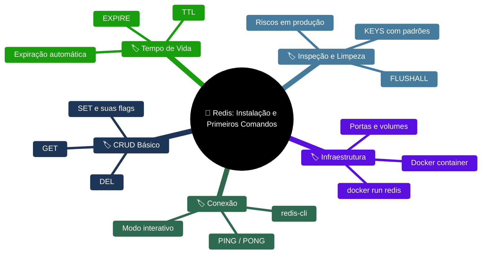
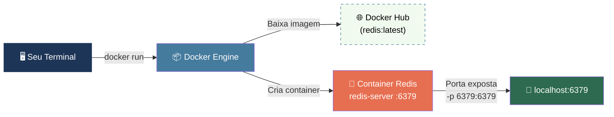
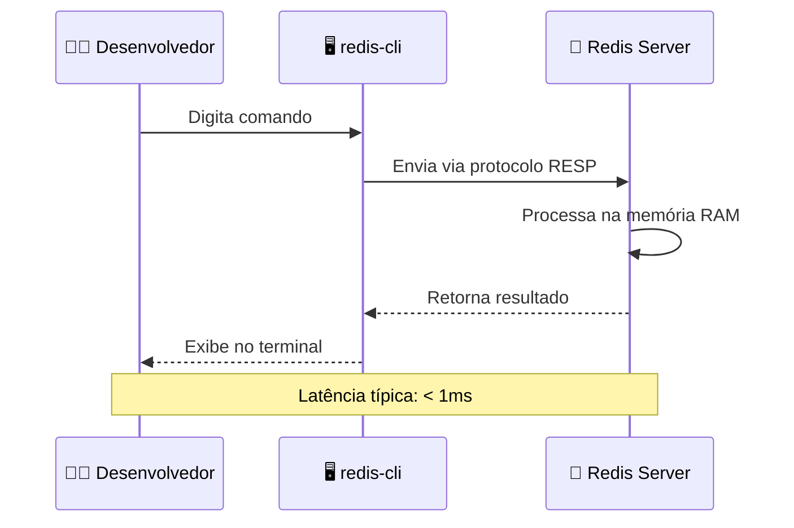
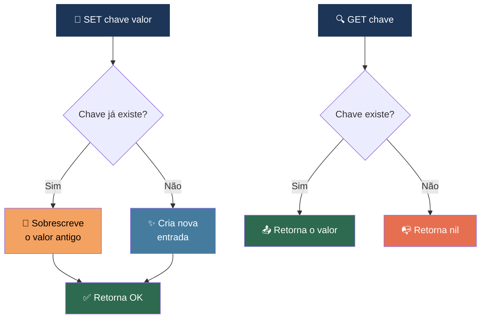
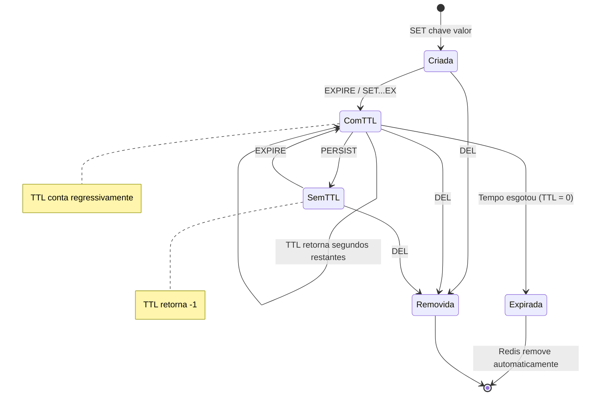
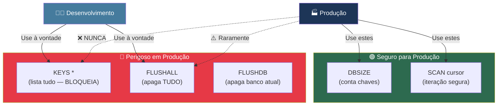
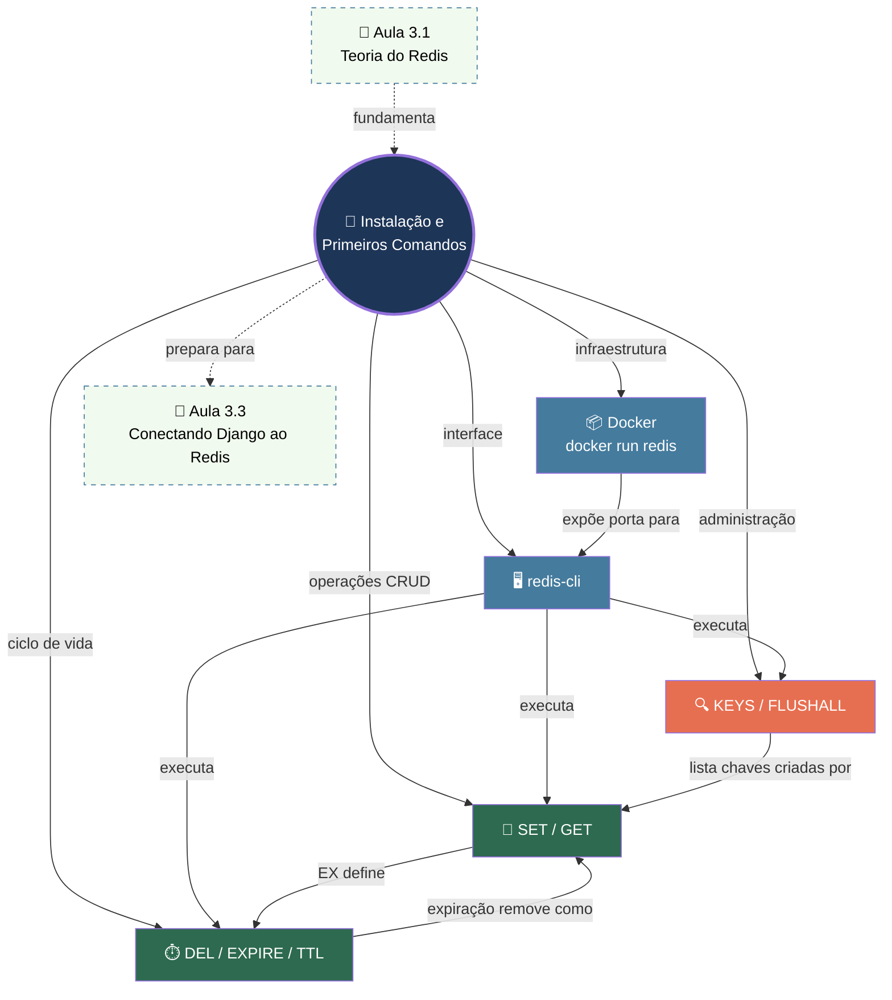
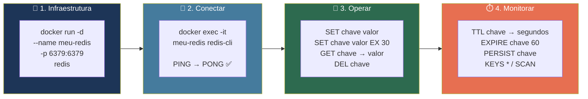

# 📘 Aula 3.2: Instalação e primeiros comandos

> **Módulo:** Módulo 3: Redis — Seu Backend de Cache em Produção | **Nível:** 🟡 Intermediário
> **Tempo estimado:** ~45min de estudo focado | **Pré-requisitos:** Docker instalado, Aula 3.1 (Redis: banco in-memory, estruturas de dados, single-threaded, persistência RDB/AOF, Redis vs Memcached)

---

## 📑 Índice

1. [🎯 Objetivo de Aprendizado](#-objetivo-de-aprendizado)
2. [🗺️ Mapa da Aula](#️-mapa-da-aula)
3. [📖 Conceito: Instalação via Docker](#-conceito-instalação-via-docker)
4. [📖 Conceito: redis-cli — O Terminal do Redis](#-conceito-redis-cli--o-terminal-do-redis)
5. [📖 Conceito: SET e GET — Escrevendo e Lendo Dados](#-conceito-set-e-get--escrevendo-e-lendo-dados)
6. [📖 Conceito: DEL, EXPIRE e TTL — Removendo e Controlando Tempo de Vida](#-conceito-del-expire-e-ttl--removendo-e-controlando-tempo-de-vida)
7. [📖 Conceito: KEYS e FLUSHALL — Inspecionando e Limpando](#-conceito-keys-e-flushall--inspecionando-e-limpando)
8. [🔗 Mapa de Conexões](#-mapa-de-conexões)
9. [📊 Resumo Visual](#-resumo-visual)
10. [🧪 Teste seu Conhecimento](#-teste-seu-conhecimento)

---

## 🎯 Objetivo de Aprendizado

Ao concluir esta aula, você será capaz de:

- **Executar** um container Redis com Docker usando `docker run` e compreender as flags essenciais para expor portas e rodar em background
- **Conectar-se** ao Redis usando `redis-cli` e navegar pelo ambiente interativo de comandos
- **Implementar** operações CRUD básicas com `SET`, `GET` e `DEL`, incluindo as opções avançadas `EX`, `NX` e `XX`
- **Configurar** tempo de vida (TTL) em chaves usando `EXPIRE` e a flag `EX` do `SET`, monitorando a expiração em tempo real com o comando `TTL`
- **Inspecionar** o estado do banco com `KEYS *` e **limpar** dados com `FLUSHALL`, explicando por que esses comandos são perigosos em produção

---

## 🗺️ Mapa da Aula



---

## 📖 Conceito: Instalação via Docker

### 💡 O que é

> 💬 **Analogia:** Instalar o Redis via Docker é como pedir comida por delivery em vez de cozinhar do zero. Você não precisa ir ao mercado (baixar dependências), preparar a cozinha (configurar o sistema operacional) nem seguir uma receita complexa — o prato chega pronto e embalado no container. Se não gostar, joga fora e pede outro, sem sujeira na sua cozinha.

O **Docker** permite rodar o Redis dentro de um **container isolado** — um ambiente completo e autocontido que traz o Redis já compilado, configurado e pronto para uso. Você não precisa instalar compiladores, bibliotecas de sistema, nem se preocupar com conflitos de versão no seu sistema operacional. Com um único comando, o Redis está de pé.

### ⚙️ Como funciona

O comando `docker run` baixa a **imagem oficial do Redis** do Docker Hub (se ainda não estiver no cache local), cria um container a partir dessa imagem e inicia o processo `redis-server` dentro dele.

| Propriedade | Detalhe |
|:---|:---|
| **Imagem oficial** | `redis` (ou `redis:latest`, `redis:7-alpine` para versão enxuta) |
| **Porta padrão** | `6379` — porta TCP onde o Redis aceita conexões |
| **Processo principal** | `redis-server` — o servidor Redis propriamente dito |
| **Persistência** | Por padrão, dados ficam **dentro do container** — se o container for removido, os dados se perdem |
| **Isolamento** | O Redis roda isolado do seu sistema — não interfere em nada já instalado |

### 📊 Diagrama



### 💻 Na Prática

```bash
# 1. Subir o Redis em modo detached (background) expondo a porta 6379
docker run -d --name meu-redis -p 6379:6379 redis

# Explicação das flags:
#   -d            → roda em background (detached), libera o terminal
#   --name        → dá um nome ao container para facilitar gerenciamento
#   -p 6379:6379  → mapeia porta do host:porta do container
#   redis         → nome da imagem oficial no Docker Hub
```

```bash
# 2. Verificar se o container está rodando
docker ps

# Saída esperada (algo como):
# CONTAINER ID   IMAGE   COMMAND                  STATUS          PORTS                    NAMES
# a1b2c3d4e5f6   redis   "docker-entrypoint.s…"   Up 10 seconds   0.0.0.0:6379->6379/tcp   meu-redis
```

```bash
# 3. Ver os logs do Redis para confirmar que está funcionando
docker logs meu-redis

# Você verá algo como:
# * Ready to accept connections tcp
```

```bash
# Comandos úteis para gerenciar o container depois:
docker stop meu-redis     # Para o container (Redis desliga)
docker start meu-redis    # Reinicia o container (Redis volta)
docker rm meu-redis       # Remove o container (dados perdidos!)
```

### ⚠️ Armadilhas Comuns

- ❌ **Esquecer o `-p 6379:6379`**: Sem o mapeamento de porta, o Redis roda dentro do container mas **ninguém de fora consegue acessá-lo**. Seu `redis-cli` na máquina host vai dar `Connection refused`. Sempre mapeie a porta.
- ❌ **Usar `docker run` repetidamente sem `--name`**: Cada execução cria um container NOVO com nome aleatório. Em pouco tempo, você terá dezenas de containers-fantasma. Use `--name` e reutilize com `docker start/stop`.
- ❌ **Confiar que os dados persistem**: O container Redis padrão **não monta volume**. Se você fizer `docker rm meu-redis`, todos os dados somem. Para persistência, use `-v redis-data:/data` — mas para estudo e cache, isso geralmente não é necessário.

---

Agora que o Redis está de pé e aceitando conexões, precisamos de uma ferramenta para conversar com ele. É aí que entra o `redis-cli`.

---

## 📖 Conceito: redis-cli — O Terminal do Redis

### 💡 O que é

> 💬 **Analogia:** O `redis-cli` é como o **balcão de atendimento** de um banco. O Redis é o cofre nos fundos — você não vai lá diretamente. Você vai ao balcão (redis-cli), faz seu pedido (comando), e o atendente (protocolo RESP) vai ao cofre, executa a operação e volta com a resposta. É a sua interface direta de conversa com o Redis.

O **redis-cli** (Redis Command Line Interface) é o cliente de terminal oficial do Redis. Ele abre uma **sessão interativa** (REPL — Read-Eval-Print Loop) onde você digita comandos Redis e recebe respostas imediatamente. É a ferramenta essencial para testar, debugar e aprender Redis.

### ⚙️ Como funciona

| Propriedade | Detalhe |
|:---|:---|
| **Conexão padrão** | `localhost:6379` (host e porta default) |
| **Protocolo** | RESP (REdis Serialization Protocol) — protocolo texto simples e eficiente |
| **Modo interativo** | REPL: digita comando → recebe resposta → repete |
| **Modo não-interativo** | `redis-cli SET chave valor` — executa e sai |
| **Teste de conexão** | `PING` → resposta `PONG` confirma que o Redis está vivo |
| **Banco de dados** | Redis tem 16 bancos (0-15) por padrão; o cli conecta ao banco `0` |

### 📊 Diagrama



### 💻 Na Prática

```bash
# Conectar ao Redis rodando no container Docker
# Opção 1: Usando redis-cli instalado na máquina host
redis-cli

# Opção 2: Usando o redis-cli DENTRO do container (não precisa instalar nada no host!)
docker exec -it meu-redis redis-cli

# Explicação:
#   docker exec    → executa um comando dentro de um container já rodando
#   -it            → modo interativo com terminal
#   meu-redis      → nome do container
#   redis-cli      → o comando a executar dentro do container
```

```bash
# Dentro do redis-cli — testar a conexão
127.0.0.1:6379> PING
PONG

# O PONG confirma: o Redis está vivo e aceitando comandos!
```

```bash
# Conectar em host/porta específicos (quando Redis não está em localhost)
redis-cli -h 192.168.1.100 -p 6380

# Conectar e selecionar um banco de dados específico (banco 2)
redis-cli -n 2
```

### ⚠️ Armadilhas Comuns

- ❌ **Tentar `redis-cli` sem ter o Redis acessível**: Se você não mapeou a porta com `-p` no `docker run`, o cli na máquina host não vai conectar. Use `docker exec -it meu-redis redis-cli` para acessar de dentro do container.
- ❌ **Esquecer que o Redis tem 16 bancos**: Os bancos 0-15 são isolados. Se você gravou dados no banco `0` (padrão) e conectou no banco `2`, não vai encontrar nada. Use `SELECT 0` para trocar de banco dentro do cli.

---

> [!TIP]
> 🧠 **Pare e Pense:** Você acabou de subir um Redis via Docker e conectou com `redis-cli`. Agora imagine que você está em uma equipe com 3 desenvolvedores, todos rodando Docker localmente. Cada um tem seu próprio container Redis isolado na porta 6379. Se um colega grava uma chave `usuario:1`, os outros verão essa chave nos seus containers? Por quê? Como isso se compara com um banco de dados PostgreSQL compartilhado que a equipe usa em desenvolvimento?

---

## 📖 Conceito: SET e GET — Escrevendo e Lendo Dados

### 💡 O que é

> 💬 **Analogia:** `SET` e `GET` são como usar um **quadro de post-its** no escritório. `SET nome "Leonardo"` é pegar um post-it, escrever "Leonardo" e colar no quadro na posição rotulada "nome". `GET nome` é ir ao quadro, encontrar o post-it na posição "nome" e ler o que está escrito. Se colar um novo post-it na mesma posição, o antigo é substituído automaticamente.

O `SET` é o comando fundamental para **escrever dados** no Redis — ele grava um par **chave-valor** na memória. O `GET` é o complemento: **lê o valor** associado a uma chave. Juntos, formam a operação CRUD mais básica do Redis (Create/Read). O Redis é um banco **chave-valor** — toda interação começa e termina com essas duas operações.

### ⚙️ Como funciona

A sintaxe completa do `SET` oferece opções poderosas:

```
SET chave valor [EX segundos] [PX milissegundos] [NX|XX] [GET]
```

| Opção | Significado | Exemplo |
|:---|:---|:---|
| **`EX segundos`** | Define TTL em **segundos** — a chave expira automaticamente | `SET token "abc" EX 30` → expira em 30s |
| **`PX milissegundos`** | Define TTL em **milissegundos** — para controle fino | `SET token "abc" PX 5000` → expira em 5000ms |
| **`NX`** | Grava **apenas se a chave NÃO existir** (Not eXists) | `SET lock "1" NX` → falha se `lock` já existe |
| **`XX`** | Grava **apenas se a chave JÁ existir** (eXists) | `SET config "v2" XX` → falha se `config` não existe |
| **`GET`** | Retorna o valor **antigo** antes de sobrescrever | `SET nome "novo" GET` → retorna o valor anterior |

### 📊 Diagrama



### 💻 Na Prática

```bash
# Dentro do redis-cli:

# 1. SET básico — gravar um par chave-valor
127.0.0.1:6379> SET minha_chave "meu_valor"
OK

# 2. GET — ler o valor da chave
127.0.0.1:6379> GET minha_chave
"meu_valor"

# 3. SET com TTL — a chave expira em 30 segundos
127.0.0.1:6379> SET minha_chave "meu_valor" EX 30
OK

# 4. SET com NX — só grava se a chave NÃO existir (útil para locks!)
127.0.0.1:6379> SET lock_pedido_123 "processando" NX EX 60
OK
# Tentando novamente — falha porque a chave já existe
127.0.0.1:6379> SET lock_pedido_123 "processando" NX EX 60
(nil)

# 5. SET com XX — só grava se a chave JÁ existir (útil para updates seguros)
127.0.0.1:6379> SET config_timeout "30" XX
(nil)
# ↑ Falhou porque config_timeout não existia

127.0.0.1:6379> SET config_timeout "30"
OK
127.0.0.1:6379> SET config_timeout "60" XX
OK
# ↑ Agora funcionou porque a chave já existia

# 6. GET em chave inexistente
127.0.0.1:6379> GET chave_fantasma
(nil)
```

### ⚠️ Armadilhas Comuns

- ❌ **Sobrescrever sem querer**: `SET` sempre sobrescreve. Se você tinha `SET usuario:1 "dados_importantes"` e executou `SET usuario:1 "oops"`, os dados antigos sumiram sem aviso. Use `NX` quando não quiser sobrescrever.
- ❌ **Achar que `GET` de chave inexistente dá erro**: Não dá erro — retorna `(nil)`, que é o "nulo" do Redis. Seu código precisa tratar esse caso (cache miss).
- ❌ **Confundir chaves com case-sensitivity**: No Redis, `Usuario` e `usuario` são chaves **diferentes**. Defina uma convenção (geralmente tudo em minúsculas com `:` como separador: `usuario:1:email`).

---

Agora que sabemos gravar e ler, a próxima pergunta natural é: como **remover** dados e **controlar por quanto tempo** eles ficam armazenados? É exatamente para isso que existem `DEL`, `EXPIRE` e `TTL`.

---

## 📖 Conceito: DEL, EXPIRE e TTL — Removendo e Controlando Tempo de Vida

### 💡 O que é

> 💬 **Analogia:** Pense no Redis como um **estacionamento rotativo**. `DEL` é o segurança que vai até a vaga e remove o carro imediatamente — a vaga fica livre na hora. `EXPIRE` é o **parquímetro**: você coloca moedas para X minutos, e quando o tempo acaba, o carro é rebocado automaticamente. `TTL` é olhar o display do parquímetro para ver **quanto tempo resta** antes do reboque.

O **DEL** remove uma ou mais chaves **imediatamente**. O **EXPIRE** define um **tempo de vida** (TTL — Time To Live) em uma chave que já existe — quando o tempo acaba, o Redis a remove automaticamente. O **TTL** permite **consultar** quantos segundos restam antes da expiração.

### ⚙️ Como funciona

| Comando | Sintaxe | Retorno | Comportamento |
|:---|:---|:---|:---|
| **`DEL`** | `DEL chave [chave2 ...]` | Número de chaves removidas | Remove imediatamente; retorna `0` se a chave não existia |
| **`EXPIRE`** | `EXPIRE chave segundos` | `1` (sucesso) ou `0` (chave não existe) | Define TTL em chave **já existente** |
| **`TTL`** | `TTL chave` | Segundos restantes | `-1` = sem TTL (vive para sempre), `-2` = chave não existe |
| **`PTTL`** | `PTTL chave` | Milissegundos restantes | Versão mais precisa do TTL |
| **`PERSIST`** | `PERSIST chave` | `1` ou `0` | **Remove** o TTL — a chave passa a viver para sempre |

### 📊 Diagrama



### 💻 Na Prática

```bash
# Dentro do redis-cli:

# 1. DEL — remoção imediata
127.0.0.1:6379> SET produto:1 "Notebook Dell"
OK
127.0.0.1:6379> DEL produto:1
(integer) 1
127.0.0.1:6379> GET produto:1
(nil)

# 2. DEL de múltiplas chaves de uma vez
127.0.0.1:6379> SET a "1"
OK
127.0.0.1:6379> SET b "2"
OK
127.0.0.1:6379> SET c "3"
OK
127.0.0.1:6379> DEL a b c
(integer) 3

# 3. EXPIRE — definir TTL em chave existente
127.0.0.1:6379> SET sessao:abc123 "usuario:leonardo"
OK
127.0.0.1:6379> EXPIRE sessao:abc123 60
(integer) 1

# 4. TTL — verificar tempo restante
127.0.0.1:6379> TTL sessao:abc123
(integer) 57

# Espere alguns segundos e consulte novamente...
127.0.0.1:6379> TTL sessao:abc123
(integer) 42

# 5. O EXERCÍCIO PRINCIPAL: SET com EX + monitorar TTL
127.0.0.1:6379> SET minha_chave "meu_valor" EX 30
OK

# Agora observe o TTL contando regressivamente!
127.0.0.1:6379> TTL minha_chave
(integer) 28
127.0.0.1:6379> TTL minha_chave
(integer) 24
127.0.0.1:6379> TTL minha_chave
(integer) 19

# ... quando o tempo acaba:
127.0.0.1:6379> TTL minha_chave
(integer) -2
# ↑ -2 significa: a chave não existe mais! Expirou automaticamente.

127.0.0.1:6379> GET minha_chave
(nil)
# ↑ Confirmado: o valor sumiu sozinho.

# 6. PERSIST — remover o TTL (a chave passa a viver para sempre)
127.0.0.1:6379> SET cache:home "html_da_pagina" EX 300
OK
127.0.0.1:6379> TTL cache:home
(integer) 298
127.0.0.1:6379> PERSIST cache:home
(integer) 1
127.0.0.1:6379> TTL cache:home
(integer) -1
# ↑ -1 significa: sem TTL — vive para sempre (até DEL ou FLUSHALL)
```

### ⚠️ Armadilhas Comuns

- ❌ **Confundir TTL `-1` com `-2`**: `-1` = a chave existe mas **não tem TTL** (vive para sempre). `-2` = a chave **não existe**. Muitos iniciantes confundem os dois e interpretam `-1` como "expirou".
- ❌ **EXPIRE em chave inexistente**: `EXPIRE chave_fantasma 60` retorna `0` silenciosamente — não dá erro. Se você definiu o EXPIRE mas esqueceu de criar a chave antes, o TTL nunca foi realmente configurado.
- ❌ **SET sobrescreve o TTL**: Se uma chave tem TTL e você faz um `SET` simples (sem `EX`), o **TTL é removido** e a chave passa a viver para sempre. Isso é um bug sutil e muito comum.

---

> [!TIP]
> 🧠 **Pare e Pense:** Imagine que você tem uma chave `sessao:user42` com TTL de 1800 segundos (30 minutos). O usuário faz uma nova requisição e você quer "renovar" a sessão por mais 30 minutos. Qual comando você usaria: `SET sessao:user42 "dados" EX 1800` ou `EXPIRE sessao:user42 1800`? Existe alguma diferença prática entre os dois neste caso? E se o valor da sessão tivesse mudado?

---

## 📖 Conceito: KEYS e FLUSHALL — Inspecionando e Limpando

### 💡 O que é

> 💬 **Analogia:** O `KEYS *` é como abrir o **livro de registro** de um hotel e pedir a lista completa de todos os hóspedes. Funciona bem quando o hotel tem 20 quartos — mas se for um resort com 50.000 quartos, o recepcionista vai travar enquanto lista todos os nomes. O `FLUSHALL` é o **botão de emergência** de evacuação: todos saem imediatamente, sem exceção. Não dá para evacuar "só o terceiro andar" — é tudo ou nada.

O **KEYS** permite listar chaves que correspondem a um **padrão** (pattern). O **FLUSHALL** remove **todas as chaves de todos os bancos de dados** do Redis de uma só vez. Ambos são ferramentas poderosas para **desenvolvimento e debug**, mas devem ser usados com extrema cautela em produção.

### ⚙️ Como funciona

| Comando | Sintaxe | Comportamento | Complexidade |
|:---|:---|:---|:---:|
| **`KEYS *`** | `KEYS padrão` | Lista todas as chaves que casam com o padrão | O(N) — **bloqueia** o Redis |
| **`FLUSHALL`** | `FLUSHALL [ASYNC]` | Remove todas as chaves de **todos** os bancos (0-15) | O(N) |
| **`FLUSHDB`** | `FLUSHDB [ASYNC]` | Remove todas as chaves do banco **atual** | O(N) |
| **`DBSIZE`** | `DBSIZE` | Retorna a **quantidade** de chaves no banco atual | O(1) |
| **`SCAN`** | `SCAN cursor [MATCH padrão] [COUNT n]` | Alternativa segura ao KEYS — iteração incremental | O(1) por iteração |

**Padrões do KEYS:**

| Padrão | Significado | Exemplo |
|:---|:---|:---|
| `*` | Qualquer sequência de caracteres | `KEYS *` → todas as chaves |
| `?` | Exatamente um caractere | `KEYS user:?` → `user:1`, `user:2` |
| `[abc]` | Um dos caracteres listados | `KEYS user:[12]` → `user:1`, `user:2` |
| `prefixo:*` | Chaves que começam com prefixo | `KEYS sessao:*` → todas as sessões |

### 📊 Diagrama



### 💻 Na Prática

```bash
# Dentro do redis-cli:

# 1. Vamos criar algumas chaves para testar
127.0.0.1:6379> SET usuario:1:nome "Leonardo"
OK
127.0.0.1:6379> SET usuario:1:email "leo@email.com"
OK
127.0.0.1:6379> SET usuario:2:nome "Maria"
OK
127.0.0.1:6379> SET sessao:abc123 "dados_sessao"
OK
127.0.0.1:6379> SET cache:home "html_home"
OK

# 2. KEYS * — listar TODAS as chaves
127.0.0.1:6379> KEYS *
1) "usuario:1:nome"
2) "usuario:1:email"
3) "usuario:2:nome"
4) "sessao:abc123"
5) "cache:home"

# 3. KEYS com padrão — filtrar por prefixo
127.0.0.1:6379> KEYS usuario:*
1) "usuario:1:nome"
2) "usuario:1:email"
3) "usuario:2:nome"

# 4. KEYS com padrão mais específico
127.0.0.1:6379> KEYS usuario:1:*
1) "usuario:1:nome"
2) "usuario:1:email"

# 5. DBSIZE — quantas chaves existem (seguro para produção!)
127.0.0.1:6379> DBSIZE
(integer) 5

# 6. SCAN — alternativa segura ao KEYS (para produção)
127.0.0.1:6379> SCAN 0 MATCH usuario:* COUNT 10
1) "0"
2) 1) "usuario:2:nome"
   2) "usuario:1:nome"
   3) "usuario:1:email"
# ↑ O "0" no retorno indica que a iteração terminou

# 7. FLUSHDB — limpar o banco atual (banco 0)
127.0.0.1:6379> FLUSHDB
OK
127.0.0.1:6379> KEYS *
(empty array)
# ↑ Tudo foi removido do banco 0

# 8. FLUSHALL — limpar TODOS os bancos (0-15)
127.0.0.1:6379> FLUSHALL
OK
# ↑ Todos os 16 bancos estão vazios agora
```

### ⚠️ Armadilhas Comuns

- ❌ **Usar `KEYS *` em produção**: O Redis é **single-threaded**. O `KEYS *` varre TODAS as chaves e **bloqueia o servidor inteiro** durante a execução. Em um Redis com 1 milhão de chaves, isso pode travar o servidor por segundos — uma eternidade em produção. Use `SCAN` em vez disso.
- ❌ **Confundir `FLUSHDB` com `FLUSHALL`**: `FLUSHDB` limpa apenas o banco atual (ex: banco 0). `FLUSHALL` limpa **todos os 16 bancos**. Se você tem aplicações diferentes usando bancos diferentes, um `FLUSHALL` acidental destrói os dados de todas.

> [!WARNING]
> Em produção, o comando `KEYS *` é considerado um **anti-pattern grave**. Com milhões de chaves, ele pode bloquear o Redis por vários segundos, causando timeout em todas as aplicações conectadas. Muitas equipes desabilitam o `KEYS` via `rename-command` no `redis.conf`. Use `SCAN` — que faz a mesma coisa de forma **incremental e não-bloqueante**.

---

> [!TIP]
> 🧠 **Pare e Pense:** Você está em produção e precisa descobrir quantas chaves de sessão existem no Redis (todas começam com `sessao:`). Seu colega sugere `KEYS sessao:* | wc -l`. Por que essa abordagem é perigosa? Qual seria a alternativa segura que te daria a mesma informação sem risco de travar o servidor?

---

## 🔗 Mapa de Conexões

Veja como os conceitos desta aula se conectam entre si — e como se integram ao contexto maior:



As conexões mais importantes desta aula são:

1. **Docker → redis-cli**: O Docker é o alicerce — sem o container rodando, o `redis-cli` não tem onde conectar. Essa dependência é direta e obrigatória.
2. **SET/GET ↔ EXPIRE/TTL**: O `SET` com `EX` e o `EXPIRE` são duas formas de definir TTL. Entender que `SET` sem `EX` **remove** um TTL existente é crucial para evitar bugs de cache em produção.
3. **Esta aula → Aula 3.3**: Tudo que praticamos aqui no `redis-cli` é exatamente o que o Django fará "por baixo dos panos" quando você configurar `django-redis`. Cada `cache.set()` do Django vira um `SET` no Redis.

---

## 📊 Resumo Visual

### Comparação Direta

| Aspecto | `SET chave valor` | `SET ... EX 30` | `SET ... NX` | `SET ... XX` |
|:---|:---:|:---:|:---:|:---:|
| **Cria chave nova?** | ✅ | ✅ | ✅ (se não existir) | ❌ |
| **Sobrescreve existente?** | ✅ | ✅ | ❌ | ✅ |
| **Define TTL?** | ❌ (vive para sempre) | ✅ (30 segundos) | ❌ (vive para sempre) | ❌ |
| **Caso de uso** | *Gravação simples* | *Cache com expiração* | *Lock distribuído* | *Update seguro* |

### Síntese em Um Olhar



### ✅ Checklist: O que devo saber

Antes de avançar, verifique se você consegue:

- [ ] Subir um container Redis com Docker usando `docker run -d --name meu-redis -p 6379:6379 redis`
- [ ] Conectar ao Redis com `docker exec -it meu-redis redis-cli` e confirmar com `PING`
- [ ] Executar `SET minha_chave "meu_valor" EX 30` e observar o TTL contando regressivamente
- [ ] Explicar a diferença entre TTL retornando `-1` e `-2`
- [ ] Explicar por que `KEYS *` é perigoso em produção e qual comando usar no lugar
- [ ] Remover chaves com `DEL` e limpar o banco inteiro com `FLUSHDB` / `FLUSHALL`

---

## 🧪 Teste seu Conhecimento

Tente responder antes de ver a resposta. Resista à tentação de espiar! 🙈

---

### Questões Conceituais

**Questão 1:** Qual é a diferença entre os retornos `-1` e `-2` do comando `TTL`?

<details>
<summary>🔍 Ver resposta</summary>

**Resposta:** `TTL` retornando **-1** significa que a chave **existe** no Redis, mas **não possui um TTL definido** — ela viverá para sempre (ou até ser removida com `DEL` ou `FLUSHALL`). `TTL` retornando **-2** significa que a chave **não existe** no Redis — ou nunca foi criada, ou já expirou, ou foi removida. É crucial não confundir os dois: `-1` é "vive para sempre", `-2` é "não existe".

</details>

---

**Questão 2:** Qual a diferença entre usar `SET chave valor EX 60` e fazer `SET chave valor` seguido de `EXPIRE chave 60`? Existe alguma vantagem em usar um ou outro?

<details>
<summary>🔍 Ver resposta</summary>

**Resposta:** Funcionalmente, o resultado final é idêntico: a chave terá um TTL de 60 segundos. Porém, `SET chave valor EX 60` é **atômico** — tudo acontece em uma única operação. Já `SET` + `EXPIRE` são **duas operações separadas**: se o processo morrer entre o `SET` e o `EXPIRE`, a chave ficará sem TTL e viverá para sempre (memory leak). Por isso, sempre prefira `SET ... EX` quando for definir TTL no momento da criação.

</details>

---

### Questões Práticas / Cenários

**Questão 3:** Você está desenvolvendo uma API e implementou um cache de sessão no Redis com TTL de 30 minutos. Porém, a cada nova requisição do usuário, você executa `SET sessao:user42 "dados_atualizados"` para atualizar os dados da sessão. Após algumas horas, você percebe que a sessão nunca expira — o usuário fica logado para sempre. O que está acontecendo?

<details>
<summary>🔍 Ver resposta</summary>

**Resposta:** O problema é que o `SET` simples (sem `EX`) **remove qualquer TTL existente** na chave. Na primeira criação, você usou `SET sessao:user42 "dados" EX 1800`, definindo TTL de 30 minutos. Mas nas requisições seguintes, ao fazer `SET sessao:user42 "dados_atualizados"` sem o `EX`, o TTL foi removido e a chave passou a viver para sempre. A correção é **sempre** incluir o `EX` quando o dado precisar expirar: `SET sessao:user42 "dados_atualizados" EX 1800`. Alternativamente, use `EXPIRE sessao:user42 1800` após o `SET`.

</details>

---

**Questão 4 (Pegadinha):** Você executa os seguintes comandos em sequência:

```
SET contador "100" NX
SET contador "200" NX
GET contador
```

Qual valor o `GET` retorna: `"100"`, `"200"`, ou `(nil)`?

<details>
<summary>🔍 Ver resposta</summary>

**Resposta:** O `GET` retorna **"100"**. A flag `NX` (Not eXists) faz o `SET` gravar **apenas se a chave não existir**. O primeiro `SET contador "100" NX` encontra a chave inexistente e grava `"100"` — retorna `OK`. O segundo `SET contador "200" NX` encontra a chave já existente e **não sobrescreve** — retorna `(nil)`. Portanto, o valor permanece `"100"`. A pegadinha é que muitos assumem que o segundo `SET` sobrescreveu o primeiro, mas o `NX` protege contra isso. Esse é exatamente o padrão usado para **locks distribuídos** no Redis.

</details>

---

**Questão 5:** Dado o cenário: seu Redis em produção tem 2 milhões de chaves. Você precisa encontrar todas as chaves que começam com `cache:produto:`. Um colega sugere usar `KEYS cache:produto:*`. Isso é seguro? O que aconteceria? Qual seria a alternativa correta?

<details>
<summary>🔍 Ver resposta</summary>

**Resposta:** **Não é seguro.** O comando `KEYS` tem complexidade O(N) — ele varre **todas** as 2 milhões de chaves em uma única operação. Como o Redis é **single-threaded**, enquanto o `KEYS` executa, **nenhum outro comando é processado**. Isso pode bloquear o Redis por vários segundos, causando timeout em todas as aplicações conectadas. A alternativa correta é o comando `SCAN`:

```bash
SCAN 0 MATCH cache:produto:* COUNT 100
```

O `SCAN` faz a mesma busca de forma **incremental** — retorna um lote por vez, sem bloquear o servidor. Você itera chamando `SCAN` novamente com o cursor retornado, até o cursor voltar a `0` (indicando que a varredura terminou).

</details>

---

### 🏋️ Desafio de Aplicação

> **Exercício hands-on (15-20 minutos):**
>
> Suba um container Redis com Docker e simule um sistema de **cache de API** com expiração. Execute as seguintes tarefas usando apenas o `redis-cli`:
>
> 1. Crie 5 chaves simulando cache de endpoints de uma API, usando a convenção `cache:api:<endpoint>`. Exemplos: `cache:api:produtos`, `cache:api:usuarios`, `cache:api:pedidos`, `cache:api:categorias`, `cache:api:dashboard`.
> 2. Defina TTLs diferentes para cada uma: 30s, 60s, 120s, 300s e sem TTL (permanente).
> 3. Use `TTL` para monitorar as chaves expirando em tempo real — acompanhe pelo menos uma chave do início ao fim da expiração.
> 4. Tente recriar a chave que expirou usando `SET ... NX` — o que acontece?
> 5. Use `KEYS cache:api:*` para listar todas as chaves de cache ativas.
> 6. Use `DBSIZE` para contar as chaves antes e depois de usar `FLUSHDB`.
>
> **Bônus:** Tente usar o `SCAN 0 MATCH cache:api:* COUNT 10` em vez do `KEYS` e observe a diferença no formato da resposta.
