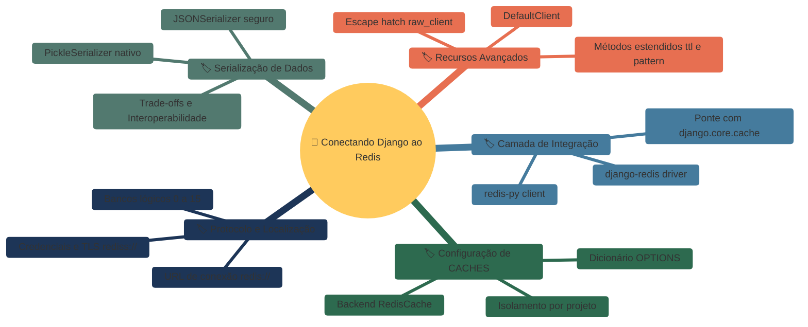
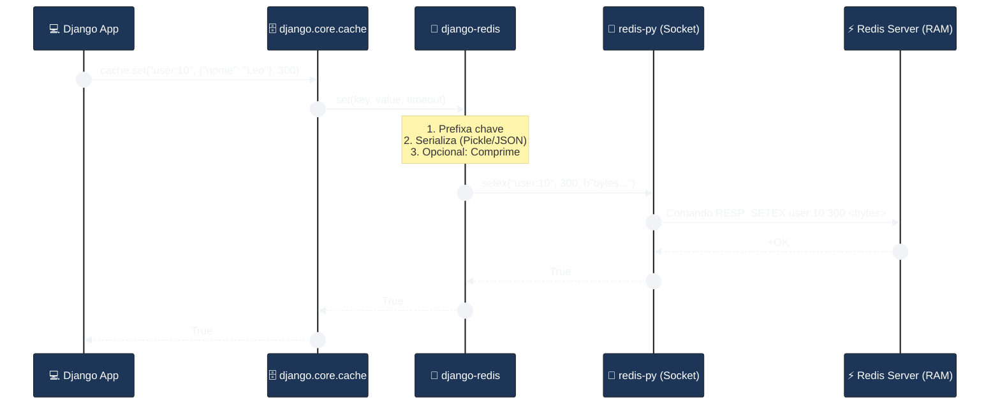
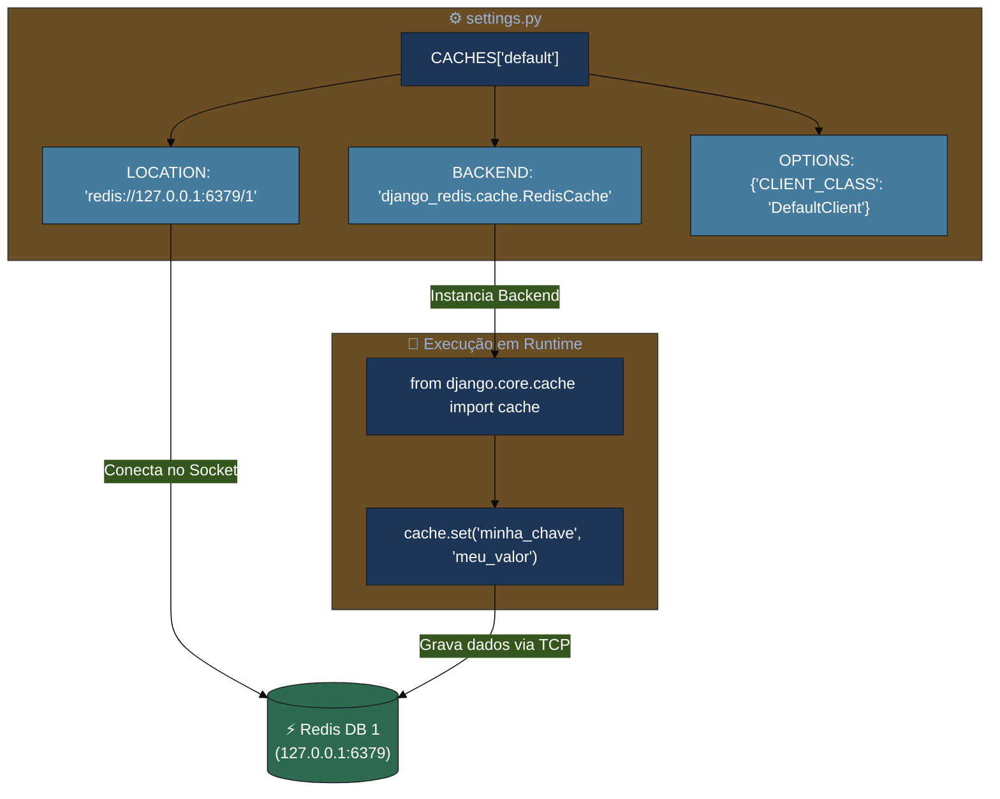
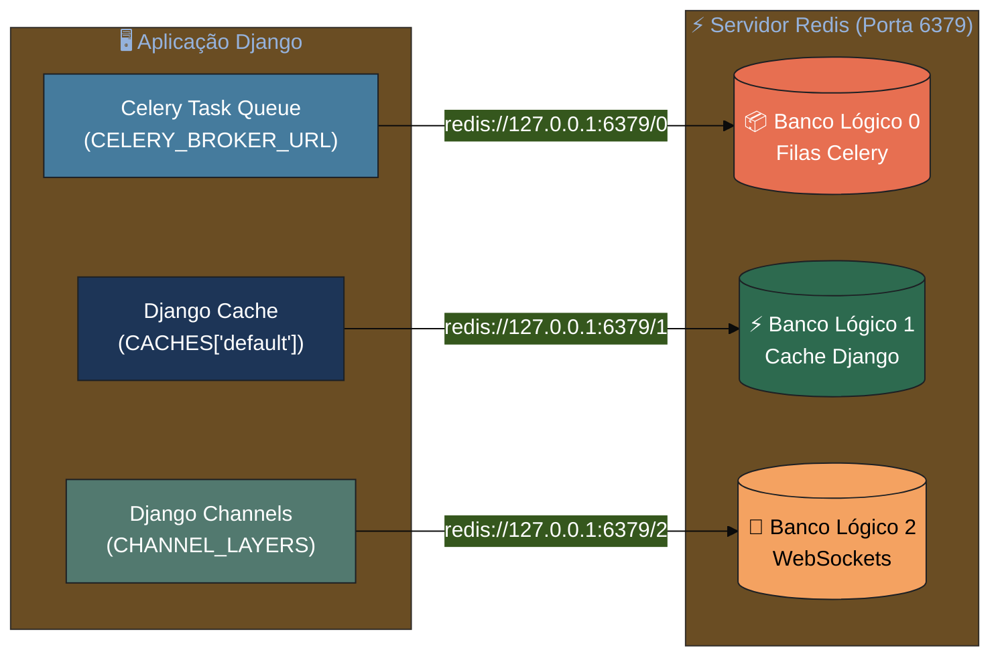
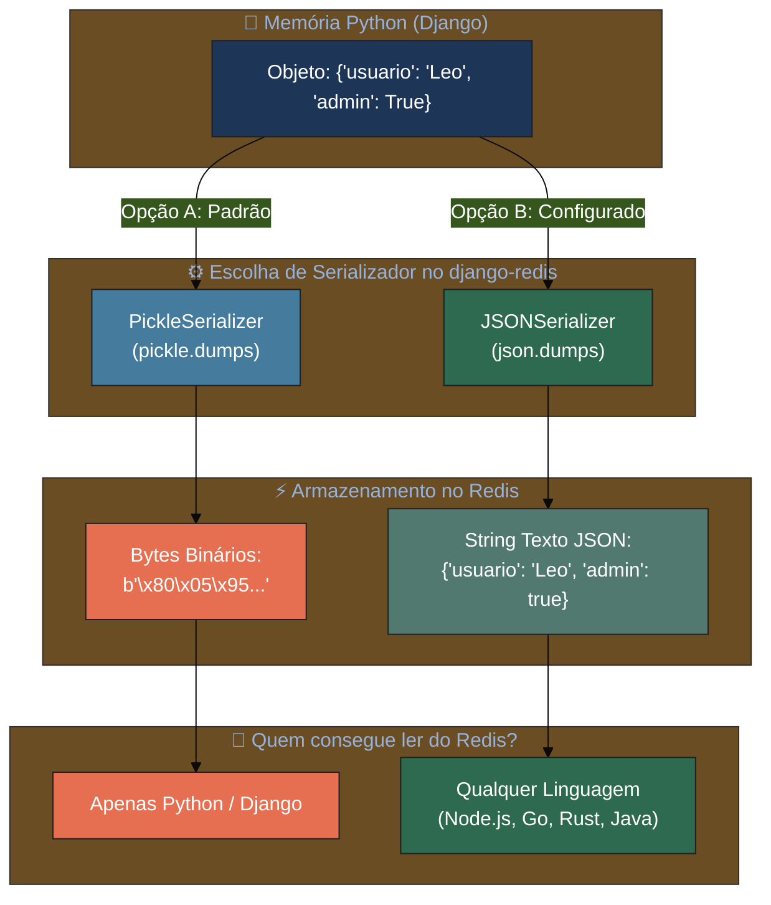
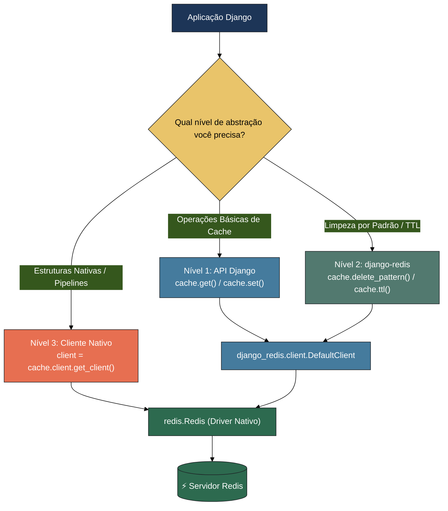
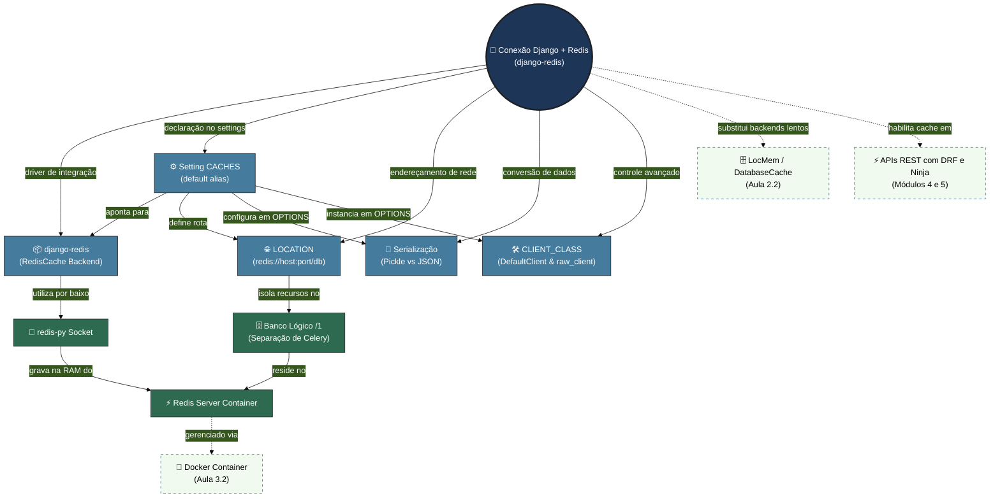
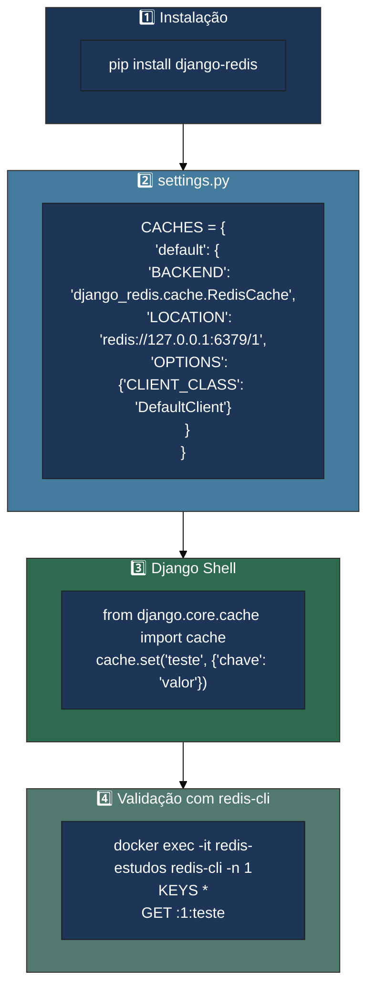

# 📘 Aula 3.3: Conectando Django ao Redis

> **Módulo:** Módulo 3: Redis — Seu Backend de Cache em Produção | **Nível:** 🟡 Intermediário
> **Tempo estimado:** ~45min de estudo focado | **Pré-requisitos:** Aula 3.2 (Instalação via Docker, `redis-cli`, comandos `SET`/`GET`/`TTL`), Aula 2.3 (API de Baixo Nível do Cache no Django: `cache.set`, `cache.get`)

---

## 📑 Índice

1. [🎯 Objetivo de Aprendizado](#-objetivo-de-aprendizado)
2. [🗺️ Mapa da Aula](#️-mapa-da-aula)
3. [📖 Conceito: A Biblioteca django-redis — A Ponte de Alta Performance](#-conceito-a-biblioteca-django-redis--a-ponte-de-alta-performance)
4. [📖 Conceito: Configuração da Setting CACHES e Backend RedisCache](#-conceito-configuração-da-setting-caches-e-backend-rediscache)
5. [📖 Conceito: LOCATION e URLs de Conexão — Bancos Lógicos, Redes e Segurança](#-conceito-location-e-urls-de-conexão--bancos-lógicos-redes-e-segurança)
6. [📖 Conceito: Serialização — PickleSerializer vs JSONSerializer](#-conceito-serialização--pickleserializer-vs-jsonserializer)
7. [📖 Conceito: Opção CLIENT_CLASS e Acesso Nativo via raw_client](#-conceito-opção-client_class-e-acesso-nativo-via-raw_client)
8. [🔗 Mapa de Conexões](#-mapa-de-conexões)
9. [📊 Resumo Visual](#-resumo-visual)
10. [🧪 Teste seu Conhecimento](#-teste-seu-conhecimento)

---

## 🎯 Objetivo de Aprendizado

Ao concluir esta aula, você será capaz de:

- **Instalar e integrar** a biblioteca `django-redis` em um projeto Django como backend oficial de cache em substituição aos backends locais ou de banco de dados
- **Estruturar** a setting `CACHES` no `settings.py`, especificando backend, URLs de conexão no parâmetro `LOCATION` e opções avançadas no dicionário `OPTIONS`
- **Distinguir** e **configurar** os bancos lógicos do Redis (`/0`, `/1`, etc.) para isolar caches, sessões e brokers em um mesmo servidor
- **Avaliar** os trade-offs de segurança, velocidade e interoperabilidade entre `PickleSerializer` e `JSONSerializer`, escolhendo o formato ideal para cada caso de uso
- **Utilizar** os recursos estendidos do `django-redis` (`delete_pattern`, `ttl`, `client.get_client()`) e **acessar** comandos nativos do `redis-py` via `raw_client`
- **Inspecionar e validar** com `redis-cli` que os objetos manipulados no Django Shell (`cache.set()`) foram devidamente serializados e gravados na memória RAM do Redis

---

## 🗺️ Mapa da Aula



---

## 📖 Conceito: A Biblioteca django-redis — A Ponte de Alta Performance

### 💡 O que é

> 💬 **Analogia:** Pense no framework de cache do Django como um **aparelho eletrônico padrão com plugue de 3 pinos**, e no Redis como uma **tomada industrial de alta potência**. Para ligar um no outro sem queimar nada e aproveitando toda a energia disponível, você precisa de um **adaptador industrial certificado**. A biblioteca `django-redis` é exatamente esse adaptador: ela traduz os comandos universais do Django (`cache.get`, `cache.set`) no dialeto de altíssima velocidade que o Redis compreende.

A biblioteca **`django-redis`** é o driver/backend de cache para Django mais maduro, performático e amplamente adotado pela indústria. Embora o Django tenha introduzido um backend básico embutido para Redis a partir da versão 4.0 (`django.core.cache.backends.redis.RedisCache`), a biblioteca `django-redis` continua sendo a **escolha padrão em ambientes de produção** por oferecer recursos avançados cruciais: **serializadores customizáveis** (Pickle, JSON, MsgPack), **compressão automática de dados** (zlib, lz4), **suporte a conexões com sentinelas/clusters**, **operações atômicas com locks distribuídos**, **métodos de busca por padrão (`delete_pattern`)** e **acesso direto ao cliente nativo `redis-py`**.

```
┌──────────────────────────────────────────────────────────┐
│                   APLICAÇÃO DJANGO                       │
│    (Views, DRF ViewSets, Models, cache.set / cache.get)   │
└────────────────────────────┬─────────────────────────────┘
                             │
                             ▼
┌──────────────────────────────────────────────────────────┐
│         DJANGO CACHE FRAMEWORK (django.core.cache)       │
│               Interface Padronizada do Django            │
└────────────────────────────┬─────────────────────────────┘
                             │
                             ▼
┌──────────────────────────────────────────────────────────┐
│             DJANGO-REDIS (Adapter / Backend)             │
│   • Serialização (Pickle/JSON) • Compressão (zlib/lz4)   │
│   • Pool de Conexões          • Métodos estendidos       │
└────────────────────────────┬─────────────────────────────┘
                             │
                             ▼
┌──────────────────────────────────────────────────────────┐
│             REDIS-PY (Driver Oficial Python)             │
│            Socket TCP / Protocolo RESP do Redis          │
└────────────────────────────┬─────────────────────────────┘
                             │
                             ▼
┌──────────────────────────────────────────────────────────┐
│                  REDIS SERVER (RAM)                      │
│             Instância Docker / Servidor Dedicado         │
└──────────────────────────────────────────────────────────┘
```

### ⚙️ Como funciona

O fluxo interno de uma chamada de cache com `django-redis` opera em camadas bem definidas. Quando sua aplicação invoca `cache.set("chave", {"nome": "Django"}, timeout=300)`:

1. O **Django Cache Framework** recebe a chamada e encaminha para o backend configurado em `settings.CACHES['default']`.
2. O **`django-redis`** intercepta a chamada, aplica prefixos de chave configurados, executa o serializador selecionado (transformando o dicionário Python em bytes) e opcionalmente comprime o payload.
3. O **`redis-py`** (cliente nativo sobre o qual o `django-redis` opera) envia os bytes via socket TCP usando o protocolo de rede RESP (*REdis Serialization Protocol*) até a porta `6379`.
4. O **Redis Server** grava os bytes em sua memória RAM e registra o tempo de vida (TTL).

| Componente | Papel Arquitetural | Onde Vive |
|:---|:---|:---|
| **`django.core.cache`** | API pública de alto nível do Django | No core do Django |
| **`django-redis`** | Backend que implementa a API do Django integrando ao Redis | Pacote Python externo (`pip install django-redis`) |
| **`redis` (`redis-py`)** | Driver de baixo nível que conversa via TCP com o servidor | Dependência instalada automaticamente pelo `django-redis` |
| **`redis-server`** | O processo do banco de dados em memória | No container Docker ou servidor dedicado |

### 📊 Diagrama



### 💻 Na Prática

Instalação do pacote no ambiente virtual do seu projeto:

```bash
# Instala django-redis (que automaticamente instala o redis-py como dependência)
pip install django-redis

# Ou com Poetry:
poetry add django-redis

# Para verificar as versões instaladas:
pip show django-redis redis
```

### ⚠️ Armadilhas Comuns

- ❌ **Instalar apenas `redis` e esquecer o `django-redis`**: O pacote `redis` instala apenas a biblioteca de baixo nível `redis-py`. Se você configurar `BACKEND: "django_redis.cache.RedisCache"` sem instalar o `django-redis`, o Django disparará um erro `ModuleNotFoundError: No module named 'django_redis'`.
- ❌ **Confundir o backend embutido do Django com `django-redis`**: Usar `django.core.cache.backends.redis.RedisCache` achando que é o `django-redis`. O backend embutido não suporta serializadores avançados, `delete_pattern` nem a rica API do `django-redis`.

---

## 📖 Conceito: Configuração da Setting CACHES e Backend RedisCache

### 💡 O que é

> 💬 **Analogia:** A configuração `CACHES` no `settings.py` é o **contrato de prestação de serviços** da sua aplicação. É nela que você diz ao Django: *"Quando alguém pedir para salvar um dado rápido, não guarde na memória deste processo isolado nem grave em uma tabela do PostgreSQL; use a transportadora `django-redis`, despache para este endereço IP e use estas regras de empacotamento"*.

No Django, todos os sistemas de cache são centralizados na variável de configuração **`CACHES`** dentro do `settings.py`. O dicionário define um ou mais aliases de cache (sendo `'default'` o principal). Para conectar o Django ao Redis via `django-redis`, configuramos a chave `'BACKEND'` apontando para a classe **`django_redis.cache.RedisCache`**.

### ⚙️ Como funciona

A estrutura da configuração `CACHES` divide-se em três blocos fundamentais:

```python
CACHES = {
    "default": {
        # 1. Qual motor de cache gerencia as operações:
        "BACKEND": "django_redis.cache.RedisCache",
        
        # 2. Onde está o servidor Redis e qual banco usar:
        "LOCATION": "redis://127.0.0.1:6379/1",
        
        # 3. Opções avançadas de cliente, serialização e conexão:
        "OPTIONS": {
            "CLIENT_CLASS": "django_redis.client.DefaultClient",
        }
    }
}
```

| Chave de Configuração | Tipo | Descrição |
|:---|:---|:---|
| **`BACKEND`** | `str` | Caminho Python completo para a classe do backend: `"django_redis.cache.RedisCache"` |
| **`LOCATION`** | `str` ou `list` | URL(s) de conexão com o Redis (suporta strings individuais ou lista de nós para sharding) |
| **`OPTIONS`** | `dict` | Dicionário de parâmetros de baixo nível: classe de cliente, serializadores, pools de conexão e tratamento de erros |
| **`KEY_PREFIX`** *(opcional)* | `str` | Prefixo global adicionado automaticamente a todas as chaves (ex: `"meuprojeto_prod"`) |
| **`TIMEOUT`** *(opcional)* | `int` | Tempo de vida padrão em segundos para chaves quando nenhum timeout é informado no `cache.set()` (padrão: 300s) |

### 📊 Diagrama



### 💻 Na Prática

Configuração completa e profissional do `settings.py` utilizando variáveis de ambiente:

```python
# settings.py
import os

# Configuração de Cache com django-redis
REDIS_URL = os.getenv("REDIS_URL", "redis://127.0.0.1:6379/1")

CACHES = {
    "default": {
        "BACKEND": "django_redis.cache.RedisCache",
        "LOCATION": REDIS_URL,
        "TIMEOUT": 300,  # 5 minutos de TTL padrão
        "OPTIONS": {
            "CLIENT_CLASS": "django_redis.client.DefaultClient",
        },
        "KEY_PREFIX": "estudos_cache",  # Evita colisões de chave no Redis
    }
}

# Opcional: Utilizar o Redis também como backend de Sessões do Django
SESSION_ENGINE = "django.contrib.sessions.backends.cache"
SESSION_CACHE_ALIAS = "default"
```

Teste no Django Shell:

```python
# Executar: python manage.py shell
from django.core.cache import cache

# 1. Escrevendo no cache
cache.set("curso", "Django Master com Redis", timeout=60)

# 2. Lendo do cache
print(cache.get("curso"))  # Saída: 'Django Master com Redis'

# 3. Testando valores complexos (dicionários / listas)
cache.set("metricas", {"usuarios_ativos": 1420, "taxa_acerto": 98.4}, timeout=120)
print(cache.get("metricas"))  # Saída: {'usuarios_ativos': 1420, 'taxa_acerto': 98.4}
```

### ⚠️ Armadilhas Comuns

- ❌ **Esquecer o `LOCATION` ou informar formato inválido**: O `LOCATION` deve ser uma URI válida que comece com `redis://`, `rediss://` ou `unix://`. Se omitido, o backend não saberá onde conectar e levantará erro na primeira chamada.
- ❌ **Subir a aplicação sem testar a conectividade**: Se o Redis estiver desligado e sua aplicação chamar `cache.get()`, por padrão o Django levantará `redis.exceptions.ConnectionError`. (Na Aula 3.4 veremos como contornar isso com `IGNORE_EXCEPTIONS`).

---

## 📖 Conceito: LOCATION e URLs de Conexão — Bancos Lógicos, Redes e Segurança

### 💡 O que é

> 💬 **Analogia:** Uma URL de conexão é o **endereço postal completo de um condomínio residencial fechado**. O protocolo `redis://` é a transportadora; o `host:port` é a rua e o número do condomínio; a senha é o crachá de segurança na portaria; e o número `/1` no final é o **número do apartamento** dentro do prédio. Você pode ter vários apartamentos (bancos `/0`, `/1`, `/2`) no mesmo prédio (servidor Redis), completamente separados uns dos outros.

A propriedade **`LOCATION`** aceita uma string formatada no padrão URI (RFC 3986) que encapsula todas as informações necessárias para que o cliente abra um socket TCP ou UNIX com o Redis Server. O Redis possui por padrão **16 bancos de dados lógicos indexados numericamente de 0 a 15** (configurável via diretiva `databases 16` no `redis.conf`).

### ⚙️ Como funciona

A anatomia completa de uma URL de conexão do Redis:

```
  protocolo       credenciais          host       porta  banco
┌───────────┐ ┌─────────────────┐ ┌─────────────┐ ┌────┐ ┌──┐
  redis://    :minhasenhasuper@   127.0.0.1      :6379   /1
  redis://    usuario:senha@      redis.prod.lan :6379   /2
  rediss://   :token@             cache.aws.com  :6379   /0   <-- rediss:// com 'ss' = SSL/TLS Criptografado
  unix:///var/run/redis/redis.sock?db=1                       <-- Unix Domain Socket (ultra rápido local)
```

| Elemento | Papel | Exemplo / Padrão |
|:---|:---|:---|
| **Protocolo** | Define o meio de transporte | `redis://` (TCP padrão), `rediss://` (TCP com TLS/SSL), `unix://` (Socket local) |
| **Autenticação** | Usuário e/ou Senha | `:minhasenha@` ou `default:minhasenha@` (Redis 6+ ACL) |
| **Host e Porta** | Localização do servidor na rede | `127.0.0.1:6379`, `localhost:6379`, `redis-container:6379` |
| **Banco Lógico (`/db`)** | Índice do banco isolado | `/0` (padrão do Redis), `/1` (recomendado para Cache Django), `/2`, etc. |

#### Por que separar os bancos lógicos?

Por convenção e boa prática de engenharia de software, nunca misture cache volátil com outros serviços no mesmo banco lógico (`/0`):

- **Banco `0` (`/0`)**: Reservado comumente para **Celery Broker / Mensageria** (onde mensagens em fila não podem ser apagadas acidentalmente).
- **Banco `1` (`/1`)**: Reservado para **Django Cache** (onde comandos de limpeza de cache afetam apenas o cache).
- **Banco `2` (`/2`)**: Reservado para **Django Channels / WebSockets layer** ou sessões de usuário.

```
┌─────────────────────────────────────────────────────────────┐
│                    REDIS INSTANCE (PORTA 6379)              │
├───────────────────┬───────────────────┬─────────────────────┤
│   DB 0 (Celery)   │   DB 1 (Cache)    │   DB 2 (Channels)   │
│   • task-id-101   │   • :1:user:42    │   • asgi:group:chat │
│   • task-id-102   │   • :1:home_page  │   • asgi:client:88  │
│   (Não expira)    │   (TTL 300s)      │   (Real-time)       │
└───────────────────┴───────────────────┴─────────────────────┘
```

> [!NOTE]
> Quando você executa o comando `FLUSHDB` no Redis conectado ao banco `/1`, apenas os dados do banco `/1` (seu cache) são deletados. Os dados das filas do Celery no banco `/0` continuam intactos! Se você usasse o mesmo banco para tudo, limpar o cache apagaria suas filas de tarefas assíncronas.

### 📊 Diagrama



### 💻 Na Prática

Configurando diferentes ambientes no `settings.py`:

```python
# 1. Desenvolvimento Local com Docker (Sem senha, localhost)
CACHES_LOCAL = {
    "default": {
        "BACKEND": "django_redis.cache.RedisCache",
        "LOCATION": "redis://127.0.0.1:6379/1",
        "OPTIONS": {
            "CLIENT_CLASS": "django_redis.client.DefaultClient",
        }
    }
}

# 2. Produção com Autenticação e TLS/SSL (ex: AWS ElastiCache / Redis Cloud)
CACHES_PROD = {
    "default": {
        "BACKEND": "django_redis.cache.RedisCache",
        "LOCATION": "rediss://:SenhaUltraForte123@redis-cluster.prod.internal:6379/1",
        "OPTIONS": {
            "CLIENT_CLASS": "django_redis.client.DefaultClient",
            "CONNECTION_POOL_KWARGS": {
                "ssl_cert_reqs": None  # Ou caminho para o arquivo de certificado CA
            }
        }
    }
}
```

Verificando no terminal interativo do Redis (`redis-cli`):

```bash
# Conectar no banco 1 diretamente via terminal:
docker exec -it redis-estudos redis-cli -n 1

# Ou conectar e trocar de banco dinamicamente:
docker exec -it redis-estudos redis-cli
127.0.0.1:6379> SELECT 1
OK
127.0.0.1:6379[1]> KEYS *
1) ":1:estudos_cache:curso"
2) ":1:estudos_cache:metricas"
```

### ⚠️ Armadilhas Comuns

- ❌ **Esquecer de especificar o banco (`/1`) e deixar o padrão `/0`**: Todos os dados irão para o banco `0`, competindo com outros serviços ou sobrescrevendo chaves de mesmo nome.
- ❌ **Usar `redis://` em conexões com a internet pública sem criptografia**: Em tráfego fora da rede local (VPC), sempre utilize `rediss://` (com dois 's') para habilitar túnel TLS e evitar interceptação de dados cacheados.

---

> [!TIP]
> 🧠 **Pare e Pense:** Se você executar `cache.clear()` dentro do Django configurado com `LOCATION: "redis://127.0.0.1:6379/1"`, o que acontece com as mensagens da sua fila assíncrona do Celery que está rodando em `redis://127.0.0.1:6379/0`?
> *(Reflexão: Como os bancos lógicos são isolados, o `cache.clear()` emite um `FLUSHDB` apenas no contexto da conexão ativa — banco 1 —, mantendo as mensagens do banco 0 intactas!)*

---

## 📖 Conceito: Serialização — PickleSerializer vs JSONSerializer

### 💡 O que é

> 💬 **Analogia:** O Redis só entende sequências brutas de bytes (`bytes`). Quando você quer salvar um objeto Python estruturado (como um dicionário com números, listas e booleanos), você precisa empacotar esse objeto para viagem. O **`PickleSerializer`** é como uma mala mágica sob medida para Python: qualquer coisa do ecossistema Python entra nela e sai idêntica do outro lado, mas ninguém de fora (como uma aplicação em Go ou Node.js) consegue abrir essa mala. Já o **`JSONSerializer`** é uma caixa de transporte padronizada internacionalmente: qualquer linguagem no planeta sabe abrir e ler seu conteúdo, mas ela só aceita objetos de formatos universais simples.

A **Serialização** é o processo de transformar objetos Python em memória em uma representação binária ou textual para transmissão pela rede e armazenamento no Redis. A **Desserialização** faz o caminho inverso quando o dado é recuperado via `cache.get()`. O `django-redis` suporta múltiplos serializadores através da chave `"SERIALIZER"` dentro de `OPTIONS`.

### ⚙️ Como funciona

#### 1. `PickleSerializer` (Padrão do django-redis)
Utiliza o módulo nativo `pickle` do Python (`pickle.dumps` e `pickle.loads`).

- **Vantagens:** Serializa praticamente **qualquer tipo de dado Python** nativamente (dicionários, tuplas, conjuntos `set`, objetos de Models, instâncias customizadas, datas, etc.) sem necessidade de conversores manuais. É extremamente rápido na execução Python.
- **Desvantagens:** **Vulnerabilidade de Segurança**: Nunca desserialize dados em `pickle` vindos de fontes não confiáveis (risco de Execução Remota de Código - RCE). Além disso, os dados no Redis ficam em formato binário ilegível para humanos e incompatível com outras linguagens.

#### 2. `JSONSerializer`
Utiliza serialização JSON em texto puro (`json.dumps` e `json.loads`).

- **Vantagens:** **Altamente Seguro** (imune a ataques de injeção de código na desserialização), **Interoperável** (permite que microsserviços em Go, Node.js, Rust ou Java leiam o cache gravado pelo Django) e **Inspecionável** (ao rodar `redis-cli get`, você lê o texto JSON perfeitamente).
- **Desvantagens:** Suporta apenas tipos primitivos padrão do JSON (`dict`, `list`, `str`, `int`, `float`, `bool`, `None`). Objetos complexos como instâncias de Models, QuerySets ou `datetime` exigem pré-conversão manual antes de gravar no cache.

| Dimensão | `PickleSerializer` (Default) | `JSONSerializer` |
|:---|:---:|:---:|
| **Classe de Configuração** | `django_redis.serializers.pickle.PickleSerializer` | `django_redis.serializers.json.JSONSerializer` |
| **Tipos Suportados** | Praticamente qualquer objeto Python | Apenas tipos primitivos JSON (`dict`, `list`, `str`...) |
| **Segurança contra RCE** | ⚠️ Baixa se o Redis for acessível externamente | 🛡️ Altíssima (Texto puro estruturado) |
| **Interoperabilidade** | ❌ Apenas aplicações Python | 🌐 Universal (Go, Node, Java, C#, PHP...) |
| **Legibilidade no `redis-cli`** | ❌ Bytes binários codificados (`\x80\x05...`) | ✅ String JSON legível (`{"id": 1, "nome": "Leo"}`) |
| **Velocidade pura em Python** | ⚡ Muito rápida | ⚡ Rápida |

### 📊 Diagrama



### 💻 Na Prática

Configurando o `JSONSerializer` no `settings.py`:

```python
# settings.py
CACHES = {
    "default": {
        "BACKEND": "django_redis.cache.RedisCache",
        "LOCATION": "redis://127.0.0.1:6379/1",
        "OPTIONS": {
            "CLIENT_CLASS": "django_redis.client.DefaultClient",
            # Habilitando serialização JSON segura e interoperável:
            "SERIALIZER": "django_redis.serializers.json.JSONSerializer",
        }
    }
}
```

Comparação visual no terminal do `redis-cli`:

```bash
# 1. Quando gravado com PickleSerializer (padrão):
127.0.0.1:6379[1]> GET ":1:teste_pickle"
"\x80\x05\x95\x1e\x00\x00\x00\x00\x00\x00\x00}\x94\x8c\x05chave\x94\x8c\x05valor\x94s."

# 2. Quando gravado com JSONSerializer:
127.0.0.1:6379[1]> GET ":1:teste_json"
"{\"chave\": \"valor\"}"
```

### ⚠️ Armadilhas Comuns

- ❌ **Passar instâncias de Django Models diretamente com `JSONSerializer`**:
  ```python
  user = User.objects.get(id=1)
  cache.set("user_obj", user)  # ERRO! TypeError: Object of type User is not JSON serializable
  ```
  *Correção:* Converta para dicionário antes ou serialize com DRF/Ninja (`cache.set("user_obj", {"id": user.id, "email": user.email})`).
- ❌ **Trocar de serializador em produção com cache quente**: Se você tiver milhares de chaves salvas em `Pickle` e alterar a configuração para `JSONSerializer` sem limpar o cache (`cache.clear()`), o Django disparará erros de decodificação (`json.decoder.JSONDecodeError`) ao tentar ler as chaves antigas em formato Pickle!

---

## 📖 Conceito: Opção CLIENT_CLASS e Acesso Nativo via raw_client

### 💡 O que é

> 💬 **Analogia:** Usar o Django Cache tradicional é como dirigir um **automóvel com câmbio automático**: é simples, intuitivo e te leva a qualquer lugar com apenas dois pedais (`get` e `set`). Mas, às vezes, você precisa entrar em uma pista de corrida ou rebocar uma carga pesada onde precisa de controle manual das marchas, tração 4x4 e telemetria avançada. O parâmetro **`CLIENT_CLASS`** e o método **`raw_client`** são o seu acesso direto ao motor do Redis: eles permitem usar todas as ferramentas especializadas do `redis-py` sem abrir mão do conforto do Django.

A opção **`CLIENT_CLASS`** define a classe controladora que orquestra as conexões no `django-redis`. O padrão é `django_redis.client.DefaultClient`. Essa classe estende a API do Django com métodos poderosos que não existem no `django.core.cache` padrão. Além disso, ela oferece o método **`cache.client.get_client()`** (ou `raw_client`), que retorna uma instância direta do cliente nativo `redis.Redis` do `redis-py`.

### ⚙️ Como funciona

A arquitetura do `DefaultClient` disponibiliza três níveis crescentes de controle:

```
┌────────────────────────────────────────────────────────────┐
│ NÍVEL 1: API Padrão do Django (Portável)                  │
│ • cache.get(key)          • cache.set(key, val, timeout)   │
│ • cache.get_many(keys)    • cache.delete(key)              │
├────────────────────────────────────────────────────────────┤
│ NÍVEL 2: Métodos Estendidos do django-redis (Produtividade)│
│ • cache.delete_pattern("user:*")  • cache.ttl(key)         │
│ • cache.persist(key)              • cache.lock("meu_lock") │
├────────────────────────────────────────────────────────────┤
│ NÍVEL 3: Cliente Nativo redis-py via raw_client (Poder Total)│
│ • client.hset(), client.hgetall() (Hashes)                 │
│ • client.rpush(), client.lpop()   (Lists)                  │
│ • client.zadd(), client.zrange()  (Sorted Sets)            │
│ • client.pipeline()               (Transações em Lote)     │
└────────────────────────────────────────────────────────────┘
```

| Método Estendido | Origem | Finalidade |
|:---|:---|:---|
| **`cache.delete_pattern("busca:*")`** | `DefaultClient` | Deleta todas as chaves que casam com uma expressão glob no Redis |
| **`cache.ttl("minha_chave")`** | `DefaultClient` | Retorna o tempo restante de vida em segundos de uma chave |
| **`cache.persist("minha_chave")`** | `DefaultClient` | Remove a expiração da chave, tornando-a permanente |
| **`cache.lock("recurso_critico")`** | `DefaultClient` | Cria um Lock Distribuído para sincronizar processos concorrentes |
| **`cache.client.get_client()`** | `DefaultClient` | Retorna o objeto `redis.Redis` nativo para executar qualquer comando do Redis |

### 📊 Diagrama



### 💻 Na Prática

Explorando métodos estendidos e comandos nativos no Django Shell:

```python
# Executar: python manage.py shell
from django.core.cache import cache

# --- 1. Usando Métodos Estendidos do django-redis ---

# Gravando chaves com padrão
cache.set("produtos:categoria:1", {"nome": "Teclado"}, timeout=600)
cache.set("produtos:categoria:2", {"nome": "Mouse"}, timeout=600)
cache.set("usuarios:perfil:1", {"nome": "Ana"}, timeout=600)

# Verificando TTL diretamente pelo Django
tempo_restante = cache.ttl("produtos:categoria:1")
print(f"Segundos restantes: {tempo_restante}")

# Deletando em lote por padrão (apaga apenas produtos:*)
chaves_deletadas = cache.delete_pattern("produtos:*")
print(f"Chaves removidas: {chaves_deletadas}")  # 2

# --- 2. Usando o Cliente Nativo (raw_client) para Hashes do Redis ---

# Obtendo o cliente nativo redis-py conectado no mesmo banco:
client = cache.client.get_client()

# Executando comandos nativos de Hashes do Redis (HSET / HGETALL)
client.hset("carrinho:user:99", mapping={
    "item_id": "8472",
    "quantidade": "2",
    "preco_unitario": "150.00"
})

# Lendo o Hash nativo:
carrinho = client.hgetall("carrinho:user:99")
print(carrinho)  # {b'item_id': b'8472', b'quantidade': b'2', b'preco_unitario': b'150.00'}

# Executando um Pipeline Atômico com comandos em lote:
pipe = client.pipeline()
pipe.incr("contador_visitas_site")
pipe.expire("contador_visitas_site", 86400)
resultados = pipe.execute()
print(f"Novo contador: {resultados[0]}")
```

### ⚠️ Armadilhas Comuns

- ❌ **Abusar de `cache.delete_pattern` em bases com milhões de chaves**: Por padrão em versões antigas, a busca por padrão executava `KEYS` no Redis (bloqueando a thread principal). O `django-redis` moderno usa `SCAN` iterativo, mas ainda assim a remoção de centenas de milhares de chaves em uma única chamada pode causar picos de latência.
- ❌ **Esquecer que dados gravados com `client.hset()` não passam pelo serializador do `cache.set()`**: Ao usar `cache.client.get_client()`, você está conversando diretamente com o Redis; strings e bytes são gravados de forma bruta sem o prefixo automático do Django nem o serializador configurado.

---

> [!TIP]
> 🧠 **Pare e Pense:** Se você usar `client = cache.client.get_client()` e executar `client.set("teste", "123")`, por que ao rodar `cache.get("teste")` o retorno pode ser `None`?
> *(Reflexão: Porque o `cache.get()` aplica o `KEY_PREFIX` (ex: `:1:estudos_cache:teste`) e tenta desserializar o payload com o Serializer configurado, enquanto o cliente nativo `client.set()` gravou a chave crua `"teste"` sem prefixo e sem cabeçalho de serialização!)*

---

## 🔗 Mapa de Conexões

Veja como todos os conceitos desta aula se articulam para criar uma arquitetura de cache robusta e escalável:



A configuração `CACHES` no `settings.py` é o ponto de convergência de toda a arquitetura. Ela une o driver `django-redis` com a topologia de rede (`LOCATION`), define a política de segurança de dados (`SERIALIZER`) e expõe métodos de alta performance (`CLIENT_CLASS`), preparando o terreno para cachear endpoints em APIs DRF e Django Ninja nos próximos módulos.

---

## 📊 Resumo Visual

### Comparação Direta: Serializadores no django-redis

| Aspecto | `PickleSerializer` (Padrão) | `JSONSerializer` | `MsgPackSerializer` *(Opcional)* |
|:---|:---:|:---:|:---:|
| **Tipos Suportados** | Qualquer objeto Python | Primitivos JSON (`dict`, `list`...) | Primitivos + Bytes binários |
| **Segurança contra RCE** | ⚠️ Requer rede 100% confiável | 🛡️ Imune a execução de código | 🛡️ Alta segurança |
| **Interoperabilidade** | ❌ Apenas Python | 🌐 Universal (Qualquer stack) | 🌐 Alta (Multi-linguagem) |
| **Legibilidade no CLI** | ❌ Bytes binários codificados | ✅ String JSON legível | ❌ Formato binário |
| **Tamanho do Payload** | Médio | Médio / Grande | 📦 Muito Compacto |
| **Palavra-chave** | *Flexibilidade Pythonica* | *Segurança e Interoperabilidade* | *Densidade Binária* |

---

### 🖼️ Síntese em Um Olhar



---

### ✅ Checklist: O que devo saber

Antes de avançar para a próxima aula, verifique se você consegue:

- [ ] **Instalar** o pacote `django-redis` em um ambiente virtual Python com `pip` ou `poetry`
- [ ] **Escrever** a estrutura completa do dicionário `CACHES` no `settings.py` utilizando o backend `django_redis.cache.RedisCache`
- [ ] **Explicar** a estrutura da URL `LOCATION` e justificar o uso de bancos lógicos separados (ex: `/1` para cache e `/0` para Celery)
- [ ] **Comparar** as vantagens e riscos de segurança entre `PickleSerializer` e `JSONSerializer`
- [ ] **Utilizar** comandos estendidos do `django-redis` como `cache.ttl()` e `cache.delete_pattern()`
- [ ] **Obter** o cliente nativo com `cache.client.get_client()` para executar comandos do Redis como `hset` ou `pipeline`
- [ ] **Inspecionar** as chaves salvas pelo Django através do `redis-cli` no terminal

---

## 🧪 Teste seu Conhecimento

Tente responder antes de ver a resposta. Resista à tentação de espiar! 🙈

---

### Questões Conceituais

**Questão 1:** Qual é a principal diferença arquitetural entre o backend embutido do Django (`django.core.cache.backends.redis.RedisCache`) e o backend fornecido pelo pacote `django-redis` (`django_redis.cache.RedisCache`)?

<details>
<summary>🔍 Ver resposta</summary>

**Resposta:** O backend embutido do Django (disponível a partir do Django 4.0) fornece apenas uma integração mínima e básica com o Redis através do `redis-py`, sem suporte nativo a serializadores configuráveis (como JSON ou MsgPack), compressão de payloads (zlib/lz4), comandos de exclusão por padrão (`delete_pattern`), obtenção de TTL direto da chave (`cache.ttl`) ou gerenciamento de locks distribuídos. O `django-redis` é uma solução completa para produção que implementa todos esses recursos e disponibiliza o cliente nativo via `raw_client`.

</details>

---

**Questão 2:** Por que é uma boa prática de arquitetura nunca apontar a setting `LOCATION` do cache do Django para o banco lógico padrão `redis://127.0.0.1:6379/0` se o mesmo servidor Redis também for utilizado pelo Celery como message broker?

<details>
<summary>🔍 Ver resposta</summary>

**Resposta:** Porque o Celery utiliza o banco `0` por padrão para armazenar filas de mensagens e tarefas assíncronas pendentes. Se o cache do Django estiver no mesmo banco `0`, operações globais de limpeza de cache (como o comando `cache.clear()` ou `FLUSHDB` disparados em deploys ou manutenções) ou colisões de nomes de chaves apagariam inadvertidamente todas as filas de processamento em background da empresa, causando perda ou atraso de tarefas críticas.

</details>

---

### Questões Práticas / Cenários

**Questão 3:** Uma empresa possui uma API Django que calcula e cacheia estatísticas diárias no Redis. Um novo microsserviço desenvolvido em **Node.js** precisa ler esses mesmos dados estatísticos diretamente do Redis para exibir em um painel em tempo real. Ao fazer o `GET` da chave no Node.js, os desenvolvedores receberam uma sequência binária corrompida que o JavaScript não consegue parsear (`\x80\x05...`). Como resolver esse problema de integração no Django?

<details>
<summary>🔍 Ver resposta</summary>

**Resposta:** O problema ocorre porque o `django-redis` utiliza por padrão o `PickleSerializer`, que gera um formato binário proprietário do Python ilegível para o ecossistema Node.js. Para permitir a interoperabilidade entre as linguagens, altere o serializador no `settings.py` do Django para `JSONSerializer`:

```python
CACHES = {
    "default": {
        "BACKEND": "django_redis.cache.RedisCache",
        "LOCATION": "redis://127.0.0.1:6379/1",
        "OPTIONS": {
            "CLIENT_CLASS": "django_redis.client.DefaultClient",
            "SERIALIZER": "django_redis.serializers.json.JSONSerializer",
        }
    }
}
```
Após a alteração e a limpeza do cache legado, os dados serão salvos em formato string JSON universal que o Node.js lê diretamente com `JSON.parse()`.

</details>

---

**Questão 4 (Pegadinha):** Um desenvolvedor júnior configurou `JSONSerializer` nas opções do `django-redis` em seu projeto. Em seguida, para otimizar uma view, ele tentou cachear o resultado direto de uma query com instâncias de Models:

```python
usuario = User.objects.get(id=15)
cache.set(f"usuario:{usuario.id}", usuario, timeout=300)
```

O código disparou um erro `TypeError: Object of type User is not JSON serializable`. O desenvolvedor argumentou que *"o Django deveria converter automaticamente o Model para JSON"*. Por que a afirmação do desenvolvedor está errada e como corrigir o código?

<details>
<summary>🔍 Ver resposta</summary>

**Resposta:** A afirmação está errada porque o `JSONSerializer` utiliza o módulo padrão `json` do Python, que sabe converter exclusivamente tipos primitivos (`dict`, `list`, `str`, `int`, `float`, `bool`, `None`). Objetos complexos do Django (como instâncias de `Model`, `QuerySet` ou instâncias com referências circulares) não possuem mapeamento direto para JSON sem serialização prévia. A correção é transformar os dados necessários em um dicionário ou utilizar os serializers do DRF / Schemas do Ninja antes de salvar no cache:

```python
# Correção: extrair apenas os dados necessários em formato primitivo
dados_usuario = {
    "id": usuario.id,
    "username": usuario.username,
    "email": usuario.email,
}
cache.set(f"usuario:{usuario.id}", dados_usuario, timeout=300)
```

</details>

---

### Questão de Aplicação / Código

**Questão 5:** Dado o seguinte trecho de código executado no Django Shell:

```python
from django.core.cache import cache

# Gravação de chaves
cache.set("cache_a", "valor_a", timeout=10)
cache.set("cache_b", "valor_b", timeout=None)

# Verificação
ttl_a = cache.ttl("cache_a")
ttl_b = cache.ttl("cache_b")
```

Quais serão os valores aproximados retornados em `ttl_a` e `ttl_b` (considerando que menos de 1 segundo se passou entre as chamadas)?

<details>
<summary>🔍 Ver resposta</summary>

**Resposta:** 
- `ttl_a` retornará um valor inteiro próximo de `10` (por exemplo, `9` ou `10`), indicando a contagem regressiva em segundos até a chave expirar.
- `ttl_b` retornará `None` ou `0` / `-1` (no padrão do `django-redis`, chaves sem expiração explícita configuradas com `timeout=None` retornam `None` no método `cache.ttl()`, indicando que a chave é persistente e não possui TTL automático).

</details>

---

### 🏋️ Desafio de Aplicação

> **Missão Prática (15 a 25 minutos):** Conectar um projeto Django ao container Redis, testar gravação/leitura com serialização e inspecionar no `redis-cli`.
>
> 1. **Ambiente:** Certifique-se de que o container Docker do Redis está em execução (`docker run -d --name redis-estudos -p 6379:6379 redis:alpine`).
> 2. **Instalação:** No seu ambiente virtual Django, instale o `django-redis`.
> 3. **Configuração:** No `settings.py`, configure o `CACHES` para usar o backend `django_redis.cache.RedisCache` apontando para o banco lógico `1` (`redis://127.0.0.1:6379/1`) com `KEY_PREFIX: "desafio"`.
> 4. **Escrita no Shell:** Abra o Django Shell (`python manage.py shell`) e execute:
>    ```python
>    from django.core.cache import cache
>    cache.set("cliente:42", {"nome": "Maria Silva", "saldo": 2500.50}, timeout=300)
>    print(cache.get("cliente:42"))
>    ```
> 5. **Inspeção no Terminal:** Abra um novo terminal do sistema e execute o `redis-cli` dentro do container:
>    ```bash
>    docker exec -it redis-estudos redis-cli -n 1
>    ```
>    Execute os comandos `KEYS *`, `TTL :1:desafio:cliente:42` e `GET :1:desafio:cliente:42`.
> 6. **Teste Avançado:** Volte ao Django Shell, recupere o cliente nativo via `client = cache.client.get_client()` e use `client.hset("carrinho:42", "total", "199.90")`. Em seguida, verifique no `redis-cli` com `HGETALL carrinho:42`.
