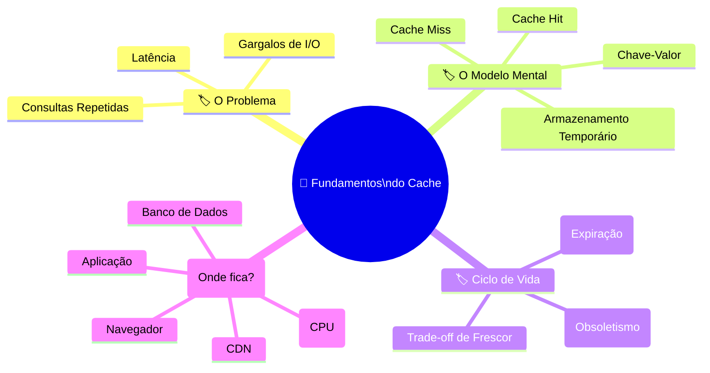
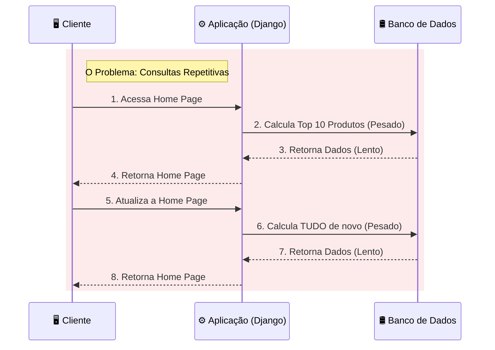
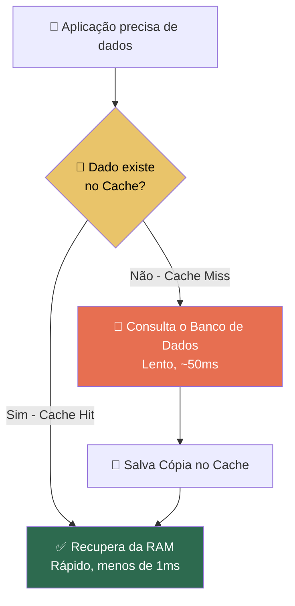
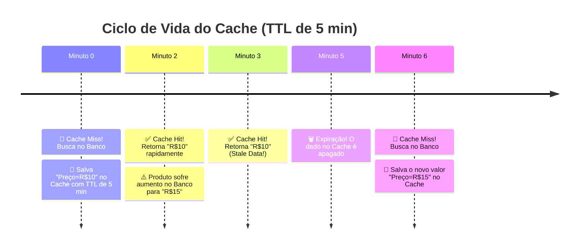
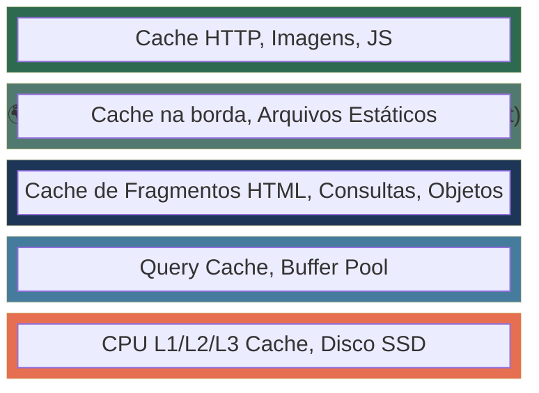
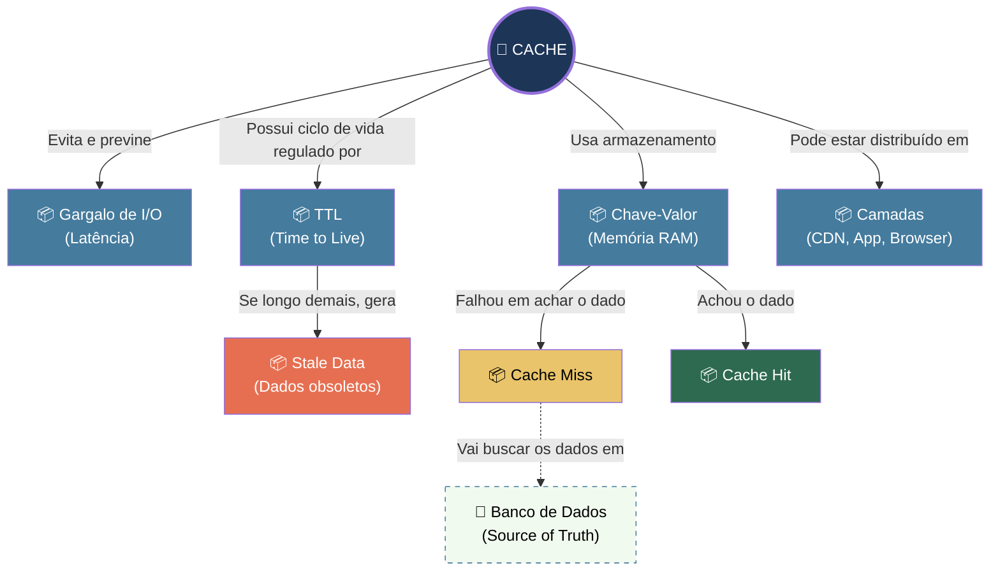
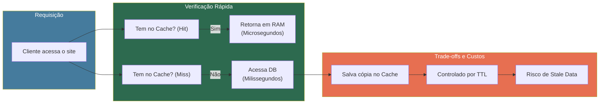

# 📘 Aula Módulo 1: O que é Cache e Por que Você Precisa Dele

> **Módulo:** Módulo 1 | **Nível:** 🟢 Fundamento
> **Tempo estimado:** ~45min de estudo focado | **Pré-requisitos:** Conhecimentos básicos de desenvolvimento web (requisições HTTP) e consultas a banco de dados.

---

## 📑 Índice

1. [🎯 Objetivo de Aprendizado](#-objetivo-de-aprendizado)
2. [🗺️ Mapa da Aula](#️-mapa-da-aula)
3. [📖 Conceito: O Problema que Cache Resolve](#-conceito-o-problema-que-cache-resolve)
4. [📖 Conceito: O que é Cache (Modelo Mental)](#-conceito-o-que-e-cache-modelo-mental)
5. [📖 Conceito: TTL, Expiração e Stale Data](#-conceito-ttl-expiracao-e-stale-data)
6. [📖 Conceito: Onde Cache Pode Existir (Camadas)](#-conceito-onde-cache-pode-existir-camadas)
7. [🔗 Mapa de Conexões](#-mapa-de-conexoes)
8. [📊 Resumo Visual](#-resumo-visual)
9. [🧪 Teste seu Conhecimento](#-teste-seu-conhecimento)

---

## 🎯 Objetivo de Aprendizado

Ao concluir esta aula, você será capaz de:

- **Identificar** cenários no seu código onde consultas repetidas ao banco de dados geram gargalos de I/O e impactam o tempo de resposta.
- **Desenhar** o fluxo de uma requisição com e sem cache, explicando o que é a origem dos dados (source of truth).
- **Avaliar** o trade-off entre frescor e velocidade, entendendo as consequências da expiração (TTL) e dos dados obsoletos (stale data).
- **Mapear** pelo menos 3 camadas de cache que já atuam em uma arquitetura web antes mesmo da requisição chegar à sua aplicação.

---

## 🗺️ Mapa da Aula



---

## 📖 Conceito: O Problema que Cache Resolve

### 💡 O que é

> 💬 **Analogia:** Imagine ter que ir dirigindo até o supermercado no centro da cidade toda vez que você precisa de apenas **um grão** de arroz para cozinhar, ignorando completamente a despensa da sua cozinha.

Aplicações web lidam com **latência** (o tempo que algo demora para chegar) e limites de **throughput** (quantas coisas podem ser processadas ao mesmo tempo). Quando seu código busca as mesmas informações no banco de dados a cada requisição, ele cria um **gargalo de I/O** (entrada/saída), desperdiçando tempo precioso de rede e processamento em respostas idênticas. 

### ⚙️ Como funciona

Toda vez que uma aplicação Django (ou qualquer framework) precisa montar uma página complexa, ela sofre custos operacionais para acessar o que chamamos de *Source of Truth* (Origem da Verdade, geralmente o Banco de Dados).

| Propriedade | Detalhe |
|:---|:---|
| **Tempo de Resposta (Response Time)** | O tempo total desde a chegada da requisição até o envio da resposta. Consultas em disco (DB) inflam esse tempo. |
| **Gargalo de I/O** | O disco rígido ou a rede são as partes mais lentas da computação. A CPU fica "ociosa" esperando eles responderem. |
| **Custo de Consultas Repetidas** | Calcular métricas complexas (ex: "Top 10 Produtos Mais Vendidos") custa CPU e RAM no banco de dados. Fazer isso 1000 vezes por minuto é insustentável. |

### 📊 Diagrama



### ⚠️ Armadilhas Comuns

- ❌ **Otimizar queries antes de pensar em cache:** É comum passar horas tentando deixar uma query SQL 10ms mais rápida, quando armazenar o resultado dessa query em cache deixaria o acesso a ela em < 1ms e removeria a carga do banco.
- ❌ **Escalar o servidor de banco de dados:** Aumentar o tamanho do banco (RAM/CPU) para aguentar muitas consultas repetitivas de leitura custa muito caro financeiramente.

*Agora que entendemos a dor (o problema de I/O), podemos entender o remédio: o cache propriamente dito.*

---

## 📖 Conceito: O que é Cache (Modelo Mental)

### 💡 O que é

> 💬 **Analogia:** Se o banco de dados é o "supermercado" onde os alimentos são mantidos por muito tempo, o cache é a "despensa da sua cozinha": menor, com acesso imediato, mas projetada para itens de uso rápido e repetitivo.

Cache é uma camada de **armazenamento temporário** de alta velocidade. Em vez de ler do banco de dados (no disco SSD/HDD), o cache guarda uma **cópia** dos dados diretamente na Memória RAM. Ele funciona majoritariamente no formato **Chave-Valor** (ex: chave `"top_10_produtos"`, valor `"[lista de produtos]"`).

### ⚙️ Como funciona

Quando sua aplicação precisa de uma informação, ela segue um fluxo de duas etapas: primeiro pergunta à despensa (Cache), depois, se não encontrar, vai ao mercado (Banco).

| Propriedade | Detalhe |
|:---|:---|
| **Source of Truth** | O Banco de Dados. É onde o dado "original e seguro" vive de verdade. |
| **Cache Hit (Acerto)** | Quando a aplicação procura a chave no cache e a **encontra**. O banco não é tocado. Resposta imediata. |
| **Cache Miss (Erro/Falta)** | Quando a chave **não existe** no cache. A aplicação precisa ir ao Source of Truth, buscar o dado, responder ao usuário e **salvar a cópia no cache** para a próxima vez. |

### 📊 Diagrama




### 💻 Na Prática

A lógica universal de cache em praticamente qualquer linguagem ou framework segue este exato modelo (pseudocódigo ilustrativo de como sua aplicação agirá):

```python
# Exemplo: Lógica universal de Cache Hit/Miss
def obter_produtos_populares():
    # 1. Tenta pegar do cache (Cache Hit?)
    dados = cache.get("top_10_produtos")
    
    if dados is None:
        # 2. Se deu Cache Miss, vai no Banco (Source of Truth)
        dados = Produto.objects.filter(popular=True)[:10] 
        
        # 3. Salva a cópia no cache para os próximos acessos
        cache.set("top_10_produtos", dados)
        
    return dados
```

---

> [!TIP]
> 🧠 **Pare e Pense:** Se o cache é apenas uma "cópia" do banco de dados projetada para ser extremamente rápida... o que acontece com essa cópia se o dado original mudar lá no banco de dados enquanto a cópia ainda está no cache?

---

*Essa reflexão nos leva diretamente ao maior desafio da computação com caches: a temporalidade.*

## 📖 Conceito: TTL, Expiração e Stale Data

### 💡 O que é

> 💬 **Analogia:** O leite na sua geladeira (cache) tem uma data de validade estampada na embalagem. Passou dessa data, você joga fora para evitar ingerir algo estragado e precisa comprar leite fresco no mercado (banco de dados).

O cache não guarda os dados para sempre, ele usa um tempo de vida limite chamado **TTL (Time To Live)**. Quando o TTL expira, a cópia é destruída. Se alguém acessar os dados antes da expiração, mas o banco já sofreu alterações, o usuário estará vendo **stale data** (dados obsoletos ou velhos).

### ⚙️ Como funciona

Definir o TTL é um jogo de equilíbrio entre precisão e velocidade.

| Propriedade | Detalhe |
|:---|:---|
| **TTL (Time To Live)** | O tempo exato (geralmente em segundos) que um dado pode viver no cache. Ex: TTL de 300 = 5 minutos. |
| **Expiração Absoluta** | O dado morre exatamente "X" segundos após ter sido criado, independentemente se alguém continuou lendo ele. |
| **Dado Obsoleto (Stale)** | Quando o dado na "Source of Truth" mudou, mas o cache continua entregando a cópia antiga até o seu TTL acabar. |
| **Trade-off** | Muito cache = mais velocidade, porém maior chance de dados estarem desatualizados para o usuário final. |

### 📊 Diagrama



### ⚠️ Armadilhas Comuns

- ❌ **TTL Infinito:** Colocar dados no cache e nunca estipular um TTL. A aplicação continuará mostrando a informação velha para sempre (ou até a RAM do servidor encher).
- ❌ **Sintomas de "Tem que apertar F5":** Quando usuários reclamam que atualizaram o perfil, mas a foto antiga continua aparecendo. Isso é *Stale Data* agindo por trás dos panos.

*Você deve estar se perguntando: "Então eu só vou ter esse problema na minha aplicação?". A verdade é que o cache está por toda parte na internet.*

---

## 📖 Conceito: Onde Cache Pode Existir (Camadas)

### 💡 O que é

> 💬 **Analogia:** Pense na cadeia de suprimentos de um sorvete: O produtor tem um galpão gigante (Banco), o caminhão tem refrigeradores (CDN), o supermercado tem o freezer (Aplicação) e você tem um congeladorzinho na sua casa (Navegador). O "cache" acontece em todas essas etapas para evitar voltar à fábrica!

O cache não é uma ferramenta única que você instala no servidor; é um **padrão de arquitetura** que existe em múltiplas camadas ao longo da jornada de um simples clique até o hardware físico do seu servidor.

### ⚙️ Como funciona

Cada camada serve a um propósito específico para garantir que o *Source of Truth* (banco de dados ou servidor original) seja perturbado o mínimo possível.

| Propriedade | Detalhe |
|:---|:---|
| **Cache de Navegador** | O browser (Chrome, Safari) salva imagens, JS e CSS no disco do usuário usando cabeçalhos `Cache-Control` ou `ETag`. O request sequer sai da casa do usuário! |
| **Cache de CDN** | Redes como a Cloudflare guardam as respostas do seu servidor em máquinas espalhadas ao redor do mundo. |
| **Cache de Aplicação** | Ferramentas como Redis ou Memcached atuando junto ao seu código (Django) para não bater no banco. |
| **Cache de Banco (Query)** | O próprio PostgreSQL/MySQL tem uma memória interna para guardar as queries que ele acabou de processar recentemente. |
| **Cache de CPU** | Níveis L1, L2, L3 no chip físico de processamento do servidor. |

### 📊 Diagrama



---

> [!TIP]
> 🧠 **Pare e Pense:** Quando você usa "Ctrl+F5" (ou Command+Shift+R) no seu navegador e o site de repente passa a mostrar a informação correta, o que acabou de acontecer em relação às camadas acima?

---

## 🔗 Mapa de Conexões

Veja como os conceitos desta aula se conectam entre si:



O Cache é a solução direta para a latência e o Gargalo de I/O, armazenando respostas em Chave-Valor para evitar bater no Banco de Dados (Source of Truth). Essa performance tem um preço: o controle via TTL que, se negligenciado, gera Stale Data (entregando dados velhos aos usuários) por qualquer uma de suas Camadas.

---

## 📊 Resumo Visual

### Síntese em Um Olhar



### ✅ Checklist: O que devo saber

Antes de avançar para os próximos módulos (onde colocaremos a mão na massa no Django), verifique se você consegue:

- [ ✔️ ] Identificar a diferença entre "Source of Truth" e "Cache".
- [ ✔️ ] Explicar com suas palavras o fluxo de um "Cache Hit" e "Cache Miss".
- [ ✔️ ] Justificar por que o banco de dados não deve ser a única resposta da sua arquitetura.
- [ ✔️ ] Explicar o que é TTL e o trade-off de escolher um tempo de vida muito alto ou muito baixo.
- [ ✔️ ] Identificar a origem do "Stale Data".
- [ ✔️ ] Listar 3 exemplos de onde o cache atua além da sua aplicação de backend.

---

## 🧪 Teste seu Conhecimento

Tente responder antes de ver a resposta. Resista à tentação de espiar! 🙈

---

### Questões Conceituais

**Questão 1:** Por que não simplesmente aumentar a memória e processador do banco de dados (Escalonamento Vertical) em vez de introduzir uma ferramenta de cache na aplicação?

<details>
<summary>🔍 Ver resposta</summary>

**Resposta:** Porque aumentar o hardware do banco de dados tem um limite físico e é financeiramente insustentável. O processamento de I/O de disco para recalcular a mesma resposta repetidamente é um desperdício de recursos. O cache resolve na raiz: responde pela memória RAM sem nem tocar na lógica do banco, aliviando a infraestrutura por uma fração do custo.

</details>

---

**Questão 2:** Explique a diferença entre a origem dos dados (*Source of Truth*) e os dados em cache usando o conceito de *Stale Data*.

<details>
<summary>🔍 Ver resposta</summary>

**Resposta:** A *Source of Truth* (Banco de Dados) é onde reside a versão oficial e definitiva da informação. O cache guarda apenas uma cópia fotográfica temporária. O *Stale Data* ocorre quando a versão definitiva é alterada na *Source of Truth*, mas o cache continua fornecendo aos usuários a cópia fotográfica antiga porque seu TTL ainda não expirou.

</details>

---

### Questões Práticas / Cenários

**Questão 3:** Você está desenvolvendo a API de um jornal online esportivo. Na final da Copa do Mundo, a "Home Page" com os resultados é acessada 5.000 vezes por segundo. Você decide configurar um cache com TTL de 30 minutos na página. O que pode dar errado?

<details>
<summary>🔍 Ver resposta</summary>

**Resposta:** O TTL de 30 minutos é demasiadamente alto para o contexto de um jogo ao vivo. Isso vai gerar um *Stale Data* massivo. Um time pode marcar um gol, e o público só verá o placar atualizado no jornal 30 minutos depois, pois o cache continuará devolvendo a cópia antiga. Para este cenário, um TTL de 15 a 30 segundos seria o trade-off ideal entre aliviar o servidor e manter os dados razoavelmente frescos.

</details>

---

**Questão 4:** *(Pegadinha)* Um usuário reclama para sua equipe de suporte: "Acabei de mudar a cor de fundo do meu perfil, recarreguei a página, e a cor continua a antiga!". Seu engenheiro júnior diz: "O problema deve estar no nosso servidor Redis de aplicação, vamos limpar os caches do Django". Essa é a única explicação provável?

<details>
<summary>🔍 Ver resposta</summary>

**Resposta:** Não, e é provável que a intuição do engenheiro júnior falhe aqui. Como vimos nas **Camadas de Cache**, a resposta estática (CSS/imagens) frequentemente fica em cache no **Navegador do Usuário** ou em uma **CDN (como a Cloudflare)** antes mesmo de bater na aplicação Django. O usuário pode precisar apenas fazer um "Hard Refresh" (Ctrl+F5) para limpar o seu cache de navegador.

</details>

---

**Questão 5:** Dado o seguinte fluxo mental do código:
1. Recebe requisição da API de cotação do Dólar.
2. Faz consulta à API de terceiros (Banco Central).
3. Salva a resposta no Cache.
4. Retorna resposta ao usuário.
O que está fundamentalmente errado nessa lógica em termos de arquitetura de cache?

<details>
<summary>🔍 Ver resposta</summary>

**Resposta:** O código não verifica a existência do dado no cache **antes** de consultar o serviço de terceiros (faltou a lógica de Cache Hit/Miss). Esse código está atualizando o cache a cada requisição, mas consultando a fonte original 100% das vezes de qualquer maneira, não trazendo benefício nenhum de performance.

</details>

---

### 🏋️ Desafio de Aplicação

> **Cenário de Análise:**
> Abra no seu navegador uma página rica em conteúdo estático (como um portal de notícias grande, ex: globo.com ou nytimes.com) ou uma loja virtual (ex: amazon.com). 
> 1. Pressione F12 para abrir as Ferramentas de Desenvolvedor (DevTools).
> 2. Vá na aba "Network" (Rede).
> 3. Recarregue a página com F5 normal e perceba a coluna "Size/Tempo" e "Transferred".
> 4. Agora recarregue fazendo um Hard Refresh (Ctrl+F5 ou Cmd+Shift+R).
> 
> **Seu desafio:** Tente identificar fisicamente o **Cache do Navegador** agindo. Quais arquivos foram carregados com "(memory cache)" ou "(disk cache)" no primeiro cenário? O que ocorreu quando você forçou a limpeza no segundo cenário? Você acaba de visualizar a "Camada 1" na prática!
